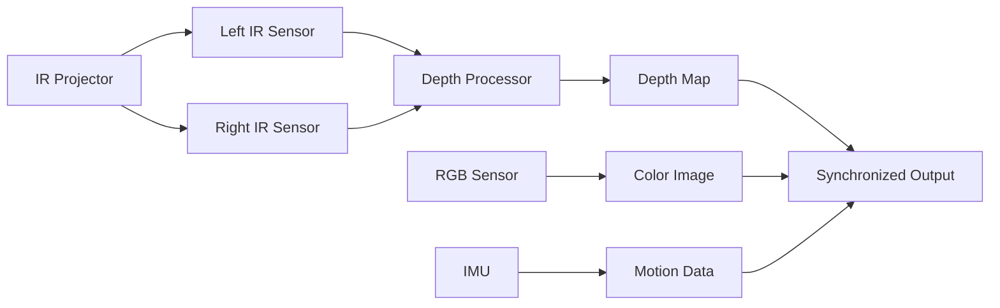

import Tabs from '@theme/Tabs';
import TabItem from '@theme/TabItem';

# Intel RealSense D435i Integration Guide

The Intel RealSense D435i is a revolutionary depth sensing camera that combines stereo vision with an inertial measurement unit (IMU) to provide rich 3D perception capabilities for robotics applications. This powerful sensor enables humanoid robots to perceive their environment with millimeter accuracy, track human movement, and navigate complex spaces with confidence.

This comprehensive guide walks you through everything you need to know to integrate the D435i into your Physical AI projects, from initial hardware setup to advanced real-time optimization techniques.

## What You'll Learn

By the end of this guide, you'll be able to:
1. Install and configure the Intel RealSense SDK 2.0 on Ubuntu systems
2. Integrate the D435i with ROS 2 for robotic applications
3. Calibrate the camera for accurate depth measurements
4. Process point cloud data for navigation and obstacle avoidance
5. Implement human detection and pose estimation using depth data
6. Optimize performance for real-time applications on edge devices
7. Troubleshoot common issues and maintain sensor accuracy

## Hardware Overview

### Intel RealSense D435i Specifications

The D435i is part of Intel's second-generation RealSense depth cameras, featuring advanced stereo vision technology and on-board processing capabilities:

| Feature | Specification |
|---------|---------------|
| **Depth Technology** | Active IR stereo with structured light |
| **Depth Range** | 0.2m - 10m optimal, up to 20m max |
| **Depth Resolution** | Up to 1280×720 @ 30fps |
| **RGB Sensor** | 1920×1080 @ 30fps |
| **FOV (Field of View)** | 87°×58° (H×V) |
| **Depth Accuracy** | &lt;2% of distance (Z-axis) |
| **IMU** | 6-axis (accelerometer + gyroscope) |
| **Interfaces** | USB 3.1 Type-C, MIPI-CSI2 |
| **Power Consumption** | 2.25W (typical) |
| **Operating Temperature** | -10°C to 45°C |

### Stereo Depth Technology

The D435i uses advanced stereo vision technology to calculate depth:



### Key Capabilities for Physical AI

The D435i excels in Physical AI applications through several unique capabilities:

1. **High-Resolution Depth**: 1280×720 depth resolution at 30fps provides detailed 3D maps
2. **Global Shutter**: Eliminates motion blur for fast-moving humanoid robots
3. **IMU Integration**: Onboard accelerometer and gyroscope for motion tracking
4. **Multi-Camera Sync**: Hardware synchronization for multi-camera arrays
5. **Compact Form Factor**: Lightweight (87g) ideal for robot mounting

### Use Cases in Humanoid Robotics

The D435i is particularly valuable for:

- **Environmental Mapping**: Creating detailed 3D maps for navigation
- **Human Detection**: Identifying and tracking humans in the robot's workspace
- **Obstacle Avoidance**: Real-time depth-based collision avoidance
- **Gesture Recognition**: Understanding human gestures for interaction
- **Fall Detection**: Monitoring human safety in assistive scenarios
- **Manipulation**: Providing depth feedback for object grasping

## Installation and Setup

### System Requirements

Before beginning, ensure your system meets these requirements:

**Minimum Requirements:**
- Ubuntu 18.04/20.04/22.04 LTS (64-bit)
- Intel Core i5 or AMD Ryzen 5 processor
- 4GB RAM (8GB recommended)
- USB 3.0 port
- 10GB free disk space

**Recommended for Development:**
- Intel Core i7 or AMD Ryzen 7
- 16GB RAM or more
- NVIDIA GPU (for CUDA acceleration)
- SSD storage

### Installing Intel RealSense SDK 2.0

The librealsense2 SDK provides the foundation for accessing D435i capabilities.

#### Method 1: Binary Installation (Recommended)

1. **Register the server's public key:**
   ```bash
   sudo apt-key adv --keyserver keyserver.ubuntu.com --recv-key F6E65AC044F831AC80A06380C8B3A55A6F3EFCDE
   ```

2. **Add the repository:**
   ```bash
   sudo add-apt-repository "deb https://librealsense.intel.com/Debian/apt-repo $(lsb_release -cs) main"
   sudo apt update
   ```

3. **Install the libraries:**
   ```bash
   sudo apt install librealsense2-dkms
   sudo apt install librealsense2-utils
   sudo apt install librealsense2-dev
   sudo apt install librealsense2-dbg
   ```

4. **Verify installation:**
   ```bash
   realsense-viewer
   ```

#### Method 2: Source Installation

For custom builds or latest features:

1. **Install dependencies:**
   ```bash
   sudo apt install git build cmake pkg-config
   sudo apt install libglfw3-dev libgl1-mesa-dev libglu1-mesa-dev
   sudo apt install libusb-1.0-0-dev
   ```

2. **Clone and build:**
   ```bash
   git clone https://github.com/IntelRealSense/librealsense.git
   cd librealsense
   mkdir build && cd build
   cmake .. -DBUILD_EXAMPLES=true
   make -j$(nproc)
   sudo make install
   ```

### Setting Up UDEV Rules

To allow non-root access to the camera:

1. **Create udev rules:**
   ```bash
   sudo cp config/99-realsense-libusb.rules /etc/udev/rules.d/
   sudo udevadm control --reload-rules && sudo udevadm trigger
   ```

2. **Add user to video group:**
   ```bash
   sudo usermod -a -G video $LOGNAME
   # Logout and login for changes to take effect
   ```

### Verifying Hardware Connection

Connect the D435i to a USB 3.0 port and verify:

```bash
# Check if device is detected
lsusb | grep Intel

# Test basic functionality
rs-enumerate-devices

# Stream test
rs-record -d 5 -c test.bag
```

Expected output should show:
- Device: Intel RealSense D435i
- Serial Number: Unique device identifier
- Firmware Version: Camera firmware version
- USB Connection: USB 3.0

## ROS 2 Integration

### Installing ROS 2 Wrapper

The realsense-ros2 package provides seamless integration with ROS 2:

#### For ROS 2 Humble (Ubuntu 22.04)

```bash
sudo apt install ros-humble-realsense2-camera
sudo apt install ros-humble-realsense2-description
```

#### For ROS 2 Foxy (Ubuntu 20.04)

```bash
sudo apt install ros-foxy-realsense2-camera
sudo apt install ros-foxy-realsense2-description
```

#### Building from Source (Latest Features)

```bash
cd ~/ros2_ws/src
git clone https://github.com/IntelRealSense/realsense-ros.git -b ros2-master
cd ~/ros2_ws
colcon build --packages-select realsense2_camera
source install/setup.bash
```

### Basic Launch Configuration

Create a basic launch file to test the camera:

```yaml
# realsense_basic_launch.yaml
realsense_camera_node:
  ros__parameters:
    device_type: 'd435i'
    serial_no: ''  # Leave empty for first available
    rgb_frame_id: 'camera_rgb_optical_frame'
    depth_frame_id: 'camera_depth_optical_frame'
    enable_rgb: true
    enable_depth: true
    enable_infra1: true
    enable_infra2: true
    enable_imu: true
    rgb_width: 640
    rgb_height: 480
    depth_width: 640
    depth_height: 480
    fps: 30
    enable_sync: true
    align_depth: true
```

Launch the camera:

```bash
ros2 launch realsense2_camera rs_launch.py \
  device_type:=d435i \
  enable_rgbd:=true \
  align_depth:=true
```

### Topics and Services

The D435i publishes several ROS 2 topics:

| Topic | Type | Description |
|-------|------|-------------|
| `/camera/color/image_raw` | sensor_msgs/Image | RGB color image |
| `/camera/depth/image_rect_raw` | sensor_msgs/Image | Aligned depth image |
| `/camera/infra1/image_raw` | sensor_msgs/Image | Left infrared image |
| `/camera/infra2/image_raw` | sensor_msgs/Image | Right infrared image |
| `/camera/imu` | sensor_msgs/Imu | IMU readings |
| `/camera/depth/points` | sensor_msgs/PointCloud2 | 3D point cloud |
| `/camera/depth/color/points` | sensor_msgs/PointCloud2 | RGBD point cloud |

### Multi-Camera Setup

For humanoid robots requiring multiple viewpoints:

```python
# multi_realsense_launch.py
import launch
from launch_ros.actions import Node
from ament_index_python.packages import get_package_share_directory

def generate_launch_description():
    # Front camera
    front_camera = Node(
        package='realsense2_camera',
        executable='realsense2_camera_node',
        name='front_realsense',
        parameters=[{
            'device_type': 'd435i',
            'serial_no': '12345678',  # Front camera serial
            'camera_name': 'front_camera',
            'frame_id': 'front_camera_link',
            'enable_rgb': True,
            'enable_depth': True,
            'enable_imu': True,
            'fps': 30,
        }]
    )

    # Side camera
    side_camera = Node(
        package='realsense2_camera',
        executable='realsense2_camera_node',
        name='side_realsense',
        parameters=[{
            'device_type': 'd435i',
            'serial_no': '87654321',  # Side camera serial
            'camera_name': 'side_camera',
            'frame_id': 'side_camera_link',
            'enable_rgb': True,
            'enable_depth': True,
            'enable_imu': False,
            'fps': 30,
        }]
    )

    return launch.LaunchDescription([front_camera, side_camera])
```

## Camera Configuration and Calibration

### Optimal Configuration Parameters

Fine-tune the camera settings for your specific application:

```python
# realsense_config.py
import pyrealsense2 as rs

pipeline = rs.pipeline()
config = rs.config()

# Configure streams
config.enable_stream(rs.stream.depth, 1280, 720, rs.format.z16, 30)
config.enable_stream(rs.stream.color, 1920, 1080, rs.format.bgr8, 30)
config.enable_stream(rs.stream.infrared, 1280, 720, rs.format.y8, 30)
config.enable_stream(rs.stream.accel, rs.format.motion_xyz32f, 200)
config.enable_stream(rs.stream.gyro, rs.format.motion_xyz32f, 200)

# Advanced depth settings
depth_sensor = pipeline.get_active_profile().get_device().first_depth_sensor()
depth_sensor.set_option(rs.option.visual_preset, 3)  # High accuracy preset
depth_sensor.set_option(rs.option.laser_power, 150)  # Moderate laser power
depth_sensor.set_option(rs.option.depth_units, 0.001)  # Millimeter precision
```

### Depth Accuracy Optimization

Maximize depth accuracy for different scenarios:

<Tabs groupId="accuracy-preset">
<TabItem value="high-accuracy" label="High Accuracy Mode">

```python
# Best for static environments, high precision needed
depth_sensor.set_option(rs.option.visual_preset, rs.visual_preset_high_accuracy)
depth_sensor.set_option(rs.option.laser_power, 330)  # Maximum laser power
depth_sensor.set_option(rs.option.depth_units, 0.0001)  # 0.1mm precision
depth_sensor.set_option(rs.option.min_distance, 0.2)  # 20cm minimum
```

</TabItem>
<TabItem value="high-density" label="High Density Mode">

```python
# Best for detailed 3D scanning
depth_sensor.set_option(rs.option.visual_preset, rs.visual_preset_high_density)
depth_sensor.set_option(rs.option.laser_power, 150)
depth_sensor.set_option(rs.option.filter_magnitude, 2)
depth_sensor.set_option(rs.option.filter_smooth_alpha, 0.5)
```

</TabItem>
<TabItem value="default" label="Default/Balanced">

```python
# Balanced for general robotics applications
depth_sensor.set_option(rs.option.visual_preset, rs.visual_preset_default)
depth_sensor.set_option(rs.option.laser_power, 150)
depth_sensor.set_option(rs.option.depth_units, 0.001)
```

</TabItem>
</Tabs>

### Calibration Procedure

Proper calibration ensures accurate depth measurements:

1. **Install calibration tools:**
   ```bash
   sudo apt install ros-humble-camera_calibration
   ```

2. **Print calibration pattern:**
   - 8x6 checkerboard with 108mm squares
   - Print on rigid, non-reflective material

3. **Run calibration:**
   ```bash
   ros2 run camera_calibration cameracalibrator \
     --size 8x6 --square 0.108 \
     --ros-args -p camera:=/camera \
     -p image:=/color/image_raw \
     -p camera_info:=/color/camera_info
   ```

4. **Capture calibration data:**
   - Move the checkerboard around the field of view
   - Ensure coverage of corners and edges
   - Wait for the calibration button to turn green
   - Click "Calibrate" and save the results

5. **Apply calibration:**
   ```bash
   cp /tmp/calibrationdata.yaml ~/.ros/camera_info/
   # Update your launch file to use this file
   ```

### Dynamic Reconfiguration

Adjust parameters during runtime:

```python
# dynamic_reconfigure_client.py
import rclpy
from rclpy.node import Node
from rcl_interfaces.msg import Parameter, ParameterValue, ParameterType
from rcl_interfaces.srv import SetParameters

class RealsenseConfigNode(Node):
    def __init__(self):
        super().__init__('realsense_config_node')
        self.cli = self.create_client(SetParameters, '/realsense2_camera/set_parameters')

    def update_fps(self, new_fps):
        req = SetParameters.Request()
        param = Parameter()
        param.name = 'fps'
        param.value.type = ParameterType.PARAMETER_INTEGER
        param.value.integer_value = new_fps
        req.parameters = [param]

        future = self.cli.call_async(req)
        future.add_done_callback(self.handle_response)

    def handle_response(self, future):
        try:
            response = future.result()
            self.get_logger().info(f"Configuration update: {response.results}")
        except Exception as e:
            self.get_logger().error(f"Failed to update configuration: {e}")

def main(args=None):
    rclpy.init(args=args)
    node = RealsenseConfigNode()

    # Example: Update FPS to 15
    node.update_fps(15)

    rclpy.spin(node)
    rclpy.shutdown()

if __name__ == '__main__':
    main()
```

## Point Cloud Processing

### Point Cloud Library (PCL) Integration

Install PCL for advanced point cloud processing:

```bash
sudo apt install libpcl-dev
sudo apt install ros-humble-pcl-ros
sudo apt install ros-humble-pcl-conversions
```

### Basic Point Cloud Processing

Convert depth images to point clouds and apply filters:

```python
# point_cloud_processor.py
import rclpy
from rclpy.node import Node
from sensor_msgs.msg import PointCloud2
import numpy as np
import open3d as o3d

class PointCloudProcessor(Node):
    def __init__(self):
        super().__init__('point_cloud_processor')
        self.subscription = self.create_subscription(
            PointCloud2,
            '/camera/depth/points',
            self.pointcloud_callback,
            10
        )
        self.publisher = self.create_publisher(
            PointCloud2,
            '/processed_cloud',
            10
        )

    def pointcloud_callback(self, msg):
        # Convert ROS2 PointCloud2 to Open3D format
        pc_data = self.ros_to_open3d(msg)

        # Apply voxel grid downsampling
        voxel_size = 0.02  # 2cm voxels
        pc_downsampled = pc_data.voxel_down_sample(voxel_size)

        # Remove outliers
        cl, ind = pc_downsampled.remove_statistical_outlier(nb_neighbors=20, std_ratio=2.0)
        pc_clean = pc_downsampled.select_by_index(ind)

        # Segment ground plane
        plane_model, inliers = pc_clean.segment_plane(
            distance_threshold=0.01,
            ransac_n=3,
            num_iterations=1000
        )

        # Extract objects above ground
        objects = pc_clean.select_by_index(inliers, invert=True)

        # Publish processed cloud
        processed_msg = self.open3d_to_ros(objects)
        self.publisher.publish(processed_msg)

    def ros_to_open3d(self, ros_cloud):
        # Convert ROS2 PointCloud2 to numpy array
        # Implementation details omitted for brevity
        pass

    def open3d_to_ros(self, o3d_cloud):
        # Convert Open3D PointCloud back to ROS2 format
        # Implementation details omitted for brevity
        pass

def main(args=None):
    rclpy.init(args=args)
    processor = PointCloudProcessor()
    rclpy.spin(processor)
    rclpy.shutdown()

if __name__ == '__main__':
    main()
```

### Real-time Filtering Pipeline

Create an efficient filtering pipeline for real-time applications:

```python
# realtime_filter_pipeline.py
class RealtimeFilterPipeline:
    def __init__(self):
        self.pass_through_filter = rs.pointcloud()
        self.decimation_filter = rs.decimation_filter()
        self.spatial_filter = rs.spatial_filter()
        self.temporal_filter = rs.temporal_filter()
        self.disparity_transform = rs.disparity_transform(True)
        self.disparity_to_depth = rs.disparity_transform(False)

        # Configure filters
        self.decimation_filter.set_option(rs.option.filter_magnitude, 2)  # 2x decimation
        self.spatial_filter.set_option(rs.option.filter_magnitude, 2)
        self.spatial_filter.set_option(rs.option.filter_smooth_alpha, 0.5)
        self.spatial_filter.set_option(rs.option.filter_smooth_delta, 20)
        self.temporal_filter.set_option(rs.option.filter_smooth_alpha, 0.4)
        self.temporal_filter.set_option(rs.option.filter_smooth_delta, 20)

    def process_frame(self, frame):
        """Process depth frame with optimized filter pipeline"""
        # Step 1: Decimation - reduce density
        frame = self.decimation_filter.process(frame)

        # Step 2: Convert to disparity for spatial filtering
        frame = self.disparity_transform.process(frame)

        # Step 3: Spatial filter - reduce noise
        frame = self.spatial_filter.process(frame)

        # Step 4: Temporal filter - reduce temporal noise
        frame = self.temporal_filter.process(frame)

        # Step 5: Convert back from disparity
        frame = self.disparity_to_depth.process(frame)

        return frame
```

### Object Segmentation using Point Clouds

Implement object segmentation for navigation:

```python
# object_segmentation.py
from sklearn.cluster import DBSCAN
import matplotlib.pyplot as plt

def segment_objects(point_cloud, eps=0.05, min_samples=10):
    """
    Segment objects from point cloud using DBSCAN clustering

    Args:
        point_cloud: Nx3 numpy array of 3D points
        eps: Maximum distance between two samples for one to be considered as in the neighborhood of the other
        min_samples: Number of samples in a neighborhood for a point to be considered as a core point

    Returns:
        labels: Cluster labels for each point (-1 for noise)
    """
    # DBSCAN clustering
    clustering = DBSCAN(eps=eps, min_samples=min_samples).fit(point_cloud)
    labels = clustering.labels_

    # Number of clusters (excluding noise)
    n_clusters = len(set(labels)) - (1 if -1 in labels else 0)

    return labels, n_clusters

def extract_bounding_boxes(point_cloud, labels):
    """
    Extract axis-aligned bounding boxes for each cluster

    Args:
        point_cloud: Nx3 numpy array of 3D points
        labels: Cluster labels for each point

    Returns:
        boxes: List of bounding boxes [(min_corner, max_corner), ...]
    """
    boxes = []
    unique_labels = set(labels)

    for label in unique_labels:
        if label == -1:  # Skip noise points
            continue

        # Get points belonging to this cluster
        cluster_points = point_cloud[labels == label]

        # Calculate bounding box
        min_corner = np.min(cluster_points, axis=0)
        max_corner = np.max(cluster_points, axis=0)

        boxes.append((min_corner, max_corner))

    return boxes

# Usage in ROS 2 node
def process_frame_for_navigation(self, point_cloud_msg):
    # Convert ROS PointCloud2 to numpy array
    points = self.pointcloud_to_numpy(point_cloud_msg)

    # Remove ground plane
    filtered_points = self.remove_ground_plane(points)

    # Segment objects
    labels, n_objects = segment_objects(filtered_points)

    # Extract bounding boxes
    boxes = extract_bounding_boxes(filtered_points, labels)

    # Create navigation map
    nav_map = self.create_navigation_map(boxes)

    # Publish for navigation stack
    self.nav_publisher.publish(nav_map)
```

## Computer Vision Integration

### OpenCV Integration for Visual Processing

Combine depth data with OpenCV for advanced visual processing:

```python
# opencv_depth_processing.py
import cv2
import numpy as np
import pyrealsense2 as rs

class DepthVisionProcessor:
    def __init__(self):
        self.pipeline = rs.pipeline()
        self.config = rs.config()
        self.config.enable_stream(rs.stream.depth, 640, 480, rs.format.z16, 30)
        self.config.enable_stream(rs.stream.color, 640, 480, rs.format.bgr8, 30)

        # Start streaming
        self.pipeline.start(self.config)

        # Create align object to align depth to color
        self.align = rs.align(rs.stream.color)

        # Initialize OpenCV face detector
        self.face_cascade = cv2.CascadeClassifier(
            cv2.data.haarcascades + 'haarcascade_frontalface_default.xml'
        )

    def process_frame(self):
        """Process frame and detect faces with depth information"""
        frames = self.pipeline.wait_for_frames()
        aligned_frames = self.align.process(frames)

        # Get aligned frames
        depth_frame = aligned_frames.get_depth_frame()
        color_frame = aligned_frames.get_color_frame()

        # Convert to numpy arrays
        depth_image = np.asanyarray(depth_frame.get_data())
        color_image = np.asanyarray(color_frame.get_data())

        # Convert color to grayscale for face detection
        gray = cv2.cvtColor(color_image, cv2.COLOR_BGR2GRAY)

        # Detect faces
        faces = self.face_cascade.detectMultiScale(gray, 1.1, 4)

        # Process each face
        for (x, y, w, h) in faces:
            # Draw rectangle on color image
            cv2.rectangle(color_image, (x, y), (x+w, y+h), (255, 0, 0), 2)

            # Get center of face
            center_x = x + w // 2
            center_y = y + h // 2

            # Get depth at face center
            depth = depth_frame.get_distance(center_x, center_y)

            # Convert depth to 3D coordinates
            depth_intrin = depth_frame.profile.as_video_stream_profile().intrinsics
            point_3d = rs.rs2_deproject_pixel_to_point(depth_intrin, [center_x, center_y], depth)

            # Display depth information
            cv2.putText(
                color_image,
                f"Distance: {depth:.2f}m",
                (x, y - 10),
                cv2.FONT_HERSHEY_SIMPLEX,
                0.5,
                (0, 255, 0),
                2
            )

        return color_image, depth_image

    def create_point_cloud(self, depth_frame, color_frame):
        """Create colored point cloud from depth and color frames"""
        pointcloud = rs.pointcloud()
        points = pointcloud.calculate(depth_frame)

        # Get texture coordinates for mapping color to point cloud
        vtx = np.asanyarray(points.get_vertices())
        tex = np.asanyarray(points.get_texture_coordinates())

        # Map color to points
        color_image = np.asanyarray(color_frame.get_data())
        colors = color_image[
            (tex[:, 1] * color_image.shape[0]).astype(int),
            (tex[:, 0] * color_image.shape[1]).astype(int)
        ]

        return vtx, colors
```

### Human Pose Estimation with MediaPipe

Integrate MediaPipe for advanced human pose estimation:

```python
# human_pose_estimation.py
import mediapipe as mp
import cv2
import numpy as np

mp_pose = mp.solutions.pose
mp_drawing = mp.solutions.drawing_utils

class HumanPoseEstimator:
    def __init__(self):
        self.pose = mp_pose.Pose(
            static_image_mode=False,
            model_complexity=1,
            enable_segmentation=False,
            min_detection_confidence=0.5,
            min_tracking_confidence=0.5
        )

    def estimate_pose_3d(self, color_image, depth_frame):
        """
        Estimate 3D human pose using color image and depth data

        Args:
            color_image: BGR color image from RealSense
            depth_frame: RealSense depth frame

        Returns:
            landmarks_3d: List of 3D landmarks (x, y, z) in meters
            pose_detected: Boolean indicating if pose was detected
        """
        # Convert BGR to RGB
        rgb_image = cv2.cvtColor(color_image, cv2.COLOR_BGR2RGB)

        # Process the image and find pose
        results = self.pose.process(rgb_image)

        landmarks_3d = []
        pose_detected = False

        if results.pose_landmarks:
            pose_detected = True
            depth_intrin = depth_frame.profile.as_video_stream_profile().intrinsics

            for landmark in results.pose_landmarks.landmark:
                # Convert normalized coordinates to pixel coordinates
                pixel_x = int(landmark.x * color_image.shape[1])
                pixel_y = int(landmark.y * color_image.shape[0])

                # Get depth at landmark position
                if 0 <= pixel_x < color_image.shape[1] and 0 <= pixel_y < color_image.shape[0]:
                    depth = depth_frame.get_distance(pixel_x, pixel_y)

                    # Convert to 3D coordinates
                    point_3d = rs.rs2_deproject_pixel_to_point(
                        depth_intrin, [pixel_x, pixel_y], depth
                    )

                    landmarks_3d.append(point_3d)
                else:
                    landmarks_3d.append([0, 0, 0])  # Invalid point

        return landmarks_3d, pose_detected

    def draw_pose(self, image, landmarks_3d, pose_detected):
        """Draw estimated pose on image"""
        if pose_detected:
            # Convert 3D landmarks back to 2D for visualization
            # Implementation depends on your camera parameters
            pass

        return image
```

### YOLO Object Detection with Depth

Combine YOLO for object detection with RealSense depth:

```python
# yolo_depth_detection.py
import torch
from ultralytics import YOLO

class YOLODepthDetector:
    def __init__(self, model_path='yolov8n.pt'):
        # Load YOLO model
        self.model = YOLO(model_path)

        # RealSense pipeline
        self.pipeline = rs.pipeline()
        self.config = rs.config()
        self.config.enable_stream(rs.stream.depth, 640, 480, rs.format.z16, 30)
        self.config.enable_stream(rs.stream.color, 640, 480, rs.format.bgr8, 30)

        self.pipeline.start(self.config)
        self.align = rs.align(rs.stream.color)

    def detect_with_depth(self):
        """Detect objects and estimate their distance"""
        frames = self.pipeline.wait_for_frames()
        aligned_frames = self.align.process(frames)

        depth_frame = aligned_frames.get_depth_frame()
        color_frame = aligned_frames.get_color_frame()

        # Convert to numpy
        color_image = np.asanyarray(color_frame.get_data())

        # Run YOLO detection
        results = self.model(color_image, verbose=False)

        # Process detections with depth
        detections_with_depth = []

        for result in results:
            boxes = result.boxes
            for box in boxes:
                # Get bounding box coordinates
                x1, y1, x2, y2 = map(int, box.xyxy[0])
                confidence = box.conf[0]
                class_id = int(box.cls[0])
                class_name = self.model.names[class_id]

                # Calculate center point
                center_x = (x1 + x2) // 2
                center_y = (y1 + y2) // 2

                # Get depth at center (with error checking)
                depth = depth_frame.get_distance(center_x, center_y)

                if depth > 0:  # Valid depth reading
                    detections_with_depth.append({
                        'class': class_name,
                        'confidence': float(confidence),
                        'bbox': (x1, y1, x2, y2),
                        'depth': depth,
                        'center_2d': (center_x, center_y)
                    })

        return color_image, detections_with_depth

    def track_objects(self, detections_with_depth):
        """Simple object tracking based on position and size"""
        # Implementation of tracking algorithm
        # Could use Kalman filter or simple IOU tracking
        pass
```

## Performance Optimization

### Real-time Performance Tuning

Optimize the D435i for real-time applications:

```python
# performance_optimizer.py
class RealSenseOptimizer:
    def __init__(self, pipeline):
        self.pipeline = pipeline
        self.device = pipeline.get_active_profile().get_device()
        self.depth_sensor = self.device.first_depth_sensor()
        self.color_sensor = self.device.first_color_sensor()

    def optimize_for_latency(self):
        """Configure for minimum latency"""
        # Reduce resolution
        self.pipeline.stop()
        self.config = rs.config()
        self.config.enable_stream(rs.stream.depth, 424, 240, rs.format.z16, 60)
        self.config.enable_stream(rs.stream.color, 424, 240, rs.format.bgr8, 60)

        # Enable hardware acceleration
        self.depth_sensor.set_option(rs.option.enable_auto_exposure, True)
        self.color_sensor.set_option(rs.option.enable_auto_exposure, True)

        # Reduce post-processing
        self.depth_sensor.set_option(rs.option.filter_option, 0)  # No filtering

        self.pipeline.start(self.config)

    def optimize_for_accuracy(self):
        """Configure for maximum accuracy"""
        self.pipeline.stop()
        self.config = rs.config()
        self.config.enable_stream(rs.stream.depth, 1280, 720, rs.format.z16, 15)
        self.config.enable_stream(rs.stream.color, 1920, 1080, rs.format.bgr8, 15)

        # High accuracy preset
        self.depth_sensor.set_option(rs.option.visual_preset, 3)

        # Enable all filters
        self.depth_sensor.set_option(rs.option.filter_option, 3)

        self.pipeline.start(self.config)

    def optimize_bandwidth(self, target_mbps):
        """Optimize for specific bandwidth constraint"""
        # Calculate required bandwidth
        depth_fps = 30
        color_fps = 30

        # Adjust based on target bandwidth
        if target_mbps < 100:
            # Low bandwidth mode
            depth_fps = 15
            color_fps = 15
            self.config.enable_stream(rs.stream.depth, 424, 240, rs.format.z16, depth_fps)
            self.config.enable_stream(rs.stream.color, 640, 480, rs.format.bgr8, color_fps)
        elif target_mbps < 500:
            # Medium bandwidth
            self.config.enable_stream(rs.stream.depth, 640, 480, rs.format.z16, 30)
            self.config.enable_stream(rs.stream.color, 640, 480, rs.format.bgr8, 30)
        else:
            # High bandwidth
            self.config.enable_stream(rs.stream.depth, 848, 480, rs.format.z16, 60)
            self.config.enable_stream(rs.stream.color, 1920, 1080, rs.format.bgr8, 30)
```

### Multi-threading for Performance

Implement multi-threading to maximize throughput:

```python
# threaded_capture.py
import threading
import queue
import time

class ThreadedRealSenseCapture:
    def __init__(self):
        self.pipeline = rs.pipeline()
        self.config = rs.config()
        self.setup_streams()

        # Thread synchronization
        self.frame_queue = queue.Queue(maxsize=5)
        self.stop_event = threading.Event()

        # Performance monitoring
        self.fps_counter = 0
        self.fps_start_time = time.time()

    def setup_streams(self):
        """Configure camera streams"""
        self.config.enable_stream(rs.stream.depth, 640, 480, rs.format.z16, 30)
        self.config.enable_stream(rs.stream.color, 640, 480, rs.format.bgr8, 30)

    def capture_thread(self):
        """Camera capture thread"""
        self.pipeline.start(self.config)
        align = rs.align(rs.stream.color)

        while not self.stop_event.is_set():
            frames = self.pipeline.wait_for_frames()
            aligned_frames = align.process(frames)

            try:
                # Non-blocking put
                self.frame_queue.put_nowait(aligned_frames)
                self.fps_counter += 1
            except queue.Full:
                # Drop frame if queue is full
                continue

        self.pipeline.stop()

    def start(self):
        """Start threaded capture"""
        self.capture_thread_obj = threading.Thread(target=self.capture_thread)
        self.capture_thread_obj.start()

    def stop(self):
        """Stop capture thread"""
        self.stop_event.set()
        self.capture_thread_obj.join()

    def get_frame(self, timeout=0.1):
        """Get latest frame with timeout"""
        try:
            return self.frame_queue.get(timeout=timeout)
        except queue.Empty:
            return None

    def get_fps(self):
        """Calculate current FPS"""
        elapsed = time.time() - self.fps_start_time
        if elapsed > 1.0:
            fps = self.fps_counter / elapsed
            self.fps_counter = 0
            self.fps_start_time = time.time()
            return fps
        return 0
```

### GPU Acceleration with CUDA

Leverage GPU for point cloud processing:

```python
# cuda_acceleration.py
import cupy as cp
import pycuda.autoinit
import pycuda.driver as cuda
from pycuda.compiler import SourceModule

class CUDAPointCloudProcessor:
    def __init__(self):
        # CUDA kernel for voxel grid downsampling
        voxel_kernel = SourceModule("""
        __global__ void voxel_downsample(float* points, int* indices,
                                        float* voxel_size, int n_points,
                                        float* output, int* output_count) {
            int idx = blockIdx.x * blockDim.x + threadIdx.x;
            if (idx >= n_points) return;

            // Calculate voxel indices
            int voxel_x = floor(points[idx * 3] / voxel_size[0]);
            int voxel_y = floor(points[idx * 3 + 1] / voxel_size[1]);
            int voxel_z = floor(points[idx * 3 + 2] / voxel_size[2]);

            // Hash voxel coordinates
            int voxel_hash = voxel_x * 73856093 ^ voxel_y * 19349663 ^ voxel_z * 83492791;
            int bucket = voxel_hash % (n_points / 8);

            // Atomic operation for unique voxels
            int old = atomicAdd(&output_count[0], 1);
            if (old < n_points) {
                output[old * 3] = points[idx * 3];
                output[old * 3 + 1] = points[idx * 3 + 1];
                output[old * 3 + 2] = points[idx * 3 + 2];
            }
        }
        """)

        self.voxel_downsample = voxel_kernel.get_function('voxel_downsample')

    def gpu_voxel_downsample(self, points, voxel_size=0.02):
        """
        GPU-accelerated voxel grid downsampling

        Args:
            points: Nx3 numpy array of points
            voxel_size: Size of voxels in meters

        Returns:
            downsampled_points: Downsampled point cloud
        """
        n_points = points.shape[0]

        # Transfer to GPU
        points_gpu = cuda.to_device(points.astype(np.float32))
        voxel_size_gpu = cuda.to_device(np.array([voxel_size, voxel_size, voxel_size], dtype=np.float32))

        # Allocate output memory
        output_gpu = cuda.mem_alloc(points.nbytes)
        output_count_gpu = cuda.mem_alloc(4)

        # Launch kernel
        threads_per_block = 256
        blocks_per_grid = (n_points + threads_per_block - 1) // threads_per_block

        self.voxel_downsample(
            points_gpu, None, voxel_size_gpu, np.int32(n_points),
            output_gpu, output_count_gpu,
            block=(threads_per_block, 1, 1),
            grid=(blocks_per_grid, 1)
        )

        # Get results
        output_count = np.zeros(1, dtype=np.int32)
        cuda.memcpy_dtoh(output_count, output_count_gpu)

        downsampled = np.zeros((output_count[0], 3), dtype=np.float32)
        cuda.memcpy_dtoh(downsampled, output_gpu)

        return downsampled
```

### Memory Management for Long-running Applications

Prevent memory leaks in long-running applications:

```python
# memory_manager.py
import gc
import psutil
import threading

class RealSenseMemoryManager:
    def __init__(self, max_memory_mb=2048):
        self.max_memory_mb = max_memory_mb
        self.frame_buffers = []
        self.memory_monitor_thread = threading.Thread(target=self.monitor_memory)
        self.memory_monitor_thread.daemon = True
        self.memory_monitor_thread.start()

    def add_frame_buffer(self, frames):
        """Add frame to buffer with automatic cleanup"""
        self.frame_buffers.append(frames)

        # Remove old frames if buffer is too large
        if len(self.frame_buffers) > 10:
            self.frame_buffers.pop(0)

    def monitor_memory(self):
        """Monitor memory usage and trigger cleanup"""
        while True:
            process = psutil.Process()
            memory_mb = process.memory_info().rss / 1024 / 1024

            if memory_mb > self.max_memory_mb * 0.8:
                # Trigger cleanup
                self.cleanup_memory()

            time.sleep(5)  # Check every 5 seconds

    def cleanup_memory(self):
        """Perform memory cleanup"""
        # Clear frame buffers
        self.frame_buffers.clear()

        # Force garbage collection
        gc.collect()

        # Alert user
        print(f"Memory cleanup triggered. Current usage: {self.get_memory_usage()}MB")

    def get_memory_usage(self):
        """Get current memory usage in MB"""
        process = psutil.Process()
        return process.memory_info().rss / 1024 / 1024
```

## Practical Applications

### Navigation and Obstacle Avoidance

Implement navigation-aware obstacle detection:

```python
# navigation_obstacle_detection.py
class NavigationObstacleDetector:
    def __init__(self, safe_distance=1.0, danger_distance=0.5):
        self.safe_distance = safe_distance
        self.danger_distance = danger_distance

        # Configuration for navigation
        self.grid_resolution = 0.05  # 5cm grid
        self.grid_size = 100  # 100x100 grid
        self.robot_radius = 0.3  # 30cm robot radius

    def create_occupancy_grid(self, point_cloud):
        """
        Create 2D occupancy grid for navigation

        Args:
            point_cloud: Nx3 numpy array of 3D points

        Returns:
            occupancy_grid: 2D occupancy grid (0=free, 100=occupied)
            origin: Grid origin in world coordinates
        """
        # Initialize empty grid
        occupancy_grid = np.zeros((self.grid_size, self.grid_size), dtype=np.uint8)

        # Filter points to ground level and relevant height
        valid_points = point_cloud[
            (point_cloud[:, 2] > 0.1) &  # Above 10cm
            (point_cloud[:, 2] < 2.0)    # Below 2m
        ]

        # Project 3D points to 2D
        for point in valid_points:
            x, y, z = point

            # Convert to grid coordinates
            grid_x = int((x + self.grid_size * self.grid_resolution / 2) / self.grid_resolution)
            grid_y = int((y + self.grid_size * self.grid_resolution / 2) / self.grid_resolution)

            # Check bounds
            if 0 <= grid_x < self.grid_size and 0 <= grid_y < self.grid_size:
                # Inflate obstacles based on robot radius
                inflation_cells = int(self.robot_radius / self.grid_resolution)

                for dx in range(-inflation_cells, inflation_cells + 1):
                    for dy in range(-inflation_cells, inflation_cells + 1):
                        nx, ny = grid_x + dx, grid_y + dy
                        if 0 <= nx < self.grid_size and 0 <= ny < self.grid_size:
                            distance = np.sqrt(dx**2 + dy**2) * self.grid_resolution
                            if distance <= self.robot_radius:
                                occupancy_grid[ny, nx] = 100

        return occupancy_grid

    def detect_danger_zones(self, point_cloud):
        """
        Detect immediate danger zones

        Returns:
            danger_points: Points within danger_distance
            warning_points: Points within safe_distance but outside danger_distance
        """
        distances = np.sqrt(np.sum(point_cloud**2, axis=1))

        danger_mask = distances < self.danger_distance
        warning_mask = (distances >= self.danger_distance) & (distances < self.safe_distance)

        danger_points = point_cloud[danger_mask]
        warning_points = point_cloud[warning_mask]

        return danger_points, warning_points

    def suggest_evasive_action(self, danger_points):
        """
        Suggest evasive action based on danger point locations

        Returns:
            action: Suggested action ('left', 'right', 'back', 'stop')
            confidence: Confidence in the suggestion (0-1)
        """
        if len(danger_points) == 0:
            return 'forward', 1.0

        # Calculate average position of danger points
        avg_x = np.mean(danger_points[:, 0])
        avg_y = np.mean(danger_points[:, 1])

        # Determine direction
        if abs(avg_x) < 0.2:  # Center
            if avg_y > 0:
                return 'back', 0.9
            else:
                return 'stop', 1.0
        elif avg_x > 0:  # Right side
            return 'left', 0.8
        else:  # Left side
            return 'right', 0.8
```

### Human-Robot Interaction

Implement interaction-aware detection:

```python
# human_robot_interaction.py
class HumanRobotInteraction:
    def __init__(self):
        self.gesture_classifier = self.load_gesture_model()
        self.proximity_zones = {
            'intimate': 0.45,    # < 45cm
            'personal': 1.2,     # 45cm - 1.2m
            'social': 3.6,       # 1.2m - 3.6m
            'public': 7.6        # > 3.6m
        }

    def detect_proximity_zone(self, distance):
        """Determine which proximity zone a person is in"""
        if distance < self.proximity_zones['intimate']:
            return 'intimate'
        elif distance < self.proximity_zones['personal']:
            return 'personal'
        elif distance < self.proximity_zones['social']:
            return 'social'
        else:
            return 'public'

    def recognize_gesture(self, landmarks_3d):
        """
        Recognize gestures from 3D pose landmarks

        Args:
            landmarks_3d: List of 3D landmarks

        Returns:
            gesture: Recognized gesture type
            confidence: Confidence score
        """
        if len(landmarks_3d) == 0:
            return 'none', 0.0

        # Extract key joints (simplified)
        left_shoulder = landmarks_3d[11] if len(landmarks_3d) > 11 else None
        right_shoulder = landmarks_3d[12] if len(landmarks_3d) > 12 else None
        left_wrist = landmarks_3d[15] if len(landmarks_3d) > 15 else None
        right_wrist = landmarks_3d[16] if len(landmarks_3d) > 16 else None

        # Simple gesture recognition rules
        gestures = []

        if left_wrist and left_shoulder:
            # Check for wave gesture
            if left_wrist[2] < left_shoulder[2] - 0.2:
                gestures.append(('wave', 0.7))

        if right_wrist and right_shoulder:
            # Check for pointing
            if right_wrist[2] < right_shoulder[2] - 0.1:
                gestures.append(('point', 0.8))

        # Return most confident gesture
        if gestures:
            return max(gestures, key=lambda x: x[1])

        return 'none', 0.0

    def generate_response(self, zone, gesture, person_id):
        """
        Generate appropriate robot response based on context

        Returns:
            response_type: Type of response
            response_data: Response-specific data
        """
        responses = {
            'intimate': {
                'wave': ('acknowledge', {'action': 'nod'}),
                'point': ('query', {'query': 'what_do_you_point_at'}),
                'none': ('maintain_distance', {'distance': 0.5})
            },
            'personal': {
                'wave': ('greet', {'greeting': 'hello'}),
                'point': ('observe', {'target': 'pointed_object'}),
                'none': ('ready', {'status': 'awaiting_command'})
            },
            'social': {
                'wave': ('greet', {'greeting': 'hello_there'}),
                'point': ('scan', {'direction': 'point_direction'}),
                'none': ('monitor', {'status': 'observing'})
            }
        }

        if zone in responses and gesture in responses[zone]:
            return responses[zone][gesture]

        return ('idle', {})
```

### Integration with Navigation Stack

Complete integration with ROS 2 navigation:

```python
# navigation_integration.py
from nav_msgs.msg import OccupancyGrid, Path
from geometry_msgs.msg import Twist

class RealSenseNavigationNode:
    def __init__(self):
        super().__init__('realsense_navigation_node')

        # Subscribers
        self.cloud_sub = self.create_subscription(
            PointCloud2,
            '/camera/depth/points',
            self.cloud_callback,
            10
        )

        # Publishers
        self.map_pub = self.create_publisher(
            OccupancyGrid,
            '/local_map',
            10
        )

        self.cmd_vel_pub = self.create_publisher(
            Twist,
            '/cmd_vel',
            10
        )

        # Components
        self.obstacle_detector = NavigationObstacleDetector()
        self.hri = HumanRobotInteraction()

        # Timers
        self.timer = self.create_timer(0.1, self.navigation_loop)  # 10 Hz

    def cloud_callback(self, msg):
        """Process incoming point cloud"""
        self.latest_cloud = msg

    def navigation_loop(self):
        """Main navigation loop"""
        if not hasattr(self, 'latest_cloud'):
            return

        # Convert to numpy
        points = self.pointcloud_to_numpy(self.latest_cloud)

        # Create local map
        occupancy_grid = self.obstacle_detector.create_occupancy_grid(points)
        self.publish_map(occupancy_grid)

        # Detect obstacles
        danger_points, warning_points = self.obstacle_detector.detect_danger_zones(points)

        # Human detection and interaction
        humans = self.detect_humans(points)
        for human in humans:
            distance = human['distance']
            zone = self.hri.detect_proximity_zone(distance)
            gesture, confidence = self.hri.recognize_gesture(human['landmarks'])

            # Generate appropriate response
            response_type, response_data = self.hri.generate_response(
                zone, gesture, human['id']
            )

            # Handle response
            self.handle_response(response_type, response_data)

        # Obstacle avoidance
        if len(danger_points) > 0:
            action, conf = self.obstacle_detector.suggest_evasive_action(danger_points)
            self.execute_evasive_action(action)

    def publish_map(self, occupancy_grid):
        """Publish occupancy grid for navigation"""
        msg = OccupancyGrid()
        msg.header.stamp = self.get_clock().now().to_msg()
        msg.header.frame_id = 'camera_link'

        msg.info.resolution = 0.05
        msg.info.width = 100
        msg.info.height = 100
        msg.info.origin.position.x = -2.5
        msg.info.origin.position.y = -2.5

        # Flatten grid and convert values
        flat_grid = occupancy_grid.flatten().astype(int)
        msg.data = flat_grid.tolist()

        self.map_pub.publish(msg)

    def execute_evasive_action(self, action):
        """Execute evasive maneuver"""
        cmd = Twist()

        if action == 'left':
            cmd.angular.z = -0.5
        elif action == 'right':
            cmd.angular.z = 0.5
        elif action == 'back':
            cmd.linear.x = -0.3
        elif action == 'stop':
            cmd.linear.x = 0
            cmd.angular.z = 0

        self.cmd_vel_pub.publish(cmd)
```

## Troubleshooting and Maintenance

### Common Issues and Solutions

| Issue | Symptoms | Solutions |
|-------|----------|-----------|
| **USB 3.0 Issues** | Intermittent connection, low FPS | Use certified USB 3.0 cable, check port compatibility, try different port |
| **Depth Jumps** | Sudden depth changes, unstable measurements | Ensure proper lighting, avoid direct sunlight, enable temporal filter |
| **IMU Drift** | Accumulated orientation error | Enable IMU fusion, regular calibration, temperature compensation |
| **High CPU Usage** | System slowdown, dropped frames | Enable hardware acceleration, reduce resolution, use GPU processing |
| **Memory Leaks** | Increasing memory usage over time | Proper buffer management, regular cleanup, memory monitoring |

### Diagnostic Tools

Create comprehensive diagnostic utilities:

```python
# diagnostics.py
import psutil
import time
import pyrealsense2 as rs

class RealSenseDiagnostics:
    def __init__(self):
        self.pipeline = rs.pipeline()
        self.metrics = {
            'fps': [],
            'cpu_usage': [],
            'memory_usage': [],
            'frame_drops': 0,
            'last_frame_time': 0
        }

    def run_diagnostics(self, duration=60):
        """Run comprehensive diagnostics"""
        print("Starting RealSense diagnostics...")
        print(f"Duration: {duration} seconds")
        print("-" * 50)

        start_time = time.time()

        # Start pipeline
        config = rs.config()
        config.enable_stream(rs.stream.depth, 640, 480, rs.format.z16, 30)
        config.enable_stream(rs.stream.color, 640, 480, rs.format.bgr8, 30)

        try:
            profile = self.pipeline.start(config)
            device = profile.get_device()

            # Print device info
            print(f"Device: {device.get_info(rs.camera_info.name)}")
            print(f"Serial: {device.get_info(rs.camera_info.serial_number)}")
            print(f"Firmware: {device.get_info(rs.camera_info.firmware_version)}")
            print("-" * 50)

            # Monitor performance
            while time.time() - start_time < duration:
                frames = self.pipeline.wait_for_frames()

                # Calculate FPS
                current_time = time.time()
                if hasattr(self, 'last_frame_time') and self.last_frame_time > 0:
                    fps = 1.0 / (current_time - self.last_frame_time)
                    self.metrics['fps'].append(fps)

                self.last_frame_time = current_time

                # System metrics
                self.metrics['cpu_usage'].append(psutil.cpu_percent())
                self.metrics['memory_usage'].append(psutil.virtual_memory().percent)

                time.sleep(0.1)

        except Exception as e:
            print(f"Error during diagnostics: {e}")
        finally:
            self.pipeline.stop()

        # Print results
        self.print_results()

    def print_results(self):
        """Print diagnostic results"""
        print("\n" + "=" * 50)
        print("DIAGNOSTIC RESULTS")
        print("=" * 50)

        if self.metrics['fps']:
            avg_fps = np.mean(self.metrics['fps'])
            min_fps = np.min(self.metrics['fps'])
            print(f"Average FPS: {avg_fps:.2f}")
            print(f"Minimum FPS: {min_fps:.2f}")
            print(f"Frame drops: {self.metrics['frame_drops']}")

        if self.metrics['cpu_usage']:
            avg_cpu = np.mean(self.metrics['cpu_usage'])
            max_cpu = np.max(self.metrics['cpu_usage'])
            print(f"Average CPU: {avg_cpu:.1f}%")
            print(f"Peak CPU: {max_cpu:.1f}%")

        if self.metrics['memory_usage']:
            avg_mem = np.mean(self.metrics['memory_usage'])
            max_mem = np.max(self.metrics['memory_usage'])
            print(f"Average Memory: {avg_mem:.1f}%")
            print(f"Peak Memory: {max_mem:.1f}%")

        print("\nRecommendations:")
        self.generate_recommendations()

    def generate_recommendations(self):
        """Generate performance recommendations"""
        if self.metrics['fps']:
            avg_fps = np.mean(self.metrics['fps'])
            if avg_fps < 25:
                print("- Consider reducing resolution or disabling color stream")
                print("- Check USB 3.0 connection and cable quality")

        if self.metrics['cpu_usage']:
            avg_cpu = np.mean(self.metrics['cpu_usage'])
            if avg_cpu > 70:
                print("- Enable hardware acceleration")
                print("- Use GPU for point cloud processing")
                print("- Consider frame skipping for real-time applications")

        if self.metrics['memory_usage']:
            avg_mem = np.mean(self.metrics['memory_usage'])
            if avg_mem > 80:
                print("- Implement frame buffer management")
                print("- Clear unused resources regularly")
                print("- Consider 64-bit application for larger memory space")
```

### Firmware Update Procedure

Keep your D435i firmware current:

```bash
# Check current firmware version
rs-enumerate-devices | grep "Firmware Version"

# Download firmware update tool
sudo apt install librealsense2-fw

# Update firmware (replace with appropriate version)
rs-firmware-update --firmware D435_FW_5.12.1.0.bin

# Verify update
rs-enumerate-devices
```

### Regular Maintenance Schedule

Establish a maintenance routine:

1. **Daily:**
   - Check camera connection and status
   - Monitor CPU and memory usage
   - Verify data quality

2. **Weekly:**
   - Clean camera lenses with microfiber cloth
   - Check USB cable integrity
   - Review error logs

3. **Monthly:**
   - Run full diagnostic suite
   - Recalibrate if accuracy issues detected
   - Check for firmware updates

4. **Quarterly:**
   - Complete calibration procedure
   - Update software and dependencies
   - Backup configuration files

## Summary

The Intel RealSense D435i is a powerful depth sensing solution that enables sophisticated perception capabilities for humanoid robotics. By following this comprehensive integration guide, you've learned to:

**Key Takeaways:**
- Install and configure the RealSense SDK 2.0 and ROS 2 wrapper for seamless integration
- Optimize camera settings for specific applications using different presets
- Process point cloud data efficiently for navigation and obstacle avoidance
- Implement human detection and pose estimation for natural interaction
- Optimize performance through multi-threading, GPU acceleration, and memory management
- Troubleshoot common issues and maintain sensor accuracy over time

**Next Steps:**
- Experiment with advanced point cloud algorithms for your specific use case
- Integrate the D435i with your robot's existing sensor suite
- Implement custom ROS 2 nodes for specialized perception tasks
- Explore multi-camera setups for 360-degree perception
- Develop application-specific calibration routines

## Further Reading

- [Intel RealSense SDK 2.0 Documentation](https://dev.intelrealsense.com/docs)
- [realsense-ros2 GitHub Repository](https://github.com/IntelRealSense/realsense-ros)
- [Point Cloud Library Documentation](https://pointclouds.org/)
- [MediaPipe Pose Detection Guide](https://mediapipe.dev/solutions/pose)
- [ROS 2 Navigation Stack](https://navigation.ros.org/)