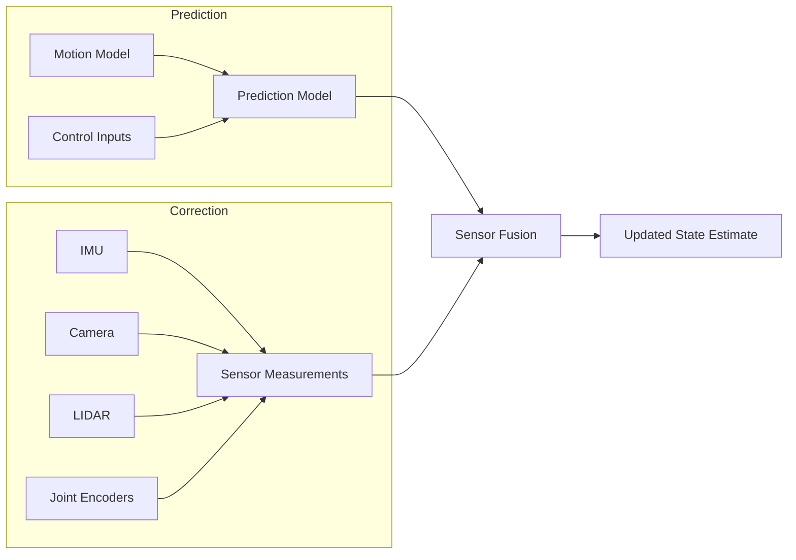

# Chapter 3: State Estimation and Localization

Understanding where a robot is and what it's doing is fundamental to Physical AI. This chapter explores the mathematical foundations and practical implementations of state estimation and localization - the processes by which robots determine their position, orientation, and internal state in the physical world. These capabilities are essential for any autonomous system to make intelligent decisions and interact meaningfully with its environment.

## What You'll Learn

By the end of this chapter, you'll be able to:
1. Implement Kalman filters for sensor fusion and state prediction
2. Apply particle filters for non-linear state estimation problems
3. Design and implement localization algorithms using various sensors
4. Understand and implement SLAM (Simultaneous Localization and Mapping)
5. Choose appropriate estimation techniques for different robotic applications
6. Handle uncertainty and noise in sensor measurements

## The State Estimation Problem

### Understanding Robot State

A robot's state represents all the information needed to describe its current configuration and condition. For a mobile humanoid robot, this typically includes:

- **Pose**: Position (x, y, z) and orientation (roll, pitch, yaw)
- **Velocity**: Linear and angular velocities
- **Joint States**: Angles and velocities of all joints
- **Sensor States**: Battery level, temperature, system health
- **Environment State**: Location of objects, map features

```python
# Robot State Representation
class RobotState:
    def __init__(self):
        # Pose (6DOF)
        self.position = np.array([0.0, 0.0, 0.0])  # x, y, z
        self.orientation = np.array([0.0, 0.0, 0.0])  # roll, pitch, yaw

        # Velocity (6DOF)
        self.linear_velocity = np.array([0.0, 0.0, 0.0])
        self.angular_velocity = np.array([0.0, 0.0, 0.0])

        # Joint states (for humanoid robots)
        self.joint_angles = np.zeros(25)  # 25 DOF humanoid
        self.joint_velocities = np.zeros(25)

        # System states
        self.battery_level = 100.0
        self.timestamp = time.time()

    def to_vector(self):
        """Convert state to vector form for filtering"""
        return np.concatenate([
            self.position,
            self.orientation,
            self.linear_velocity,
            self.angular_velocity,
            self.joint_angles,
            self.joint_velocities
        ])
```

### Sources of Uncertainty

Physical AI systems operate in an inherently uncertain world. Understanding and managing this uncertainty is key to robust state estimation:

1. **Sensor Noise**: All sensors have measurement noise and biases
2. **Actuator Noise**: Motors and joints have position and velocity errors
3. **Model Uncertainty**: Simplified models don't perfectly capture reality
4. **Environmental Factors**: Slipping, uneven terrain, dynamic obstacles

### The Estimation Framework

State estimation combines three key components:



## Kalman Filters

### The Linear Kalman Filter

The Kalman filter is the cornerstone of state estimation in robotics. It provides an optimal recursive solution to the linear filtering problem.

```python
import numpy as np

class KalmanFilter:
    def __init__(self, state_dim, measurement_dim):
        # State dimensions
        self.n = state_dim
        self.m = measurement_dim

        # State estimate and covariance
        self.x = np.zeros(state_dim)  # State vector
        self.P = np.eye(state_dim)     # Covariance matrix

        # Process model
        self.F = np.eye(state_dim)     # State transition matrix
        self.Q = np.eye(state_dim) * 0.01  # Process noise covariance

        # Measurement model
        self.H = np.zeros((measurement_dim, state_dim))  # Measurement matrix
        self.R = np.eye(measurement_dim) * 0.1          # Measurement noise covariance

    def predict(self, u=None):
        """Prediction step"""
        # Predict state: x_k = F * x_{k-1} + B * u
        if u is not None:
            self.x = self.F @ self.x + u
        else:
            self.x = self.F @ self.x

        # Predict covariance: P_k = F * P_{k-1} * F^T + Q
        self.P = self.F @ self.P @ self.F.T + self.Q

    def update(self, z):
        """Correction step"""
        # Innovation (measurement residual)
        y = z - self.H @ self.x

        # Innovation covariance
        S = self.H @ self.P @ self.H.T + self.R

        # Kalman gain
        K = self.P @ self.H.T @ np.linalg.inv(S)

        # Updated state estimate
        self.x = self.x + K @ y

        # Updated covariance
        I = np.eye(self.n)
        self.P = (I - K @ self.H) @ self.P

        return self.x.copy()
```

### Extended Kalman Filter (EKF)

For non-linear systems, we use the Extended Kalman Filter which linearizes around the current estimate:

```python
class ExtendedKalmanFilter(KalmanFilter):
    def __init__(self, state_dim, measurement_dim):
        super().__init__(state_dim, measurement_dim)

    def predict(self, u=None, dt=0.1):
        """Non-linear prediction step"""
        # Non-linear state transition function f(x, u)
        def state_transition(x, u):
            # Example: 2D robot with position and velocity
            theta = x[2]  # heading
            x_new = x.copy()
            x_new[0] += x[3] * np.cos(theta) * dt  # x position
            x_new[1] += x[3] * np.sin(theta) * dt  # y position
            x_new[2] += x[4] * dt  # heading
            # Velocity states remain (or update based on control)
            return x_new

        # Predict state
        self.x = state_transition(self.x, u if u is not None else 0)

        # Linearize for covariance prediction
        # Compute Jacobian of state transition function
        F_jacobian = self.compute_jacobian(self.x, u, dt)
        self.P = F_jacobian @ self.P @ F_jacobian.T + self.Q

    def compute_jacobian(self, x, u, dt):
        """Compute Jacobian matrix of state transition"""
        F = np.eye(self.n)
        theta = x[2]
        v = x[3]

        # Partial derivatives for x, y position
        F[0, 2] = -v * np.sin(theta) * dt  # ∂x/∂θ
        F[0, 3] = np.cos(theta) * dt      # ∂x/∂v
        F[1, 2] = v * np.cos(theta) * dt   # ∂y/∂θ
        F[1, 3] = np.sin(theta) * dt      # ∂y/∂v

        return F
```

### Application: Robot Localization

```python
class RobotLocalizationEKF:
    def __init__(self):
        # State: [x, y, theta, vx, vy, vtheta] (6DOF)
        self.ekf = ExtendedKalmanFilter(6, 3)

        # Measurement models
        self.setup_gps_measurement_model()
        self.setup_imu_measurement_model()
        self.setup_odometry_measurement_model()

    def setup_gps_measurement_model(self):
        """GPS measures x, y position"""
        self.ekf.H_gps = np.array([
            [1, 0, 0, 0, 0, 0],  # x
            [0, 1, 0, 0, 0, 0],  # y
            [0, 0, 1, 0, 0, 0]   # theta (from GPS heading if available)
        ])
        self.ekf.R_gps = np.diag([2.0, 2.0, 0.1])  # GPS noise

    def setup_imu_measurement_model(self):
        """IMU measures angular velocity and acceleration"""
        self.ekf.H_imu = np.array([
            [0, 0, 0, 0, 0, 1],  # angular velocity
            # Add acceleration measurements if needed
        ])
        self.ekf.R_imu = np.diag([0.05])

    def update_with_gps(self, gps_measurement):
        """Incorporate GPS measurement"""
        self.ekf.H = self.ekf.H_gps
        self.ekf.R = self.ekf.R_gps
        return self.ekf.update(gps_measurement)

    def update_with_imu(self, imu_measurement):
        """Incorporate IMU measurement"""
        self.ekf.H = self.ekf.H_imu
        self.ekf.R = self.ekf.R_imu
        return self.ekf.update(imu_measurement)
```

## Particle Filters

### Monte Carlo Localization

Particle filters represent the state probability distribution using a set of random samples (particles). They excel at handling non-linearities and multi-modal distributions.

```python
import numpy as np
import matplotlib.pyplot as plt

class ParticleFilter:
    def __init__(self, num_particles, state_dim, motion_model, measurement_model):
        self.num_particles = num_particles
        self.state_dim = state_dim

        # Initialize particles randomly
        self.particles = np.random.randn(num_particles, state_dim)
        self.weights = np.ones(num_particles) / num_particles

        # Models
        self.motion_model = motion_model
        self.measurement_model = measurement_model

    def predict(self, control_input, dt):
        """Move particles according to motion model"""
        for i in range(self.num_particles):
            # Add noise to simulate process uncertainty
            noise = np.random.randn(self.state_dim) * 0.1
            self.particles[i] = self.motion_model(
                self.particles[i],
                control_input,
                dt
            ) + noise

    def update_weights(self, measurement):
        """Update particle weights based on measurement"""
        for i in range(self.num_particles):
            # Calculate likelihood of measurement given particle state
            likelihood = self.measurement_model(self.particles[i], measurement)
            self.weights[i] *= likelihood

        # Normalize weights
        self.weights /= np.sum(self.weights)

    def resample(self):
        """Resample particles based on weights (systematic resampling)"""
        # Effective number of particles
        neff = 1.0 / np.sum(self.weights**2)

        if neff < self.num_particles / 2:
            # Systematic resampling
            cumulative_sum = np.cumsum(self.weights)
            cumulative_sum[-1] = 1.0  # Ensure sum is exactly 1

            positions = (np.arange(self.num_particles) + np.random.random()) / self.num_particles
            new_particles = np.zeros_like(self.particles)

            i, j = 0, 0
            for position in positions:
                while position > cumulative_sum[i]:
                    i += 1
                new_particles[j] = self.particles[i]
                j += 1

            self.particles = new_particles
            self.weights = np.ones(self.num_particles) / self.num_particles

    def estimate_state(self):
        """Estimate state from particles (weighted mean)"""
        return np.average(self.particles, weights=self.weights, axis=0)
```

### MCL for Robot Localization

```python
class MonteCarloLocalization:
    def __init__(self, map_data, num_particles=1000):
        self.map = map_data
        self.particle_filter = ParticleFilter(
            num_particles=num_particles,
            state_dim=3,  # [x, y, theta]
            motion_model=self.motion_model,
            measurement_model=self.sensor_model
        )

    def motion_model(self, state, control, dt):
        """Simple odometry-based motion model"""
        x, y, theta = state
        v, omega = control  # Linear and angular velocity

        # Add noise to simulate slip and uncertainty
        v_noise = np.random.normal(0, 0.1)
        omega_noise = np.random.normal(0, 0.05)

        # Update position
        x_new = x + (v + v_noise) * np.cos(theta) * dt
        y_new = y + (v + v_noise) * np.sin(theta) * dt
        theta_new = theta + (omega + omega_noise) * dt

        # Normalize angle
        theta_new = np.arctan2(np.sin(theta_new), np.cos(theta_new))

        return np.array([x_new, y_new, theta_new])

    def sensor_model(self, state, measurement):
        """Likelihood of sensor measurement given state"""
        # Get expected sensor readings at this state
        expected_scan = self.simulate_lidar_scan(state)

        # Compare with actual measurement
        error = np.linalg.norm(expected_scan - measurement)

        # Gaussian likelihood
        likelihood = np.exp(-error**2 / (2 * 0.5**2))
        return likelihood

    def simulate_lidar_scan(self, state):
        """Simulate what LiDAR would see at given state"""
        # Simplified: return distances to walls at various angles
        angles = np.linspace(0, 2*np.pi, 360, endpoint=False)
        distances = []

        x, y, theta = state

        for angle in angles:
            global_angle = theta + angle
            # Ray casting to find nearest obstacle
            dist = self.ray_cast(x, y, global_angle)
            distances.append(dist)

        return np.array(distances)
```

## SLAM (Simultaneous Localization and Mapping)

### EKF-SLAM

EKF-SLAM simultaneously estimates robot pose and landmark positions using an Extended Kalman Filter.

```python
class EKFSLAM:
    def __init__(self, initial_state, num_landmarks=10):
        # State vector: [robot_pose, landmark1, landmark2, ...]
        self.robot_state_dim = 3  # x, y, theta
        self.landmark_dim = 2     # Each landmark has x, y
        self.state_dim = self.robot_state_dim + num_landmarks * self.landmark_dim

        # Initialize state and covariance
        self.state = np.zeros(self.state_dim)
        self.state[:self.robot_state_dim] = initial_state

        # Covariance matrix
        self.P = np.eye(self.state_dim) * 0.1
        self.P[:self.robot_state_dim, :self.robot_state_dim] = np.eye(3) * 1.0

        # Process and measurement noise
        self.Q = np.eye(self.robot_state_dim) * 0.01
        self.R = np.eye(2) * 0.1  # 2D landmark measurement

        # Landmark management
        self.num_known_landmarks = 0
        self.landmark_index = {}

    def predict(self, control, dt):
        """Predict robot motion"""
        # Extract robot pose
        x, y, theta = self.state[:3]

        # Motion model (differential drive)
        v, omega = control
        if abs(omega) < 1e-5:
            # Straight motion
            self.state[0] += v * np.cos(theta) * dt
            self.state[1] += v * np.sin(theta) * dt
        else:
            # Circular motion
            radius = v / omega
            self.state[0] += radius * (np.sin(theta + omega * dt) - np.sin(theta))
            self.state[1] += radius * (-np.cos(theta + omega * dt) + np.cos(theta))
            self.state[2] += omega * dt

        # Update covariance (linearized)
        F = np.eye(self.state_dim)
        F[0, 2] = -v * np.sin(theta) * dt
        F[1, 2] = v * np.cos(theta) * dt

        Q_extended = np.zeros((self.state_dim, self.state_dim))
        Q_extended[:3, :3] = self.Q

        self.P = F @ self.P @ F.T + Q_extended

    def update_landmark(self, measurement, landmark_id):
        """Update with landmark observation"""
        if landmark_id not in self.landmark_index:
            # New landmark - initialize it
            self.initialize_landmark(measurement, landmark_id)
            return

        # Get landmark index in state vector
        idx = self.landmark_index[landmark_id]

        # Expected measurement (range and bearing)
        rx = self.state[idx]
        ry = self.state[idx + 1]
        robot_x = self.state[0]
        robot_y = self.state[1]
        robot_theta = self.state[2]

        # Distance to landmark
        dx = rx - robot_x
        dy = ry - robot_y
        range_est = np.sqrt(dx**2 + dy**2)
        bearing_est = np.arctan2(dy, dx) - robot_theta

        # Normalize bearing
        bearing_est = np.arctan2(np.sin(bearing_est), np.cos(bearing_est))

        # Measurement vector
        z_pred = np.array([range_est, bearing_est])

        # Innovation
        y = measurement - z_pred
        y[1] = np.arctan2(np.sin(y[1]), np.cos(y[1]))  # Normalize

        # Measurement Jacobian
        H = np.zeros((2, self.state_dim))

        # Partial derivatives
        H[0, 0] = -dx / range_est
        H[0, 1] = -dy / range_est
        H[0, idx] = dx / range_est
        H[0, idx + 1] = dy / range_est

        H[1, 0] = dy / range_est**2
        H[1, 1] = -dx / range_est**2
        H[1, 2] = -1
        H[1, idx] = -dy / range_est**2
        H[1, idx + 1] = dx / range_est**2

        # Kalman update
        S = H @ self.P @ H.T + self.R
        K = self.P @ H.T @ np.linalg.inv(S)

        self.state = self.state + K @ y
        self.P = (np.eye(self.state_dim) - K @ H) @ self.P

    def initialize_landmark(self, measurement, landmark_id):
        """Initialize a new landmark in the state vector"""
        # Convert measurement to global coordinates
        range_obs, bearing_obs = measurement
        robot_x, robot_y, robot_theta = self.state[:3]

        # Global landmark position
        lx = robot_x + range_obs * np.cos(bearing_obs + robot_theta)
        ly = robot_y + range_obs * np.sin(bearing_obs + robot_theta)

        # Add to state vector
        idx = self.robot_state_dim + self.num_known_landmarks * self.landmark_dim
        self.state[idx] = lx
        self.state[idx + 1] = ly

        # Store mapping
        self.landmark_index[landmark_id] = idx
        self.num_known_landmarks += 1
```

## Advanced Topics

### Factor Graphs and Optimization

Modern SLAM systems often use factor graphs for optimization:

```python
# Pseudocode for factor graph SLAM
class FactorGraphSLAM:
    def __init__(self):
        self.variables = {}  # Robot poses and landmarks
        self.factors = []    # Measurements and constraints

    def add_odometry_factor(self, pose_id1, pose_id2, odometry):
        """Add odometry constraint between poses"""
        factor = OdometryFactor(pose_id1, pose_id2, odometry)
        self.factors.append(factor)

    def add_landmark_factor(self, pose_id, landmark_id, measurement):
        """Add landmark observation constraint"""
        factor = LandmarkFactor(pose_id, landmark_id, measurement)
        self.factors.append(factor)

    def optimize(self):
        """Solve the optimization problem"""
        # Use non-linear least squares solver
        # (e.g., g2o, Ceres Solver, or iSAM2)
        solution = nonlinear_least_squares(self.variables, self.factors)
        return solution
```

### Multi-Robot State Estimation

```python
class MultiRobotStateEstimator:
    def __init__(self, robot_ids):
        self.robots = {rid: RobotStateEstimator() for rid in robot_ids}
        self.relative_poses = {}

    def update_relative_pose(self, robot1_id, robot2_id, relative_pose):
        """Update relative pose between robots"""
        self.relative_poses[(robot1_id, robot2_id)] = relative_pose

        # Fuse estimates to improve consistency
        self.fuse_multi_robot_estimates()

    def fuse_multi_robot_estimates(self):
        """Consistent estimation across multiple robots"""
        # Use distributed Kalman filtering or
        # Pose graph optimization
        pass
```

## Best Practices

1. **Sensor Calibration**: Always calibrate sensors before use
2. **Outlier Rejection**: Remove measurements that don't fit the model
3. **Adaptive Filtering**: Adjust process noise based on motion
4. **Validation**: Use multiple sensors for validation
5. **Computational Efficiency**: Consider real-time constraints

## Summary

State estimation and localization are fundamental to Physical AI systems:

- **Kalman filters** provide optimal linear estimation
- **Extended/Unscented Kalman filters** handle non-linearities
- **Particle filters** excel at multi-modal distributions
- **SLAM** simultaneously maps and localizes
- **Factor graphs** enable large-scale optimization

These techniques enable robots to understand their position and state in the world, forming the foundation for intelligent decision-making and autonomous behavior.

## Knowledge Check

1. Explain the difference between prediction and correction steps in a Kalman filter.
2. When would you use a particle filter instead of an EKF?
3. What are the key challenges in SLAM?
4. How does sensor fusion improve state estimation?
5. Implement a simple 1D Kalman filter for tracking position.