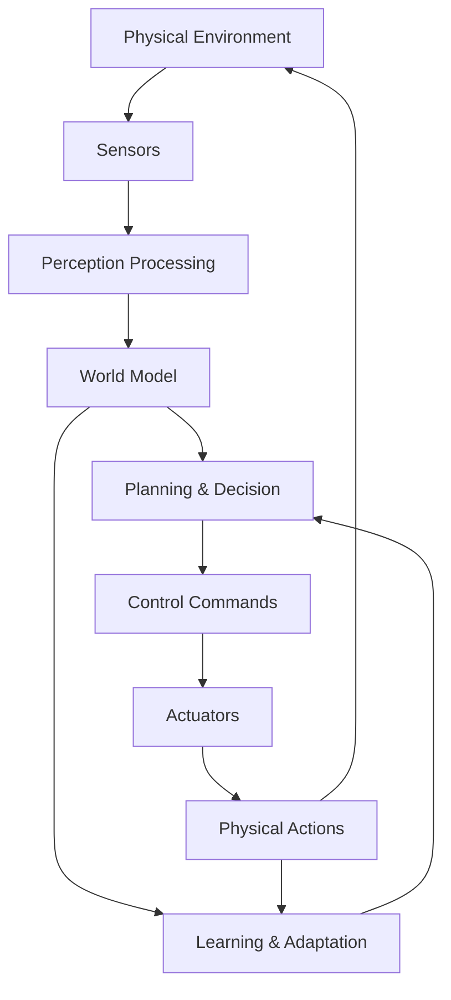

# Chapter 1: Introduction to Physical AI & Embodied Intelligence

The convergence of artificial intelligence and robotics has given birth to a revolutionary field: Physical AI. Unlike traditional AI that exists purely in digital realms, Physical AI embodies intelligence in physical form, enabling machines to perceive, reason, and act in the real world. This chapter introduces you to the fundamental concepts that bridge the gap between abstract algorithms and tangible robotic systems that can transform our world.

## What You'll Learn

By the end of this chapter, you'll be able to:
1. Define Physical AI and distinguish it from traditional AI systems
2. Explain the concept of embodiment and its critical role in intelligence
3. Trace the historical evolution of robotics from automation to autonomy
4. Identify the key components of modern robotic systems
5. Analyze the challenges and opportunities in Physical AI development
6. Design high-level architectures for embodied AI systems

## The Foundation: Understanding Physical AI

### Beyond Digital Intelligence

Physical AI represents a paradigm shift in artificial intelligence. While traditional AI systems process data and make decisions in abstract digital spaces, Physical AI extends intelligence into the physical world through robotic embodiment. This extension creates a feedback loop where physical interactions inform and refine intelligent behaviors.

The essence of Physical AI lies in its ability to:
- **Perceive** the environment through multimodal sensors
- **Process** sensory information to build understanding
- **Decide** on appropriate actions based on goals and constraints
- **Act** upon the physical world through motors and actuators
- **Learn** from the consequences of physical interactions

```python
# Conceptual model of Physical AI system
class PhysicalAISystem:
    def __init__(self):
        self.sensors = SensorSuite()      # Input from physical world
        self.perception = PerceptionModule()  # World understanding
        self.reasoning = PlanningEngine()  # Decision making
        self.actuators = ActuatorSystem()  # Physical action
        self.learning = AdaptiveModule()   # Experience integration

    def perceive_act_think_cycle(self):
        # Continuous loop of interaction with world
        sensor_data = self.sensors.read_environment()
        world_model = self.perception.process(sensor_data)
        action_plan = self.reasoning.plan(world_model)
        physical_action = self.actuators.execute(action_plan)
        learning_update = self.learning.update(sensor_data, action_plan, physical_action)
        return learning_update
```

### Embodiment: The Body as Cognition Platform

Embodiment is the cornerstone of Physical AI. It's not merely housing an AI system in a robotic body—it's the recognition that physical form fundamentally shapes intelligence. The embodiment hypothesis suggests that intelligence emerges from the dynamic interaction between brain, body, and environment.

**Key Principles of Embodiment:**
- **Morphological Computation**: The body itself performs computational tasks
- **Sensorimotor Coupling**: Actions influence perception and vice versa
- **Environmental Affordances**: The environment shapes possible behaviors
- **Developmental Learning**: Complexity emerges through interaction over time

The choice of embodiment dramatically impacts the AI's capabilities:
- **Humanoid forms** excel in human environments
- **Wheeled platforms** provide stability and efficiency
- **Quadrupeds** navigate complex terrain
- **Aerial systems** offer three-dimensional freedom

### Historical Evolution: From Automation to Autonomy

The journey to modern Physical AI spans decades of innovation:

**1960s-1970s: Industrial Automation**
- Unimate, the first industrial robot (1961)
- Fixed programming, repetitive tasks
- No environmental awareness

**1980s-1990s: Early Mobile Robotics**
- Shakey the robot at SRI (1966-1972)
- Introduction of sensing capabilities
- Basic planning and navigation

**2000s: Sensing and Cognition**
- Mars rovers demonstrate autonomous exploration
- Computer vision advances enable visual perception
- Machine learning integration begins

**2010s: Deep Learning Revolution**
- Deep neural networks transform perception
- End-to-end learning becomes viable
- Simulation accelerates development

**2020s: Foundation Models and Embodiment**
- Large language models meet robotics
- Foundation models for robot control emerge
- Humanoid robotics renaissance

## Modern Robotic System Architecture

### Core Components

Every Physical AI system consists of five essential components working in concert:

1. **Perception System**
   - Sensors (visual, depth, inertial, tactile)
   - Data fusion and processing
   - Environment modeling

2. **Cognitive Architecture**
   - World representation
   - Planning and decision-making
   - Learning and adaptation

3. **Control System**
   - Motion planning
   - Motor control
   - Real-time execution

4. **Communication Interface**
   - Human-robot interaction
   - Multi-robot coordination
   - Cloud connectivity

5. **Safety and Ethics**
   - Collision avoidance
   - Emergency protocols
   - Ethical decision frameworks

```yaml
# Physical AI System Configuration
system_architecture:
  perception:
    visual_sensors:
      - type: RGB_camera
        resolution: "1920x1080"
        fps: 30
      - type: depth_camera
        range: "0.1-10m"
        accuracy: "±2cm"
    lidar:
      range: "100m"
      angular_resolution: 0.25°
    imu:
      gyro_range: "±2000°/s"
      accel_range: "±16g"

  cognition:
    perception_module: "Transformer-based"
    planning_algorithm: "Monte Carlo Tree Search"
    learning_framework: "Deep Reinforcement Learning"

  control:
    motion_planner: "RRT*"
    controller: "Model Predictive Control"
    update_rate: "1kHz"
```

### Information Flow in Embodied Systems

The flow of information through a Physical AI system follows a continuous loop:



## Challenges in Physical AI Development

### The Simulation-to-Reality Gap

One of the most significant challenges in Physical AI is bridging the gap between simulation and reality. Systems trained entirely in simulation often fail when deployed in the real world due to:

- **Sensor Noise**: Real sensors introduce imperfections
- **Actuator Dynamics**: Physical motors have delays and constraints
- **Environmental Variability**: Real world is unpredictable
- **Physical Constraints**: Energy, weight, and durability limitations

**Mitigation Strategies:**
- Domain randomization in training
- Progressive transfer learning
- Real-world fine-tuning
- Robust control architectures

### Real-Time Constraints

Physical AI systems must operate within strict timing constraints:
- Perception typically requires 10-30 Hz updates
- Control loops run at 100-1000 Hz
- Planning decisions in milliseconds for dynamic environments

These constraints demand efficient algorithms and optimized implementations.

### Safety and Reliability

Unlike purely digital AI, Physical AI systems can cause physical harm:
- Collision avoidance must be guaranteed
- Emergency stop mechanisms are essential
- Predictable behavior in edge cases
- Graceful degradation under failures

## Applications and Impact

### Transformative Applications

Physical AI is revolutionizing numerous domains:

**Healthcare**
- Surgical robots with enhanced precision
- Elderly care assistance systems
- Rehabilitation exoskeletons
- Diagnostic automation

**Manufacturing**
- Flexible production lines
- Quality inspection systems
- Collaborative assembly
- Predictive maintenance

**Transportation**
- Autonomous vehicles
- Delivery drones
- Traffic management systems
- Infrastructure inspection

**Exploration**
- Space exploration rovers
- Deep-sea research vehicles
- Hazardous environment navigation
- Planetary sample collection

### Economic and Social Impact

The rise of Physical AI presents both opportunities and challenges:

**Opportunities:**
- Increased productivity and efficiency
- Reduced human exposure to dangerous tasks
- New capabilities in exploration and discovery
- Enhanced quality of life through assistance

**Challenges:**
- Workforce displacement and reskilling needs
- Economic inequality concerns
- Privacy and surveillance issues
- Ethical decision-making frameworks

## Future Directions

### Emerging Trends

Several trends are shaping the future of Physical AI:

**Foundation Models for Robotics**
- Large-scale pre-training on diverse robotic data
- Transfer learning across platforms
- Zero-shot task adaptation
- Multimodal understanding

**Human-Robot Collaboration**
- Natural language interaction
- Intention prediction
- Collaborative task planning
- Safety in shared spaces

**Swarm Intelligence**
- Decentralized coordination
- Emergent collective behaviors
- Scalable systems
- Resilient architectures

**Edge Computing Integration**
- On-device processing
- Reduced latency
- Privacy preservation
- Offline operation capabilities

### Research Frontiers

Active research areas pushing the boundaries of Physical AI:

- **Embodied Cognition**: Understanding how physical form shapes intelligence
- **Lifelong Learning**: Continuous adaptation without catastrophic forgetting
- **Energy Efficiency**: Sustainable AI for battery-powered systems
- **Explainability**: Making robotic decisions understandable to humans
- **Creativity**: Enabling robots to solve novel problems

## Knowledge Check

### Conceptual Questions

1. **Define Physical AI** in your own words and explain how it differs from traditional AI systems.

2. **Explain the embodiment hypothesis** and provide three examples of how physical form influences intelligence.

3. **Describe the perceive-act-think cycle** and explain why continuous feedback is essential for embodied intelligence.

4. **Identify and explain** the five core components of a modern Physical AI system.

5. **Compare and contrast** simulation-based training with real-world learning in robotics.

### Practical Application

6. **Design a simple Physical AI system** for a warehouse robot. Include:
   - Required sensors and their specifications
   - Cognitive architecture components
   - Control system requirements
   - Safety considerations

7. **Create a flowchart** showing the information flow from environmental perception to action execution in a self-driving car.

8. **Analyze a real-world robot** (e.g., Boston Dynamics Spot, NASA Mars rover) and identify its Physical AI components.

### Critical Thinking

9. **Debate the ethical implications** of deploying Physical AI systems in public spaces. What safeguards are necessary?

10. **Predict how advances in foundation models** might transform Physical AI development over the next five years.

## Summary

**Key Takeaways:**
- Physical AI extends intelligence beyond digital realms into physical embodiment
- Embodiment fundamentally shapes intelligence through sensorimotor coupling
- Modern Physical AI systems integrate perception, cognition, control, communication, and safety
- The simulation-to-reality gap remains a significant challenge requiring robust solutions
- Physical AI is transforming numerous industries while presenting new ethical considerations

**Next Steps:** In the next chapter, we'll explore the sensors and perception systems that serve as the eyes and ears of Physical AI, understanding how robots transform raw sensory data into meaningful understanding of their environment.

## Further Reading

- [Robotics: Modelling, Planning and Control](https://link.springer.com/book/10.1007/978-1-84628-642-1) by Siciliano, Khatib, et al.
- [Principles of Robot Motion: Theory, Algorithms, and Implementations](https://mitpress.mit.edu/9780262033275/principles-of-robot-motion/) by Howie Choset et al.
- [Embodied Cognition: A New Guide to Thinking and Learning](https://www.routledge.com/Embodied-Cognition-A-New-Guide-to-Thinking-and-Learning/Maher/p/book/9781138492623) by Shaun Gallagher
- [Robotics State of the Art 2023](https://ieeexplore.ieee.org/document/10140015) - IEEE Annual Report