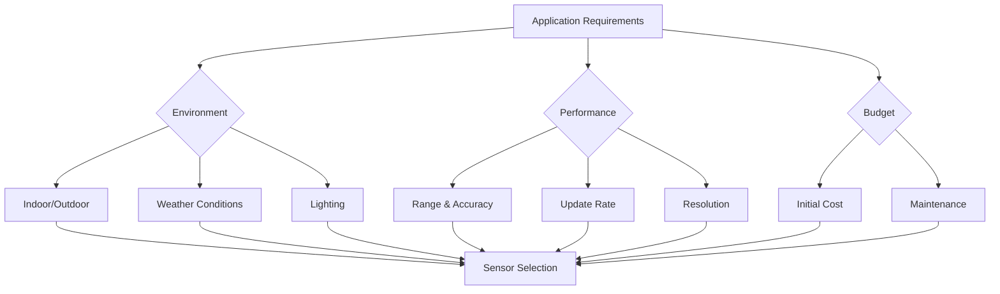

# Chapter 2: Sensors & Perception (LiDAR, Cameras, IMUs)

The ability to perceive and understand the environment is fundamental to Physical AI. Robots must transform raw sensory data into meaningful representations of the world to make intelligent decisions. This chapter explores the critical sensors that serve as robotic senses and the sophisticated algorithms that process their data into actionable intelligence. From the precise distance measurements of LiDAR to the rich contextual understanding from computer vision, we'll examine how modern robots perceive their world with increasing sophistication.

## What You'll Learn

By the end of this chapter, you'll be able to:
1. Compare different sensor modalities and their applications
2. Implement basic LiDAR processing algorithms for obstacle detection
3. Design computer vision pipelines for object recognition and tracking
4. Fuse sensor data using Kalman filters for robust perception
5. Calibrate and synchronize multiple sensor systems
6. Select appropriate sensors for specific robotic applications

## The Sensor Ecosystem

### Sensor Modalities Overview

Robotic perception relies on multiple sensor types, each providing unique information about the environment:

**Visual Sensors**
- RGB cameras capture rich color and texture information
- Depth cameras provide 3D structure alongside visual data
- Thermal cameras detect heat signatures for night vision
- Event cameras offer microsecond temporal resolution

**Range Finding Sensors**
- LiDAR provides precise 3D point clouds
- Radar penetrates adverse weather conditions
- Ultrasonic sensors offer close-range obstacle detection
- Time-of-flight cameras capture depth at high frame rates

**Position and Orientation Sensors**
- IMUs measure linear acceleration and angular velocity
- GPS provides global positioning
- Magnetometers detect magnetic fields for heading
- Barometric pressure sensors estimate altitude

```python
class SensorSuite:
    """Multi-modal sensor configuration for autonomous robots"""
    def __init__(self):
        # Visual sensors
        self.rgb_camera = RGBCamera(resolution=(1920, 1080), fps=30)
        self.depth_camera = DepthCamera(range=(0.5, 10.0), fps=30)
        self.thermal_camera = ThermalCamera(fov=60)

        # Range sensors
        self.lidar = LiDAR3D(range=100, angular_resolution=0.25)
        self.radar = RadarSensor(range=200, velocity_accuracy=0.1)

        # Position sensors
        self.imu = IMU(gyro_range=2000, accel_range=16)
        self.gps = GPSReceiver(accuracy=1.0, update_rate=10)

    def get_sensor_fusion_data(self):
        """Combine data from all sensors for comprehensive perception"""
        return {
            'visual': self._process_visual_data(),
            'range': self._process_range_data(),
            'position': self._process_position_data(),
            'timestamp': time.time()
        }
```

### Sensor Selection Criteria

Choosing the right sensors involves balancing multiple factors:

**Environmental Conditions**
- Indoor/outdoor operation
- Lighting conditions
- Weather resistance
- Temperature ranges

**Performance Requirements**
- Detection range and accuracy
- Update rate and latency
- Resolution and field of view
- Power consumption

**Cost and Integration**
- Budget constraints
- Size and weight limitations
- Interface compatibility
- Maintenance requirements



## LiDAR: Precision 3D Perception

### LiDAR Fundamentals

Light Detection and Ranging (LiDAR) sensors measure distances by emitting laser pulses and measuring their return time. This creates precise 3D point clouds representing the environment's structure.

**Key LiDAR Technologies:**
- **Mechanical Scanning**: Rotating mirrors for 360° coverage
- **Solid State**: No moving parts, higher reliability
- **Flash LiDAR**: Single-pulse 3D imaging
- **MEMS-based**: Micro-electromechanical scanning systems

```python
class LiDARProcessor:
    """Process LiDAR point clouds for obstacle detection and navigation"""

    def __init__(self, voxel_size=0.1, ground_threshold=-0.5):
        self.voxel_size = voxel_size
        self.ground_threshold = ground_threshold
        self.kd_tree = None

    def preprocess_pointcloud(self, points):
        """Apply filtering and preprocessing to raw point cloud"""
        # Remove noise points
        filtered = self.statistical_outlier_removal(points, nb_neighbors=20, std_ratio=2.0)

        # Downsample for computational efficiency
        voxel_downsampled = self.voxel_grid_filter(filtered, self.voxel_size)

        return voxel_downsampled

    def segment_ground_plane(self, points):
        """Separate ground points from obstacles using RANSAC"""
        plane_model, inliers = self.ransac_plane_segmentation(
            points,
            distance_threshold=0.01,
            ransac_n=3,
            num_iterations=1000
        )

        ground_points = points[inliers]
        obstacle_points = points[~inliers]

        return ground_points, obstacle_points

    def cluster_obstacles(self, points):
        """Group nearby points into individual obstacles"""
        # Build KD-tree for efficient neighbor search
        self.kd_tree = KDTree(points)

        # DBSCAN clustering based on distance
        clusters = self.dbscan_clustering(
            points,
            eps=0.5,  # 50cm clustering distance
            min_samples=10
        )

        return clusters

    def extract_features(self, clusters):
        """Extract geometric features from obstacle clusters"""
        features = []
        for cluster in clusters:
            if len(cluster) < 10:  # Ignore tiny clusters
                continue

            # Calculate cluster properties
            centroid = np.mean(cluster, axis=0)
            dimensions = self.calculate_bounding_box(cluster)
            volume = np.prod(dimensions)

            features.append({
                'centroid': centroid,
                'dimensions': dimensions,
                'volume': volume,
                'point_count': len(cluster)
            })

        return features
```

### Advanced LiDAR Applications

**Simultaneous Localization and Mapping (SLAM)**
LiDAR enables robots to build maps while simultaneously localizing within them:

```python
class LiDARSLAM:
    """LiDAR-based SLAM implementation"""

    def __init__(self, map_resolution=0.1):
        self.occupancy_grid = OccupancyGrid(resolution=map_resolution)
        self.pose_graph = PoseGraph()
        self.current_pose = Transform()

    def update(self, pointcloud, imu_data, wheel_odometry):
        """Update SLAM with new sensor data"""

        # Predict motion using IMU and wheel odometry
        predicted_pose = self.motion_model.predict(
            self.current_pose,
            imu_data,
            wheel_odometry
        )

        # Correct using scan matching with previous pointcloud
        corrected_pose, transform = self.scan_matcher.match(
            pointcloud,
            self.previous_pointcloud,
            predicted_pose
        )

        # Update pose graph
        self.pose_graph.add_node(corrected_pose)
        if len(self.pose_graph.nodes) > 1:
            self.pose_graph.add_edge(
                len(self.pose_graph.nodes) - 2,
                len(self.pose_grid.nodes) - 1,
                transform
            )

        # Update occupancy map
        self.occupancy_grid.update_map(pointcloud, corrected_pose)

        # Store for next iteration
        self.current_pose = corrected_pose
        self.previous_pointcloud = pointcloud

        return corrected_pose
```

## Computer Vision for Robotics

### Vision Processing Pipeline

Computer vision transforms raw images into actionable information through a series of processing stages:

```python
class VisionProcessor:
    """Complete computer vision pipeline for robotics"""

    def __init__(self, model_path=None):
        # Load pre-trained models
        self.object_detector = self.load_object_detector(model_path)
        self.segmentation_model = self.load_segmentation_model(model_path)

        # Camera calibration parameters
        self.camera_matrix = np.array([[960.0, 0.0, 640.0],
                                      [0.0, 960.0, 360.0],
                                      [0.0, 0.0, 1.0]])
        self.distortion_coeffs = np.zeros(5)

    def process_frame(self, image):
        """Complete vision processing pipeline"""
        # 1. Preprocessing
        corrected_image = self.undistort_image(image)

        # 2. Object detection
        detections = self.detect_objects(corrected_image)

        # 3. Semantic segmentation
        segmentation = self.segment_image(corrected_image)

        # 4. Feature tracking
        optical_flow = self.track_features(corrected_image)

        # 5. Depth estimation (if stereo or depth camera)
        if self.is_stereo_camera:
            depth_map = self.compute_disparity_map(corrected_image)
        else:
            depth_map = self.estimate_depth(corrected_image)

        return {
            'objects': detections,
            'segmentation': segmentation,
            'flow': optical_flow,
            'depth': depth_map
        }

    def detect_objects(self, image):
        """YOLO-based object detection optimized for robotics"""
        # Resize image for network input
        input_tensor = self.preprocess_image(image, input_size=(640, 640))

        # Run inference
        with torch.no_grad():
            predictions = self.object_detector(input_tensor)

        # Post-process detections
        detections = self.nms_postprocess(
            predictions,
            confidence_threshold=0.5,
            iou_threshold=0.4
        )

        # Convert to 3D using depth information
        if self.depth_available:
            detections_3d = self.project_to_3d(detections, self.depth_map)
        else:
            detections_3d = None

        return detections_3d

    def track_features(self, image):
        """Optical flow tracking for motion estimation"""
        # Shi-Tomasi corner detection
        corners = cv2.goodFeaturesToTrack(
            cv2.cvtColor(image, cv2.COLOR_BGR2GRAY),
            maxCorners=1000,
            qualityLevel=0.01,
            minDistance=7
        )

        if corners is None:
            return None

        # Lucas-Kanade optical flow
        next_corners, status, error = cv2.calcOpticalFlowPyrLK(
            self.prev_gray,
            cv2.cvtColor(image, cv2.COLOR_BGR2GRAY),
            corners,
            None,
            winSize=(15, 15),
            maxLevel=2,
            criteria=(cv2.TERM_CRITERIA_EPS | cv2.TERM_CRITERIA_COUNT, 10, 0.03)
        )

        # Filter good tracks
        good_prev = corners[status == 1]
        good_next = next_corners[status == 1]

        self.prev_gray = cv2.cvtColor(image, cv2.COLOR_BGR2GRAY)

        return good_prev, good_next
```

### Advanced Vision Techniques

**Multi-Object Tracking**
Track multiple objects across frames using deep association:

```python
class MultiObjectTracker:
    """Deep learning-based multi-object tracking"""

    def __init__(self):
        self.tracker = DeepSORT(max_age=30, n_init=3)
        self.track_history = {}

    def update(self, detections, image):
        """Update tracker with new detections"""

        # Extract appearance features
        features = self.extract_appearance_features(detections, image)

        # Update tracks with Hungarian algorithm assignment
        tracks = self.tracker.update(detections, features)

        # Maintain track history
        for track in tracks:
            if track.track_id not in self.track_history:
                self.track_history[track.track_id] = []

            self.track_history[track.track_id].append({
                'bbox': track.to_tlwh(),
                'confidence': track.confidence,
                'feature': track.feature,
                'timestamp': time.time()
            })

        return tracks

    def predict_trajectory(self, track_id, horizon=1.0):
        """Predict future position of tracked object"""
        if track_id not in self.track_history:
            return None

        history = self.track_history[track_id]
        if len(history) < 3:
            return None

        # Extract recent positions
        recent_positions = [h['bbox'][:2] for h in history[-5:]]

        # Fit Kalman filter and predict
        kf = KalmanFilter(dim_x=4, dim_z=2)
        kf.F = np.array([[1, 0, 1, 0],
                        [0, 1, 0, 1],
                        [0, 0, 1, 0],
                        [0, 0, 0, 1]])

        for pos in recent_positions:
            kf.predict()
            kf.update(pos)

        # Predict future position
        future_positions = []
        for _ in range(int(horizon * 10)):  # 10Hz predictions
            future_positions.append(kf.predict()[:2])

        return future_positions
```

## Inertial Measurement Units (IMUs)

### IMU Fundamentals and Processing

IMUs provide essential motion data through accelerometers and gyroscopes:

```python
class IMUProcessor:
    """Advanced IMU processing with sensor fusion"""

    def __init__(self, sample_rate=100):
        self.sample_rate = sample_rate
        self.dt = 1.0 / sample_rate

        # Complementary filter for orientation
        self.alpha = 0.98  # Gyro weight
        self.orientation = Quaternion()

        # Kalman filter for velocity/position
        self.kf = self.init_kalman_filter()

        # Bias estimation
        self.accel_bias = np.zeros(3)
        self.gyro_bias = np.zeros(3)
        self.bias_estimator = BiasEstimator()

    def process_imu_data(self, accel, gyro, magnetometer=None):
        """Process raw IMU data with filtering and integration"""

        # Remove estimated biases
        accel_corrected = accel - self.accel_bias
        gyro_corrected = gyro - self.gyro_bias

        # Update orientation using complementary filter
        self.orientation = self.complementary_filter_update(
            self.orientation,
            gyro_corrected,
            accel_corrected,
            self.dt
        )

        # Transform acceleration to world frame
        accel_world = self.orientation.rotate(accel_corrected)

        # Remove gravity
        accel_world[2] += 9.81

        # Kalman filter update for velocity and position
        self.kf.predict()
        self.kf.update(accel_world)

        # Estimate and update biases
        if self.bias_estimator.is_static(accel_corrected):
            self.accel_bias = self.bias_estimator.update_accel_bias(accel_corrected)
            self.gyro_bias = self.bias_estimator.update_gyro_bias(gyro_corrected)

        state = self.kf.x

        return {
            'orientation': self.orientation,
            'velocity': state[3:6],
            'position': state[6:9],
            'accel_bias': self.accel_bias,
            'gyro_bias': self.gyro_bias
        }

    def complementary_filter_update(self, orientation, gyro, accel, dt):
        """Update orientation using complementary filter"""

        # Integrate gyroscope data
        gyro_quat = Quaternion.from_euler(gyro * dt)
        orientation = orientation * gyro_quat

        # Calculate gravity direction from accelerometer
        if np.linalg.norm(accel) > 0:
            accel_norm = accel / np.linalg.norm(accel)
            gravity_quat = Quaternion.from_two_vectors([0, 0, 1], accel_norm)

            # Blend gyroscope and accelerometer
            orientation = orientation.slerp(gravity_quat, 1 - self.alpha)

        return orientation.normalized()
```

## Sensor Fusion

### Kalman Filter Implementation

Sensor fusion combines multiple sensors to achieve more accurate and robust perception:

```python
class ExtendedKalmanFilter:
    """EKF for multi-sensor fusion"""

    def __init__(self):
        # State vector: [x, y, z, vx, vy, vz, ax, ay, az]
        self.state = np.zeros(9)
        self.covariance = np.eye(9) * 0.1

        # Process model
        self.F = np.eye(9)
        self.F[0:3, 3:6] = np.eye(3) * self.dt
        self.F[3:6, 6:9] = np.eye(3) * self.dt

        # Process noise
        self.Q = np.diag([0.01, 0.01, 0.01,    # position noise
                         0.1, 0.1, 0.1,        # velocity noise
                         1.0, 1.0, 1.0])        # acceleration noise

    def predict(self):
        """Predict next state"""
        self.state = self.F @ self.state
        self.covariance = self.F @ self.covariance @ self.F.T + self.Q

    def update_lidar(self, pointcloud):
        """Update with LiDAR measurement"""
        # Extract features from pointcloud
        features = self.extract_lidar_features(pointcloud)

        # Measurement function (non-linear)
        H_lidar = self.lidar_measurement_jacobian()

        # Innovation
        z_pred = self.lidar_measurement_function()
        innovation = features - z_pred

        # Measurement noise
        R_lidar = np.diag([0.05, 0.05, 0.05])  # LiDAR noise

        # Kalman gain
        S = H_lidar @ self.covariance @ H_lidar.T + R_lidar
        K = self.covariance @ H_lidar.T @ np.linalg.inv(S)

        # Update
        self.state = self.state + K @ innovation
        self.covariance = (np.eye(len(self.state)) - K @ H_lidar) @ self.covariance

    def update_camera(self, detections):
        """Update with camera measurements"""
        for detection in detections:
            # Project 3D detection to camera coordinates
            z_camera = self.project_to_camera(detection['position'])

            # Measurement function
            H_cam = self.camera_measurement_jacobian()

            # Innovation
            z_pred = self.camera_measurement_function()
            innovation = z_camera - z_pred

            # Measurement noise
            R_cam = np.diag([0.1, 0.1])  # Pixel noise

            # Kalman gain and update
            S = H_cam @ self.covariance @ H_cam.T + R_cam
            K = self.covariance @ H_cam.T @ np.linalg.inv(S)

            self.state = self.state + K @ innovation
            self.covariance = (np.eye(len(self.state)) - K @ H_cam) @ self.covariance

class MultiSensorFusion:
    """Central hub for multi-sensor data fusion"""

    def __init__(self):
        self.ekf = ExtendedKalmanFilter()
        self.sensors = {
            'lidar': LiDARProcessor(),
            'camera': VisionProcessor(),
            'imu': IMUProcessor()
        }

        # Sensor calibration and synchronization
        self.calibrations = self.load_calibrations()
        self.timestamp_synchronizer = TimestampSynchronizer()

    def process_sensor_data(self, sensor_data):
        """Fuse data from all sensors"""

        # Synchronize timestamps
        synced_data = self.timestamp_synchronizer.sync(sensor_data)

        # Process individual sensor data
        processed_data = {}
        for sensor_name, data in synced_data.items():
            if sensor_name in self.sensors:
                processed_data[sensor_name] = self.sensors[sensor_name].process(data)

        # Predict step
        self.ekf.predict()

        # Update with each sensor
        if 'lidar' in processed_data:
            self.ekf.update_lidar(processed_data['lidar'])

        if 'camera' in processed_data:
            self.ekf.update_camera(processed_data['camera']['detections'])

        if 'imu' in processed_data:
            self.ekf.update_imu(processed_data['imu'])

        return self.ekf.get_state()
```

## Practical Implementation

### Complete Perception System

Here's a complete perception system integrating all sensors:

```python
class RobotPerceptionSystem:
    """Complete perception system for autonomous robots"""

    def __init__(self, config_file):
        self.config = self.load_config(config_file)
        self.sensor_fusion = MultiSensorFusion()

        # Initialize threads for each sensor
        self.sensor_threads = {}
        self.data_queues = {}

        # Performance monitoring
        self.performance_monitor = PerformanceMonitor()

    def initialize_sensors(self):
        """Initialize all sensors with calibration"""
        for sensor_config in self.config['sensors']:
            sensor_name = sensor_config['name']
            sensor_type = sensor_config['type']

            if sensor_type == 'lidar':
                sensor = LiDAR3D(**sensor_config['params'])
            elif sensor_type == 'camera':
                sensor = RGBCamera(**sensor_config['params'])
            elif sensor_type == 'imu':
                sensor = IMU(**sensor_config['params'])

            # Apply calibration
            sensor.apply_calibration(self.load_calibration(sensor_name))

            # Start data acquisition thread
            self.data_queues[sensor_name] = Queue(maxsize=10)
            self.sensor_threads[sensor_name] = Thread(
                target=self.sensor_acquisition_loop,
                args=(sensor, sensor_name),
                daemon=True
            )
            self.sensor_threads[sensor_name].start()

    def sensor_acquisition_loop(self, sensor, sensor_name):
        """Continuous data acquisition from sensor"""
        while True:
            try:
                # Acquire data
                data = sensor.read_data()
                timestamp = time.time()

                # Add to queue
                self.data_queues[sensor_name].put({
                    'data': data,
                    'timestamp': timestamp,
                    'sensor': sensor_name
                })

                # Rate limiting based on sensor frequency
                sleep_time = 1.0 / sensor.get_frequency() - (time.time() - timestamp)
                if sleep_time > 0:
                    time.sleep(sleep_time)

            except Exception as e:
                print(f"Error reading {sensor_name}: {e}")
                time.sleep(0.1)  # Brief pause on error

    def perception_loop(self):
        """Main perception processing loop"""
        perception_frequency = 30  # Hz
        loop_time = 1.0 / perception_frequency

        while True:
            start_time = time.time()

            # Collect latest data from all sensors
            sensor_data = {}
            for sensor_name, queue in self.data_queues.items():
                if not queue.empty():
                    sensor_data[sensor_name] = queue.get()

            # Process and fuse data
            if sensor_data:
                fused_state = self.sensor_fusion.process_sensor_data(sensor_data)

                # Extract useful information
                obstacles = self.extract_obstacles(fused_state)
                free_space = self.compute_free_space(fused_state)
                robot_state = fused_state['state']

                # Publish perception results
                self.publish_perception_results({
                    'obstacles': obstacles,
                    'free_space': free_space,
                    'robot_state': robot_state,
                    'timestamp': time.time()
                })

            # Monitor performance
            loop_duration = time.time() - start_time
            self.performance_monitor.update(loop_duration)

            # Maintain timing
            sleep_time = loop_time - loop_duration
            if sleep_time > 0:
                time.sleep(sleep_time)
```

## Knowledge Check

### Conceptual Questions

1. **Explain the trade-offs** between LiDAR, cameras, and radar sensors for autonomous navigation.

2. **Describe the sensor fusion process** and why it's essential for robust robotic perception.

3. **Compare and contrast** the Kalman filter and complementary filter for IMU processing.

4. **How does point cloud processing** enable 3D environment understanding for robots?

5. **Explain the importance** of sensor calibration in multi-sensor systems.

### Practical Exercises

6. **Design a sensor suite** for an autonomous delivery robot operating in urban environments. Justify your choices.

7. **Implement a simple clustering algorithm** to group LiDAR points into individual obstacles.

8. **Create a calibration routine** for synchronizing camera and LiDAR sensors with known accuracy.

9. **Design a state estimation filter** that fuses GPS, IMU, and wheel odometry data.

### Advanced Problems

10. **Analyze failure modes** of vision-based systems in adverse weather and propose mitigation strategies.

11. **Design a sensor fusion architecture** that can handle sensor failures gracefully.

12. **Implement a feature tracking system** that maintains tracking through occlusions and lighting changes.

## Summary

**Key Takeaways:**
- Multiple sensor modalities provide complementary information for robust perception
- LiDAR offers precise 3D measurements but is expensive and weather-sensitive
- Computer vision provides rich semantic understanding but requires careful processing
- IMUs provide high-rate motion data but suffer from drift without correction
- Sensor fusion combines multiple sensors to overcome individual limitations
- Calibration and synchronization are essential for accurate multi-sensor systems

**Next Steps:** In the next chapter, we'll explore ROS 2, the robotic operating system that provides the framework for integrating perception systems with control and planning components.

## Further Reading

- [Probabilistic Robotics](https://mitpress.mit.edu/9780262201629/probabilistic-robotics/) by Thrun, Burgard, and Fox
- [Computer Vision: Algorithms and Applications](https://szeliski.org/Book/) by Richard Szeliski
- [Robot Vision](https://mitpress.mit.edu/9780262015436/robot-vision/) by Berthold K. P. Horn
- [Multi-Sensor Data Fusion: An Introduction](https://link.springer.com/book/10.1007/978-3-030-03406-8) by H. B. Mitchell