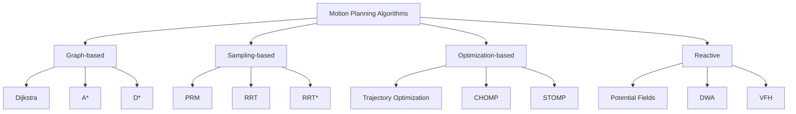

# Chapter 4: Motion Planning and Control

Motion planning and control form the bridge between perception and action in Physical AI systems. While perception tells a robot where it is and what's around it, motion planning determines how to move, and control executes those movements. This chapter explores the mathematical foundations and practical implementations of planning and controlling robot motion in complex, dynamic environments.

## What You'll Learn

By the end of this chapter, you'll be able to:
1. Design and implement path planning algorithms for mobile robots
2. Optimize trajectories for smooth and efficient motion
3. Implement various control strategies (PID, LQR, MPC)
4. Handle dynamic obstacles and real-time replanning
5. Integrate planning and control for humanoid locomotion
6. Validate and test motion planning algorithms

## The Motion Planning Problem

### Defining the Planning Space

Motion planning operates in multiple spaces:

1. **Configuration Space (C-Space)**: All possible robot configurations
2. **Task Space**: Positions and orientations in the world
3. **Joint Space**: Individual joint angles and positions
4. **Workspace**: Reachable positions of end-effectors

```python
import numpy as np
import matplotlib.pyplot as plt
from scipy.spatial import KDTree
from queue import PriorityQueue

class ConfigurationSpace:
    def __init__(self, dimensions, limits):
        """
        Initialize configuration space
        dimensions: number of DOF
        limits: list of (min, max) tuples for each dimension
        """
        self.dimensions = dimensions
        self.limits = np.array(limits)
        self.obstacles = []

    def add_obstacle(self, center, radius):
        """Add spherical obstacle to configuration space"""
        self.obstacles.append({
            'center': np.array(center),
            'radius': radius
        })

    def is_valid(self, configuration):
        """Check if configuration is collision-free"""
        # Check limits
        for i, (q, (min_q, max_q)) in enumerate(zip(configuration, self.limits)):
            if q < min_q or q > max_q:
                return False

        # Check obstacles
        for obstacle in self.obstacles:
            if np.linalg.norm(configuration - obstacle['center']) < obstacle['radius']:
                return False

        return True

    def is_path_valid(self, config1, config2, resolution=0.1):
        """Check if path between two configurations is valid"""
        # Sample points along the path
        distance = np.linalg.norm(config2 - config1)
        num_steps = int(distance / resolution) + 1

        for i in range(num_steps + 1):
            t = i / num_steps
            config = config1 + t * (config2 - config1)
            if not self.is_valid(config):
                return False
        return True
```

### Planning Taxonomy

Motion planning algorithms can be categorized by:

1. **Completeness**: Finding a solution if one exists
2. **Optimality**: Finding the best solution
3. **Computational Complexity**: Time and space requirements
4. **Dimensionality**: Handling different numbers of DOF



## Graph-Based Planning

### Dijkstra's Algorithm

Dijkstra's algorithm finds the shortest path in a weighted graph, guaranteeing optimality.

```python
class DijkstraPlanner:
    def __init__(self, cspace, resolution=0.1):
        self.cspace = cspace
        self.resolution = resolution
        self.graph = None

    def build_graph(self):
        """Build discretized graph from configuration space"""
        # Generate grid of valid configurations
        x_range = np.arange(self.cspace.limits[0, 0],
                           self.cspace.limits[0, 1],
                           self.resolution)
        y_range = np.arange(self.cspace.limits[1, 0],
                           self.cspace.limits[1, 1],
                           self.resolution)

        nodes = []
        for x in x_range:
            for y in y_range:
                config = np.array([x, y])
                if self.cspace.is_valid(config):
                    nodes.append(config)

        self.graph = nodes
        return nodes

    def plan(self, start, goal):
        """Plan path using Dijkstra's algorithm"""
        if self.graph is None:
            self.build_graph()

        # Find nearest valid nodes
        start_node = self.find_nearest_node(start)
        goal_node = self.find_nearest_node(goal)

        # Initialize distances and parents
        distances = {tuple(node): np.inf for node in self.graph}
        parents = {tuple(node): None for node in self.graph}
        distances[tuple(start_node)] = 0

        # Priority queue (distance, node)
        pq = PriorityQueue()
        pq.put((0, tuple(start_node)))

        while not pq.empty():
            current_dist, current = pq.get()

            if np.array_equal(np.array(current), goal_node):
                # Reconstruct path
                path = []
                node = tuple(goal_node)
                while node is not None:
                    path.append(np.array(node))
                    node = parents[node]
                return path[::-1]

            # Explore neighbors
            for neighbor in self.get_neighbors(np.array(current)):
                neighbor_tuple = tuple(neighbor)
                if neighbor_tuple in distances:
                    edge_cost = np.linalg.norm(neighbor - np.array(current))
                    new_dist = current_dist + edge_cost

                    if new_dist < distances[neighbor_tuple]:
                        distances[neighbor_tuple] = new_dist
                        parents[neighbor_tuple] = tuple(current)
                        pq.put((new_dist, neighbor_tuple))

        return None  # No path found

    def get_neighbors(self, node):
        """Get valid neighbors of a node"""
        neighbors = []
        movements = [
            [self.resolution, 0], [-self.resolution, 0],
            [0, self.resolution], [0, -self.resolution],
            [self.resolution, self.resolution],
            [-self.resolution, self.resolution],
            [self.resolution, -self.resolution],
            [-self.resolution, -self.resolution]
        ]

        for movement in movements:
            neighbor = node + movement
            if (self.cspace.is_valid(neighbor) and
                self.cspace.is_path_valid(node, neighbor, self.resolution/2)):
                neighbors.append(neighbor)

        return neighbors

    def find_nearest_node(self, config):
        """Find nearest valid node to given configuration"""
        min_dist = np.inf
        nearest = None

        for node in self.graph:
            dist = np.linalg.norm(node - config)
            if dist < min_dist:
                min_dist = dist
                nearest = node

        return nearest
```

### A* Algorithm

A* improves on Dijkstra by using a heuristic to guide the search toward the goal.

```python
class AStarPlanner(DijkstraPlanner):
    def __init__(self, cspace, resolution=0.1):
        super().__init__(cspace, resolution)

    def heuristic(self, node, goal):
        """Admissible heuristic (Euclidean distance)"""
        return np.linalg.norm(node - goal)

    def plan(self, start, goal):
        """Plan path using A* algorithm"""
        if self.graph is None:
            self.build_graph()

        start_node = self.find_nearest_node(start)
        goal_node = self.find_nearest_node(goal)

        # Priority queue: (f_cost, g_cost, node)
        pq = PriorityQueue()
        pq.put((self.heuristic(start_node, goal_node), 0, tuple(start_node)))

        # Track best costs and parents
        g_costs = {tuple(start_node): 0}
        parents = {tuple(start_node): None}
        visited = set()

        while not pq.empty():
            f_cost, g_cost, current = pq.get()

            if current in visited:
                continue
            visited.add(current)

            if np.array_equal(np.array(current), goal_node):
                # Reconstruct path
                path = []
                node = current
                while node is not None:
                    path.append(np.array(node))
                    node = parents[node]
                return path[::-1]

            # Explore neighbors
            for neighbor in self.get_neighbors(np.array(current)):
                neighbor_tuple = tuple(neighbor)

                if neighbor_tuple in visited:
                    continue

                edge_cost = np.linalg.norm(neighbor - np.array(current))
                tentative_g = g_cost + edge_cost

                if neighbor_tuple not in g_costs or tentative_g < g_costs[neighbor_tuple]:
                    g_costs[neighbor_tuple] = tentative_g
                    f_cost = tentative_g + self.heuristic(neighbor, goal_node)
                    parents[neighbor_tuple] = current
                    pq.put((f_cost, tentative_g, neighbor_tuple))

        return None
```

## Sampling-Based Planning

### Rapidly-exploring Random Trees (RRT)

RRT explores the configuration space by randomly sampling and connecting points.

```python
class RRTPlanner:
    def __init__(self, cspace, max_iterations=10000, step_size=0.5):
        self.cspace = cspace
        self.max_iterations = max_iterations
        self.step_size = step_size
        self.tree = []

    def plan(self, start, goal, goal_tolerance=0.5):
        """Plan path using RRT"""
        self.tree = [start]
        goal_region_reached = False

        for iteration in range(self.max_iterations):
            # Sample random configuration
            if np.random.random() < 0.1:  # 10% chance to sample goal
                random_config = goal
            else:
                random_config = self.sample_random_config()

            # Find nearest node in tree
            nearest_node = self.find_nearest_node(random_config)

            # Extend tree toward random configuration
            new_node = self.steer(nearest_node, random_config)

            if self.cspace.is_path_valid(nearest_node, new_node):
                self.tree.append(new_node)

                # Check if goal is reached
                if np.linalg.norm(new_node - goal) < goal_tolerance:
                    # Build path
                    path = self.build_path(new_node)
                    return [start] + path

        return None  # No path found

    def sample_random_config(self):
        """Sample random configuration in C-space"""
        config = np.zeros(self.cspace.dimensions)
        for i in range(self.cspace.dimensions):
            config[i] = np.random.uniform(
                self.cspace.limits[i, 0],
                self.cspace.limits[i, 1]
            )
        return config

    def find_nearest_node(self, config):
        """Find nearest node in tree to given configuration"""
        min_dist = np.inf
        nearest = None

        for node in self.tree:
            dist = np.linalg.norm(node - config)
            if dist < min_dist:
                min_dist = dist
                nearest = node

        return nearest

    def steer(self, from_node, to_node):
        """Extend from from_node toward to_node"""
        direction = to_node - from_node
        distance = np.linalg.norm(direction)

        if distance <= self.step_size:
            return to_node
        else:
            return from_node + (direction / distance) * self.step_size

    def build_path(self, end_node):
        """Build path from start to end node"""
        path = [end_node]
        current = end_node

        while not np.array_equal(current, self.tree[0]):
            # Find parent (nearest node that can reach current)
            min_dist = np.inf
            parent = None

            for node in self.tree:
                if np.array_equal(node, current):
                    continue
                if self.cspace.is_path_valid(node, current):
                    dist = np.linalg.norm(node - current)
                    if dist < min_dist:
                        min_dist = dist
                        parent = node

            if parent is None:
                break
            path.append(parent)
            current = parent

        return path[::-1][1:]  # Exclude start node
```

### RRT* (Optimal RRT)

RRT* improves on RRT by optimizing the path as it explores.

```python
class RRTStarPlanner(RRTPlanner):
    def __init__(self, cspace, max_iterations=10000, step_size=0.5,
                 rewire_radius=1.0):
        super().__init__(cspace, max_iterations, step_size)
        self.rewire_radius = rewire_radius
        self.costs = {}  # Cost to reach each node
        self.parents = {}  # Parent of each node

    def plan(self, start, goal, goal_tolerance=0.5):
        """Plan path using RRT*"""
        self.tree = [start]
        self.costs[tuple(start)] = 0
        self.parents[tuple(start)] = None

        for iteration in range(self.max_iterations):
            # Sample random configuration
            if np.random.random() < 0.1:
                random_config = goal
            else:
                random_config = self.sample_random_config()

            # Find nearest nodes (consider k-nearest for optimization)
            nearest_nodes = self.find_k_nearest_nodes(random_config, k=5)
            nearest_node = nearest_nodes[0]

            # Extend tree
            new_node = self.steer(nearest_node, random_config)

            if self.cspace.is_path_valid(nearest_node, new_node):
                # Find best parent
                best_parent, best_cost = self.choose_parent(new_node, nearest_nodes)

                # Add new node to tree
                self.tree.append(new_node)
                self.parents[tuple(new_node)] = best_parent
                self.costs[tuple(new_node)] = best_cost

                # Rewire tree
                self.rewire(new_node)

                # Check goal
                if np.linalg.norm(new_node - goal) < goal_tolerance:
                    path = self.extract_path(new_node)
                    return [start] + path

        return None

    def choose_parent(self, new_node, candidate_parents):
        """Choose best parent for new node"""
        best_parent = None
        best_cost = np.inf

        for parent in candidate_parents:
            cost_to_parent = self.costs[tuple(parent)]
            edge_cost = np.linalg.norm(new_node - parent)
            total_cost = cost_to_parent + edge_cost

            if (total_cost < best_cost and
                self.cspace.is_path_valid(parent, new_node)):
                best_cost = total_cost
                best_parent = parent

        return best_parent, best_cost

    def rewire(self, new_node):
        """Rewire tree for better paths"""
        for node in self.tree:
            if np.array_equal(node, new_node):
                continue

            distance = np.linalg.norm(node - new_node)

            if distance < self.rewire_radius:
                # Check if path through new_node is better
                cost_to_new = self.costs[tuple(new_node)]
                edge_cost = distance
                total_cost = cost_to_new + edge_cost

                if (total_cost < self.costs[tuple(node)] and
                    self.cspace.is_path_valid(new_node, node)):
                    self.parents[tuple(node)] = new_node
                    self.costs[tuple(node)] = total_cost
                    self.propagate_cost_to_children(node)

    def propagate_cost_to_children(self, node):
        """Propagate cost changes to children"""
        for i, child in enumerate(self.tree):
            if self.parents[tuple(child)] is not None and \
               np.array_equal(self.parents[tuple(child)], node):
                # Update child's cost
                new_cost = self.costs[tuple(node)] + \
                          np.linalg.norm(child - node)
                if new_cost < self.costs[tuple(child)]:
                    self.costs[tuple(child)] = new_cost
                    self.propagate_cost_to_children(child)

    def extract_path(self, end_node):
        """Extract optimal path from tree"""
        path = [end_node]
        current = end_node

        while self.parents[tuple(current)] is not None:
            current = self.parents[tuple(current)]
            path.append(current)

        return path[::-1][1:]  # Exclude start node
```

## Trajectory Optimization

### Minimum-Jerk Trajectories

Generate smooth trajectories by minimizing jerk (derivative of acceleration).

```python
class MinimumJerkTrajectory:
    def __init__(self, waypoints):
        """
        waypoints: List of (position, time) tuples
        """
        self.waypoints = waypoints
        self.trajectories = []

    def plan(self):
        """Generate minimum-jerk trajectories between waypoints"""
        for i in range(len(self.waypoints) - 1):
            start_pos, start_time = self.waypoints[i]
            end_pos, end_time = self.waypoints[i + 1]

            duration = end_time - start_time
            if duration <= 0:
                continue

            # Calculate coefficients for minimum-jerk trajectory
            # Using quintic polynomial: s(t) = a0 + a1*t + a2*t^2 + a3*t^3 + a4*t^4 + a5*t^5
            coeffs = self.calculate_coefficients(
                start_pos, end_pos, duration
            )

            self.trajectories.append({
                'coeffs': coeffs,
                'start_time': start_time,
                'end_time': end_time,
                'duration': duration
            })

    def calculate_coefficients(self, start, end, duration):
        """Calculate polynomial coefficients for minimum-jerk trajectory"""
        # Boundary conditions
        p0 = start
        p1 = end
        T = duration

        # Coefficients for minimum-jerk trajectory
        a0 = p0
        a1 = 0
        a2 = 0
        a3 = 10 * (p1 - p0) / T**3
        a4 = -15 * (p1 - p0) / T**4
        a5 = 6 * (p1 - p0) / T**5

        return np.array([a0, a1, a2, a3, a4, a5])

    def evaluate(self, t, derivative=0):
        """Evaluate trajectory at time t"""
        # Find appropriate trajectory segment
        for traj in self.trajectories:
            if traj['start_time'] <= t <= traj['end_time']:
                tau = t - traj['start_time']
                coeffs = traj['coeffs']

                # Calculate derivative
                if derivative == 0:
                    # Position
                    return (coeffs[0] + coeffs[1]*tau + coeffs[2]*tau**2 +
                           coeffs[3]*tau**3 + coeffs[4]*tau**4 + coeffs[5]*tau**5)
                elif derivative == 1:
                    # Velocity
                    return (coeffs[1] + 2*coeffs[2]*tau + 3*coeffs[3]*tau**2 +
                           4*coeffs[4]*tau**3 + 5*coeffs[5]*tau**4)
                elif derivative == 2:
                    # Acceleration
                    return (2*coeffs[2] + 6*coeffs[3]*tau + 12*coeffs[4]*tau**2 +
                           20*coeffs[5]*tau**3)
                elif derivative == 3:
                    # Jerk
                    return (6*coeffs[3] + 24*coeffs[4]*tau + 60*coeffs[5]*tau**2)

        return 0
```

### CHOMP (Covariant Hamiltonian Optimization for Motion Planning)

CHOMP optimizes trajectories while avoiding obstacles.

```python
class CHOMPPlanner:
    def __init__(self, cspace, n_waypoints=50):
        self.cspace = cspace
        self.n_waypoints = n_waypoints
        self.eta = 0.1  # Learning rate
        self.epsilon = 0.01  # Obstacle avoidance gain

    def plan(self, start, goal, max_iterations=100):
        """Plan path using CHOMP optimization"""
        # Initialize straight-line path
        path = np.linspace(start, goal, self.n_waypoints)

        # Fix start and goal
        path[0] = start
        path[-1] = goal

        for iteration in range(max_iterations):
            # Compute gradient
            gradient = self.compute_gradient(path)

            # Update path
            path[1:-1] += self.eta * gradient[1:-1]

            # Check convergence
            if np.linalg.norm(gradient) < 1e-6:
                break

        return path

    def compute_gradient(self, path):
        """Compute gradient of cost function"""
        gradient = np.zeros_like(path)
        n = len(path)

        # Smoothness gradient (finite differences)
        for i in range(1, n - 1):
            gradient[i] = (path[i-1] - 2*path[i] + path[i+1])

        # Obstacle gradient
        obstacle_gradient = self.compute_obstacle_gradient(path)
        gradient += obstacle_gradient

        return gradient

    def compute_obstacle_gradient(self, path):
        """Compute gradient from obstacle avoidance potential"""
        gradient = np.zeros_like(path)

        for i, point in enumerate(path):
            for obstacle in self.cspace.obstacles:
                # Distance to obstacle
                dist = np.linalg.norm(point - obstacle['center'])

                if dist < obstacle['radius'] * 2:  # Within influence range
                    # Repulsive potential
                    if dist < obstacle['radius']:
                        # Inside obstacle - strong repulsion
                        repulsion = self.epsilon * (obstacle['radius'] - dist) * \
                                  (point - obstacle['center']) / dist
                    else:
                        # Near obstacle - smooth repulsion
                        repulsion = self.epsilon * np.exp(-(dist - obstacle['radius'])) * \
                                  (point - obstacle['center']) / dist

                    gradient[i] -= repulsion

        return gradient
```

## Control Systems

### PID Control

Proportional-Integral-Derivative control is the foundation of robot control.

```python
class PIDController:
    def __init__(self, kp, ki, kd, setpoint=0):
        self.kp = kp  # Proportional gain
        self.ki = ki  # Integral gain
        self.kd = kd  # Derivative gain
        self.setpoint = setpoint

        self.integral = 0
        self.previous_error = 0
        self.last_time = None

    def update(self, measurement, dt=None):
        """Update controller and return control output"""
        current_time = time.time()
        if dt is None:
            if self.last_time is None:
                dt = 0.01
            else:
                dt = current_time - self.last_time
        self.last_time = current_time

        # Calculate error
        error = self.setpoint - measurement

        # Proportional term
        p_term = self.kp * error

        # Integral term with anti-windup
        self.integral += error * dt
        self.integral = np.clip(self.integral, -10, 10)  # Anti-windup
        i_term = self.ki * self.integral

        # Derivative term
        derivative = (error - self.previous_error) / dt if dt > 0 else 0
        d_term = self.kd * derivative

        # Total control output
        output = p_term + i_term + d_term

        self.previous_error = error
        return output

    def reset(self):
        """Reset controller state"""
        self.integral = 0
        self.previous_error = 0
        self.last_time = None

    def set_gains(self, kp=None, ki=None, kd=None):
        """Update controller gains"""
        if kp is not None:
            self.kp = kp
        if ki is not None:
            self.ki = ki
        if kd is not None:
            self.kd = kd
```

### Model Predictive Control (MPC)

MPC solves an optimization problem at each time step.

```python
import cvxpy as cp

class ModelPredictiveController:
    def __init__(self, model, horizon=10, dt=0.1):
        self.model = model  # System dynamics model
        self.horizon = horizon
        self.dt = dt

        # Control limits
        self.u_min = np.array([-1.0, -1.0])  # [linear_vel, angular_vel]
        self.u_max = np.array([1.0, 1.0])

        # Cost weights
        self.Q = np.eye(3) * 10  # State error weight
        self.R = np.eye(2) * 1   # Control effort weight

    def solve(self, current_state, reference_trajectory):
        """Solve MPC optimization problem"""
        n_states = self.model.n_states
        n_controls = self.model.n_controls

        # Optimization variables
        X = cp.Variable((self.horizon + 1, n_states))
        U = cp.Variable((self.horizon, n_controls))

        # Cost function
        cost = 0
        constraints = []

        # Initial state constraint
        constraints.append(X[0] == current_state)

        for k in range(self.horizon):
            # Dynamics constraint
            constraints.append(
                X[k + 1] == self.model.A @ X[k] + self.model.B @ U[k]
            )

            # Control constraints
            constraints.append(U[k] >= self.u_min)
            constraints.append(U[k] <= self.u_max)

            # Tracking cost
            ref = reference_trajectory[min(k, len(reference_trajectory) - 1)]
            cost += cp.quad_form(X[k] - ref, self.Q)

            # Control effort cost
            cost += cp.quad_form(U[k], self.R)

        # Terminal cost
        cost += cp.quad_form(
            X[self.horizon] - reference_trajectory[-1],
            self.Q * 10
        )

        # Solve optimization
        problem = cp.Problem(cp.Minimize(cost), constraints)
        problem.solve()

        if problem.status == 'optimal':
            return U.value[0]  # First control action
        else:
            return np.zeros(n_controls)  # Fallback
```

### LQR Control

Linear Quadratic Regulator provides optimal control for linear systems.

```python
class LQRController:
    def __init__(self, A, B, Q, R):
        """
        LQR Controller
        A: State transition matrix
        B: Control matrix
        Q: State cost matrix
        R: Control cost matrix
        """
        self.A = A
        self.B = B
        self.Q = Q
        self.R = R
        self.K = None

        # Solve Riccati equation
        self.solve_riccati()

    def solve_riccati(self):
        """Solve continuous-time algebraic Riccati equation"""
        # Using scipy's solve_continuous_are
        from scipy.linalg import solve_continuous_are

        P = solve_continuous_are(self.A, self.B, self.Q, self.R)
        self.K = np.linalg.inv(self.R) @ self.B.T @ P

    def control(self, state, reference):
        """Compute optimal control input"""
        error = state - reference
        u = -self.K @ error
        return u
```

## Applications

### Mobile Robot Navigation

```python
class MobileRobotNavigator:
    def __init__(self, robot_state):
        self.robot = robot_state
        self.planner = None
        self.controller = None
        self.current_path = None
        self.current_waypoint = 0

    def navigate_to_goal(self, start, goal, obstacles):
        """Navigate robot from start to goal"""
        # Create configuration space
        cspace = ConfigurationSpace(2, [[0, 10], [0, 10]])
        for obs in obstacles:
            cspace.add_obstacle(obs['center'], obs['radius'])

        # Plan path
        self.planner = AStarPlanner(cspace)
        self.current_path = self.planner.plan(start, goal)
        self.current_waypoint = 0

        if self.current_path is None:
            print("No path found!")
            return False

        # Initialize controller
        self.controller = PIDController(kp=1.0, ki=0.1, kd=0.5)
        return True

    def update(self, dt):
        """Update robot control"""
        if self.current_path is None or self.current_waypoint >= len(self.current_path):
            return np.array([0, 0])  # Stop

        # Get current waypoint
        target = self.current_path[self.current_waypoint]

        # Calculate control
        self.controller.setpoint = target
        control = self.controller.update(self.robot.position, dt)

        # Check if reached waypoint
        if np.linalg.norm(self.robot.position - target) < 0.1:
            self.current_waypoint += 1
            if self.current_waypoint >= len(self.current_path):
                print("Goal reached!")
                return np.array([0, 0])

        return control
```

## Best Practices

1. **Choose the Right Algorithm**: Match algorithm to problem complexity
2. **Computational Efficiency**: Consider real-time constraints
3. **Robustness**: Handle sensor noise and model uncertainties
4. **Safety**: Always include collision checking and emergency stops
5. **Tuning**: Carefully tune controller gains and planner parameters

## Summary

Motion planning and control are essential for Physical AI systems:

- **Graph-based methods** guarantee optimality but scale poorly
- **Sampling-based methods** handle high dimensions well
- **Trajectory optimization** produces smooth, efficient paths
- **Control theory** provides the mathematical foundation for motion execution
- **Integration** of planning and control enables robust autonomous behavior

These techniques work together to enable robots to move intelligently and safely in complex environments.

## Knowledge Check

1. Compare Dijkstra and A* algorithms. When would you use each?
2. Explain the trade-offs between RRT and RRT*.
3. How does CHOMP differ from traditional planning methods?
4. When should you use MPC instead of PID control?
5. Design a navigation system for a mobile robot in a dynamic environment.