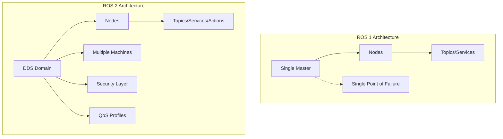
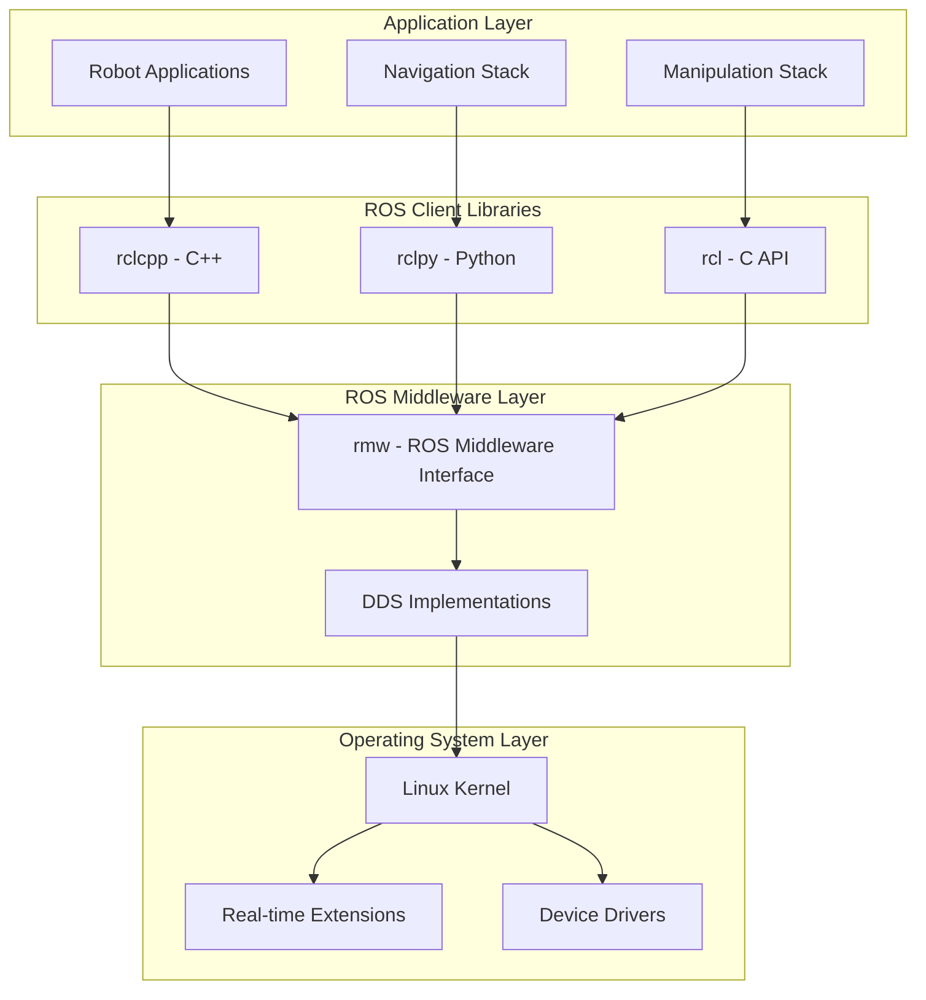

# Chapter 6: ROS 2 Architecture & Core Concepts

Robot Operating System 2 (ROS 2) represents the nervous system of modern robotics. Unlike its predecessor, ROS 2 was designed from the ground up for production-grade systems with real-time capabilities, security, and multi-robot support. This chapter explores the sophisticated architecture that enables robots to coordinate hundreds of processes running across multiple computers, creating a truly distributed intelligent system. We'll examine how ROS 2's data distribution service (DDS) foundation provides the robust communication backbone for complex robotic applications.

## What You'll Learn

By the end of this chapter, you'll be able to:
- Explain the ROS 2 architecture and its DDS foundation
- Implement nodes, topics, services, and actions effectively
- Design quality of service (QoS) profiles for reliable communication
- Utilize the ROS 2 command-line interface for system management
- Debug and monitor ROS 2 systems using specialized tools
- Apply security features for production deployments

## ROS 2 Architecture Overview

### From ROS 1 to ROS 2: Evolution of a Robotic OS

ROS 2 represents a fundamental architectural shift from ROS 1, addressing critical production requirements:

**ROS 1 Limitations:**
- Single master system creates single point of failure
- No real-time guarantees
- Limited security features
- Poor multi-robot support
- Windows and macOS support limited

**ROS 2 Improvements:**
- Distributed DDS-based communication eliminates single master
- Real-time capable with proper configuration
- Built-in security (authentication, encryption)
- Native multi-robot and multi-machine support
- Cross-platform (Linux, Windows, macOS)



### The DDS Foundation

Data Distribution Service (DDS) provides the communication backbone for ROS 2. This industry-standard middleware enables efficient, real-time data exchange between distributed systems.

**Key DDS Concepts:**
- **Domain ID**: Isolated communication spaces (0-232)
- **Participants**: Network entities that can communicate
- **Publishers/Subscribe rs**: Asynchronous data channels
- **Data Writers/Readers**: Typed data interfaces
- **Topics**: Named data channels with types

```yaml
# DDS Configuration Example
ros2:
  domain_id: 42  # Isolated communication domain

  middleware:
    vendor: "eProsima Fast DDS"  # or RTI Connext, Cyclone DDS

    qos_profiles:
      sensor_data:
        reliability: "RELIABLE"
        durability: "VOLATILE"
        deadline: "100ms"
        lifespan: "0ms"

      control_commands:
        reliability: "RELIABLE"
        durability: "TRANSIENT_LOCAL"
        deadline: "50ms"

      system_status:
        reliability: "RELIABLE"
        durability: "TRANSIENT_LOCAL"
        deadline: "1s"

  security:
    enable: true
    governance_file: "governance.p7s"
    permissions_file: "permissions.p7s"
```

### ROS 2 Layered Architecture

ROS 2 follows a layered architecture for maximum flexibility:



## Core ROS 2 Concepts

### Nodes: The Computational Units

Nodes are independent processes that perform computation and communication. They're the basic building blocks of ROS 2 applications.

```python
# Python Node Example with Advanced Features
import rclpy
from rclpy.node import Node
from rclpy.qos import QoSProfile, DurabilityPolicy, ReliabilityPolicy
from rclpy.executors import MultiThreadedExecutor
from rclpy.timer import Timer
import threading
import time

class AdvancedRobotNode(Node):
    """Advanced robot node demonstrating ROS 2 features"""

    def __init__(self):
        # Initialize node with custom options
        super().__init__('advanced_robot_node',
                        namespace='robot_1',
                        start_parameter_services=True)

        # Declare parameters with defaults and descriptions
        self.declare_parameter('update_frequency', 50.0,
                              'Control loop frequency in Hz')
        self.declare_parameter('safety_enabled', True,
                              'Enable safety monitoring')
        self.declare_parameter('log_level', 'INFO',
                              'Logging level: DEBUG, INFO, WARN, ERROR')

        # Get parameters
        self.update_freq = self.get_parameter('update_frequency').value
        self.safety_enabled = self.get_parameter('safety_enabled').value

        # Set logging level
        log_level = self.get_parameter('log_level').value
        self.get_logger().set_level(getattr(rclpy.logging.LoggingSeverity, log_level))

        # Create QoS profiles for different data types
        self.sensor_qos = QoSProfile(
            depth=10,
            durability=DurabilityPolicy.VOLATILE,
            reliability=ReliabilityPolicy.BEST_EFFORT
        )

        self.control_qos = QoSProfile(
            depth=1,
            durability=DurabilityPolicy.TRANSIENT_LOCAL,
            reliability=ReliabilityPolicy.RELIABLE
        )

        # Initialize components
        self.setup_publishers()
        self.setup_subscribers()
        self.setup_services()
        self.setup_timers()

        self.get_logger().info(f"Advanced robot node initialized at {self.update_freq} Hz")

    def setup_publishers(self):
        """Initialize publishers with appropriate QoS"""
        # High-frequency sensor data
        self.imu_publisher = self.create_publisher(
            Imu, 'imu/data_raw', self.sensor_qos)

        self.camera_publisher = self.create_publisher(
            Image, 'camera/image_raw', self.sensor_qos)

        # Critical control commands
        self.cmd_vel_publisher = self.create_publisher(
            Twist, 'cmd_vel', self.control_qos)

        # System status (reliable with durability)
        self.status_publisher = self.create_publisher(
            RobotStatus, 'robot/status', self.control_qos)

    def setup_subscribers(self):
        """Initialize subscribers with callbacks"""
        self.odom_subscriber = self.create_subscription(
            Odometry, 'odom', self.odometry_callback, self.control_qos)

        self.laser_subscriber = self.create_subscription(
            LaserScan, 'scan', self.laser_callback, self.sensor_qos)

        # Dynamic subscriptions (can be created/destroyed at runtime)
        self.dynamic_subscribers = {}

    def setup_services(self):
        """Initialize service servers"""
        selfemergency_stop_service = self.create_service(
            Trigger, 'emergency_stop', self.emergency_stop_callback)

        self.status_service = self.create_service(
            GetStatus, 'get_status', self.get_status_callback)

    def setup_timers(self):
        """Setup periodic timers for different rates"""
        # Control loop timer
        period_ns = int(1e9 / self.update_freq)  # Convert to nanoseconds
        self.control_timer = self.create_timer(
            period_ns / 1e9, self.control_loop)

        # Status publishing timer (slower rate)
        self.status_timer = self.create_timer(
            0.1, self.publish_status)  # 10 Hz

        # Health check timer
        self.health_timer = self.create_timer(
            1.0, self.health_check)  # 1 Hz

    def control_loop(self):
        """Main control loop running at high frequency"""
        try:
            # Get current state
            current_time = self.get_clock().now()

            # Process sensor data and compute control
            cmd_msg = Twist()
            cmd_msg.linear.x = 0.5  # Example forward command
            cmd_msg.angular.z = 0.1  # Slight turn

            # Safety check
            if self.safety_enabled and self.check_safety():
                cmd_msg = Twist()  # Stop if unsafe

            # Publish command
            self.cmd_vel_publisher.publish(cmd_msg)

        except Exception as e:
            self.get_logger().error(f"Control loop error: {e}")

    def odometry_callback(self, msg):
        """Handle odometry data with timestamp checking"""
        current_time = self.get_clock().now()
        message_time = rclpy.time.Time.from_msg(msg.header.stamp)
        latency = (current_time - message_time).nanoseconds / 1e9

        if latency > 0.1:  # More than 100ms delay
            self.get_logger().warn(f"High odometry latency: {latency:.3f}s")

        self.current_odometry = msg

    def laser_callback(self, msg):
        """Process laser scan with obstacle detection"""
        # Find minimum distance
        min_distance = min(msg.ranges)

        if min_distance < 0.5:  # Obstacle within 0.5m
            self.get_logger().warn(f"Obstacle detected at {min_distance:.2f}m")
            self.obstacle_detected = True
        else:
            self.obstacle_detected = False

    def emergency_stop_callback(self, request, response):
        """Handle emergency stop service call"""
        self.get_logger().warn("Emergency stop triggered!")

        # Stop robot immediately
        stop_msg = Twist()
        self.cmd_vel_publisher.publish(stop_msg)

        # Set emergency flag
        self.emergency_stopped = True

        response.success = True
        response.message = "Emergency stop activated"
        return response

    def get_status_callback(self, request, response):
        """Return robot status information"""
        response.status.operational = not self.emergency_stopped
        response.status.battery_level = self.get_battery_level()
        response.status.last_update = self.get_clock().now().to_msg()

        return response

    def publish_status(self):
        """Periodic status publishing"""
        status_msg = RobotStatus()
        status_msg.header.stamp = self.get_clock().now().to_msg()
        status_msg.operational = not self.emergency_stopped
        status_msg.battery_level = self.get_battery_level()
        status_msg.uptime = self.get_uptime()

        self.status_publisher.publish(status_msg)

    def health_check(self):
        """Periodic health monitoring"""
        # Check communication with critical systems
        systems_ok = True

        # Check if receiving odometry
        if not hasattr(self, 'current_odometry'):
            self.get_logger().error("No odometry data received")
            systems_ok = False

        # Check battery level
        battery = self.get_battery_level()
        if battery < 0.2:  # Below 20%
            self.get_logger().warn(f"Low battery: {battery*100:.1f}%")

        if not systems_ok:
            self.get_logger().error("System health check failed")

def main(args=None):
    """Main function with proper node lifecycle management"""
    rclpy.init(args=args)

    try:
        # Create node
        node = AdvancedRobotNode()

        # Use multi-threaded executor for concurrent operations
        executor = MultiThreadedExecutor(num_threads=4)
        executor.add_node(node)

        # Add shutdown handling
        def signal_handler(sig, frame):
            node.get_logger().info("Shutting down gracefully...")
            node.destroy_node()
            rclpy.shutdown()

        import signal
        signal.signal(signal.SIGINT, signal_handler)

        # Spin the executor
        try:
            executor.spin()
        except KeyboardInterrupt:
            pass

    except Exception as e:
        print(f"Node initialization failed: {e}")

    finally:
        rclpy.shutdown()

if __name__ == '__main__':
    main()
```

### Topics: Publish-Subscribe Communication

Topics provide asynchronous many-to-many communication channels for continuous data streams.

```python
# Topic monitoring and analysis tool
import rclpy
from rclpy.node import Node
from rclpy.qos import QoSProfile, QoSReliabilityPolicy, QoSDurabilityPolicy
import psutil
import time
from collections import defaultdict, deque

class TopicMonitor(Node):
    """Monitor ROS 2 topic performance and statistics"""

    def __init__(self):
        super().__init__('topic_monitor')

        self.topic_stats = defaultdict(lambda: {
            'message_count': 0,
            'last_message_time': None,
            'frequency': deque(maxlen=100),  # Last 100 samples
            'message_sizes': deque(maxlen=100),
            'dropped_messages': 0,
            'total_bytes': 0
        })

        # Start monitoring timer
        self.monitor_timer = self.create_timer(1.0, self.monitor_topics)

        # Get topic information
        self.topic_info = self.get_topic_info()

    def get_topic_info(self):
        """Get information about all available topics"""
        topic_info = {}

        # Get topic names and types
        topic_names_and_types = self.get_topic_names_and_types()

        for topic_name, topic_types in topic_names_and_types:
            topic_info[topic_name] = {
                'types': topic_types,
                'publisher_count': self.count_publishers(topic_name),
                'subscriber_count': self.count_subscribers(topic_name)
            }

        return topic_info

    def create_topic_subscriber(self, topic_name, topic_type):
        """Create subscriber for monitoring specific topic"""
        msg_module = self.import_message_type(topic_type)

        def topic_callback(msg):
            current_time = time.time()
            stats = self.topic_stats[topic_name]

            # Update statistics
            stats['message_count'] += 1
            msg_size = self.calculate_message_size(msg)
            stats['message_sizes'].append(msg_size)
            stats['total_bytes'] += msg_size

            # Calculate frequency
            if stats['last_message_time'] is not None:
                time_diff = current_time - stats['last_message_time']
                if time_diff > 0:
                    stats['frequency'].append(1.0 / time_diff)

            stats['last_message_time'] = current_time

        # Create subscriber with best-effort QoS for monitoring
        qos = QoSProfile(
            depth=10,
            reliability=QoSReliabilityPolicy.BEST_EFFORT,
            durability=QoSDurabilityPolicy.VOLATILE
        )

        return self.create_subscription(
            msg_module, topic_name, topic_callback, qos)

    def monitor_topics(self):
        """Periodic monitoring and reporting"""
        self.get_logger().info("=== Topic Performance Report ===")

        # System performance
        cpu_usage = psutil.cpu_percent()
        memory_usage = psutil.virtual_memory().percent

        self.get_logger().info(f"System: CPU {cpu_usage:.1f}%, Memory {memory_usage:.1f}%")

        # Topic statistics
        for topic_name, stats in self.topic_stats.items():
            if stats['message_count'] > 0:
                avg_frequency = (sum(stats['frequency']) / len(stats['frequency'])
                               if stats['frequency'] else 0)
                avg_size = (sum(stats['message_sizes']) / len(stats['message_sizes'])
                          if stats['message_sizes'] else 0)

                self.get_logger().info(
                    f"{topic_name}: {stats['message_count']} msgs, "
                    f"{avg_frequency:.1f} Hz, {avg_size:.0f} bytes avg"
                )

    def calculate_message_size(self, msg):
        """Calculate approximate message size in bytes"""
        import yaml
        return len(yaml.dump(msg).encode('utf-8'))

    def import_message_type(self, topic_type):
        """Dynamically import message type"""
        package_name, message_name = topic_type.split('/')
        module_name = f"{package_name}.msg"

        try:
            module = __import__(module_name, fromlist=[message_name])
            return getattr(module, message_name)
        except ImportError:
            self.get_logger().error(f"Cannot import message type: {topic_type}")
            return None
```

### Services: Request-Response Communication

Services provide synchronous request-response communication for one-time operations.

```cpp
// C++ Service Server Example
#include <rclcpp/rclcpp.hpp>
#include <std_srvs/srv/trigger.hpp>
#include <chrono>

class RobotControllerService : public rclcpp::Node
{
public:
    RobotControllerService() : Node("robot_controller_service")
    {
        // Create service server with callback group
        callback_group_ = create_callback_group(
            rclcpp::CallbackGroupType::MutuallyExclusive);

        service_ = create_service<std_srvs::srv::Trigger>(
            "execute_mission",
            std::bind(&RobotControllerService::execute_mission_callback,
                     this, std::placeholders::_1, std::placeholders::_2),
            rmw_qos_profile_services_default,
            callback_group_);

        // Mission execution timer (runs at 50 Hz)
        timer_ = create_wall_timer(
            std::chrono::milliseconds(20),
            std::bind(&RobotControllerService::mission_update, this),
            callback_group_);

        RCLCPP_INFO(get_logger(), "Robot controller service ready");
    }

private:
    rclcpp::Service<std_srvs::srv::Trigger>::SharedPtr service_;
    rclcpp::TimerBase::SharedPtr timer_;
    rclcpp::CallbackGroup::SharedPtr callback_group_;

    bool mission_active_ = false;
    std::string current_mission_;

    void execute_mission_callback(
        const std::shared_ptr<std_srvs::srv::Trigger::Request> request,
        std::shared_ptr<std_srvs::srv::Trigger::Response> response)
    {
        (void)request; // Unused parameter

        if (mission_active_)
        {
            response->success = false;
            response->message = "Mission already in progress";
            return;
        }

        // Start new mission
        current_mission_ = "exporation_mission_" +
                          std::to_string(std::time(nullptr));
        mission_active_ = true;

        RCLCPP_INFO(get_logger(), "Starting mission: %s", current_mission_.c_str());

        response->success = true;
        response->message = "Mission started: " + current_mission_;
    }

    void mission_update()
    {
        if (!mission_active_)
            return;

        // Simulate mission execution
        static int step = 0;
        step++;

        // Mission complete after 100 steps (2 seconds)
        if (step >= 100)
        {
            mission_active_ = false;
            step = 0;
            RCLCPP_INFO(get_logger(), "Mission completed: %s", current_mission_.c_str());
        }
    }
};

int main(int argc, char** argv)
{
    rclcpp::init(argc, argv);

    // Multi-threaded executor for concurrent service handling
    rclcpp::executors::MultiThreadedExecutor executor;
    auto node = std::make_shared<RobotControllerService>();

    executor.add_node(node);
    executor.spin();

    rclcpp::shutdown();
    return 0;
}
```

### Actions: Long-Running Goal-Oriented Tasks

Actions provide infrastructure for long-running tasks with feedback, cancellation, and result reporting.

```python
# Action Server Example
import rclpy
from rclpy.action import ActionServer
from rclpy.node import Node
from action_msgs.msg import GoalStatus
from builtin_interfaces.msg import Duration

class NavigationActionServer(Node):
    """Action server for robot navigation"""

    def __init__(self):
        super().__init__('navigation_action_server')

        # Create action server
        self.action_server = ActionServer(
            self,
            NavigateToPose,  # Custom action message type
            'navigate_to_pose',
            self.execute_callback,
            cancel_callback=self.cancel_callback,
            execute_callback=self.execute_callback
        )

        self.get_logger().info("Navigation action server initialized")

    async def execute_callback(self, goal_handle):
        """Execute navigation goal"""
        self.get_logger().info('Executing navigation goal...')

        # Get goal pose
        target_pose = goal_handle.request.pose

        # Create feedback message
        feedback_msg = NavigateToPose.Feedback()

        try:
            # Initialize navigation
            current_distance = self.calculate_distance(target_pose)
            initial_distance = current_distance
            start_time = self.get_clock().now()

            # Execute navigation loop
            while current_distance > 0.1 and not goal_handle.is_cancel_requested:

                # Check for obstacles
                if self.check_obstacles():
                    if goal_handle.is_cancel_requested:
                        goal_handle.canceled()
                        result = NavigateToPose.Result()
                        result.success = False
                        result.message = "Goal cancelled due to obstacle"
                        return result

                    # Wait for obstacle to clear
                    await asyncio.sleep(0.1)
                    continue

                # Move towards goal
                self.move_towards_pose(target_pose)

                # Update feedback
                current_distance = self.calculate_distance(target_pose)
                progress = max(0, (initial_distance - current_distance) / initial_distance)

                feedback_msg.current_pose = self.get_current_pose()
                feedback_msg.distance_remaining = current_distance
                feedback_msg.progress_percentage = progress * 100
                feedback_msg.estimated_time_remaining = self.estimate_time_remaining(
                    current_distance, start_time)

                goal_handle.publish_feedback(feedback_msg)

                # Rate limit to 10 Hz
                await asyncio.sleep(0.1)

            # Check if goal was cancelled
            if goal_handle.is_cancel_requested:
                goal_handle.canceled()
                result = NavigateToPose.Result()
                result.success = False
                result.message = "Goal was cancelled"
                return result

            # Goal reached successfully
            goal_handle.succeed()
            result = NavigateToPose.Result()
            result.success = True
            result.message = "Navigation completed successfully"
            result.final_pose = self.get_current_pose()
            result.time_elapsed = (self.get_clock().now() - start_time).to_msg()

            return result

        except Exception as e:
            self.get_logger().error(f'Navigation failed: {e}')
            goal_handle.abort()

            result = NavigateToPose.Result()
            result.success = False
            result.message = f"Navigation failed: {str(e)}"

            return result

    async def cancel_callback(self, goal_handle):
        """Handle goal cancellation"""
        self.get_logger().info('Received cancel request')

        # Stop robot motion immediately
        self.stop_robot()

        return GoalStatus.STATUS_CANCELLED
```

## Quality of Service (QoS) in ROS 2

QoS policies control how data is exchanged between nodes, enabling optimization for different use cases.

### Understanding QoS Profiles

```python
# QoS Configuration for Different Use Cases
from rclpy.qos import (
    QoSProfile, QoSReliabilityPolicy, QoSDurabilityPolicy,
    QoSHistoryPolicy, QoSLivelinessPolicy
)

class QoSManager:
    """Manage QoS profiles for different communication patterns"""

    @staticmethod
    def get_sensor_data_qos():
        """QoS for high-frequency sensor data"""
        return QoSProfile(
            depth=10,  # Keep only recent messages
            reliability=QoSReliabilityPolicy.BEST_EFFORT,  # Allow packet loss
            durability=QoSDurabilityPolicy.VOLATILE,  # No historical data
            deadline=Duration(sec=0, nanosec=50000000),  # 50ms deadline
            lifespan=Duration(sec=0, nanosec=100000000),  # 100ms max age
            liveliness=QoSLivelinessPolicy.AUTOMATIC,
            history=QoSHistoryPolicy.KEEP_LAST
        )

    @staticmethod
    def get_control_command_qos():
        """QoS for critical control commands"""
        return QoSProfile(
            depth=1,  # Only latest command matters
            reliability=QoSReliabilityPolicy.RELIABLE,  # Must receive
            durability=QoSDurabilityPolicy.TRANSIENT_LOCAL,  # Store for late joiners
            deadline=Duration(sec=0, nanosec=10000000),  # 10ms deadline
            lifespan=Duration(sec=0, nanosec=0),  # No expiration
            liveliness=QoSLivelinessPolicy.MANUAL_BY_TOPIC,
            history=QoSHistoryPolicy.KEEP_LAST
        )

    @staticmethod
    def get_system_status_qos():
        """QoS for system status information"""
        return QoSProfile(
            depth=5,
            reliability=QoSReliabilityPolicy.RELIABLE,
            durability=QoSDurabilityPolicy.TRANSIENT_LOCAL,
            deadline=Duration(sec=1, nanosec=0),  # 1 second deadline
            lifespan=Duration(sec=5, nanosec=0),  # 5 second max age
            liveliness=QoSLivelinessPolicy.AUTOMATIC,
            history=QoSHistoryPolicy.KEEP_LAST
        )

# Using QoS profiles in practice
class RobotNode(Node):
    def __init__(self):
        super().__init__('robot_node')

        # Publisher with control command QoS
        self.cmd_vel_publisher = self.create_publisher(
            Twist, 'cmd_vel', QoSManager.get_control_command_qos())

        # Subscriber with sensor data QoS
        self.laser_subscriber = self.create_subscription(
            LaserScan, 'scan', self.laser_callback,
            QoSManager.get_sensor_data_qos())
```

### QoS Compatibility and Debugging

```python
class QoSDebugger(Node):
    """Debug QoS compatibility issues"""

    def __init__(self):
        super().__init__('qos_debugger')

        self.qos_publisher = self.create_publisher(
            String, 'qos_test', self.create_test_qos())

        self.qos_subscriber = self.create_subscription(
            String, 'qos_test', self.qos_callback,
            self.create_test_qos())

        # Debug timer
        self.debug_timer = self.create_timer(1.0, self.debug_qos)

    def create_test_qos(self):
        """Create QoS profile for testing"""
        return QoSProfile(
            depth=10,
            reliability=QoSReliabilityPolicy.RELIABLE,
            durability=QoSDurabilityPolicy.VOLATILE
        )

    def debug_qos(self):
        """Debug QoS configuration and compatibility"""
        # Get publishers and subscribers count
        pub_count = self.count_publishers('qos_test')
        sub_count = self.count_subscribers('qos_test')

        self.get_logger().info(
            f"QoS Test Topic - Publishers: {pub_count}, Subscribers: {sub_count}")

        # Get topic info
        topic_info = self.get_topic_names_and_types()
        for topic_name, topic_types in topic_info:
            if 'qos_test' in topic_name:
                self.get_logger().info(f"Topic: {topic_name}, Type: {topic_types}")

    def qos_callback(self, msg):
        """Handle QoS test messages"""
        current_time = self.get_clock().now()
        message_time = rclpy.time.Time.from_msg(msg.stamp) if hasattr(msg, 'stamp') else current_time
        latency = (current_time - message_time).nanoseconds / 1e9

        if latency > 0.1:
            self.get_logger().warn(f"High latency detected: {latency:.3f}s")
```

## ROS 2 Command Line Interface

### Essential ROS 2 Commands

```bash
# Node Management
ros2 node list                    # List all running nodes
ros2 node info /robot_controller  # Get detailed node information
ros2 run my_package my_node       # Run a node from a package

# Topic Operations
ros2 topic list                   # List all topics
ros2 topic echo /cmd_vel          # Echo topic messages
ros2 topic hz /scan              # Calculate topic frequency
ros2 topic info /odom            # Get topic information including QoS
ros2 topic pub /cmd_vel geometry_msgs/msg/Twist "{linear: {x: 0.5}}"

# Service Operations
ros2 service list                # List all services
ros2 service call /emergency_stop std_srvs/srv/Trigger
ros2 service info /set_parameters

# Action Operations
ros2 action list                 # List all actions
ros2 action send_goal /navigate_to_pose nav2_msgs/action/NavigateToPose

# Parameter Management
ros2 param list /robot_node      # List node parameters
ros2 param get /robot_node update_frequency
ros2 param set /robot_node update_frequency 100.0
ros2 param dump /robot_node > params.yaml
ros2 param load /robot_node params.yaml

# System Information
ros2 daemon status               # Check ROS 2 daemon status
ros2 doctor                      # Diagnose system issues
ros2 bag record -a               # Record all topics to a bag
ros2 bag play recording.bag      # Play back recorded bag
```

## Knowledge Check

### Conceptual Questions

1. **Explain the role of DDS** in ROS 2 and how it enables distributed communication.

2. **Compare and contrast** ROS 2 topics, services, and actions with their use cases.

3. **Describe the QoS policies** in ROS 2 and how they affect communication reliability.

4. **How does ROS 2 handle node discovery** in a distributed system?

5. **Explain the differences** between ROS 1 and ROS 2 architectures.

### Practical Exercises

6. **Create a ROS 2 package** with a publisher and subscriber that communicate at 100 Hz using appropriate QoS settings.

7. **Implement a service** that accepts navigation goals and returns estimated time of arrival.

8. **Design an action server** for object manipulation with feedback on grasp quality.

9. **Write a QoS configuration** for a multi-robot system requiring reliable coordination.

### Advanced Problems

10. **Design a security configuration** for a production ROS 2 system with authentication and encryption.

11. **Implement a node lifecycle manager** that handles startup, shutdown, and error states gracefully.

12. **Create a custom QoS policy** that adapts dynamically based on network conditions.

## Summary

**Key Takeaways:**
- ROS 2 provides a distributed architecture based on DDS for robust multi-robot communication
- Nodes, topics, services, and actions provide different communication patterns for various use cases
- QoS profiles enable fine-tuned control over communication reliability and timing
- The ROS 2 CLI provides comprehensive tools for system management and debugging.
- Security features enable production deployments with authentication and encryption

**Next Steps:** In the next chapter, we'll dive into building ROS 2 nodes with Python, creating practical applications that leverage ROS 2's powerful architecture for real robotic systems.

## Further Reading

- [Effective Robotics Programming with ROS 2](https://link.springer.com/book/10.1007/978-1-4842-8786-5) by Anil Mahtani et al.
- [ROS 2 Developer Guide](https://docs.ros.org/en/rolling/Contributing/Developer-Guide.html) - Official ROS 2 Documentation
- [Programming Robots with ROS: A Practical Introduction](https://www.oreilly.com/library/view/programming-robots-with/9781492034486/) by Morgan Quigley et al.
- [Designing Autonomous AI Systems](https://designingautonomousai.com) by Dr. Ali H. Sayed