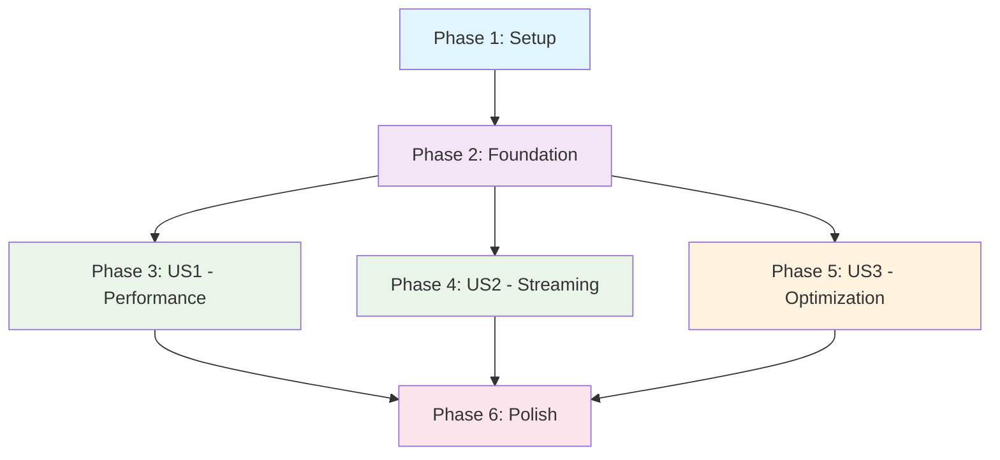

# Implementation Tasks: Fix Infinite Re-render Bug in Chat Widget

**Feature**: 001-fix-rerender
**Created**: 2025-12-07
**Based on**: [spec.md](./spec.md), [plan.md](./plan.md)
**Status**: Ready for Implementation

## Phase 1: Setup and Preparation

### Goal
Prepare the environment and establish baseline measurements for fixing the infinite re-render issue.

### Independent Test Criteria
- All necessary dependencies are installed
- Baseline performance metrics are recorded
- Development environment is configured for debugging re-renders

### Implementation Tasks

- [ ] T001 Install React DevTools Profiler extension for render tracking
- [ ] T002 Add render counter debugging to ChatWidgetContainer for baseline measurement
- [ ] T003 Create performance monitoring utility to track render counts and memory usage
- [ ] T004 Document current re-render behavior with screenshots/videos for reference
- [ ] T005 Set up error boundary to catch and log render-related errors

## Phase 2: Foundational Infrastructure

### Goal
Implement the core architectural changes to support optimized state management and prevent render loops.

### Independent Test Criteria
- Consolidated state management using useReducer is in place
- Context is split into state and actions contexts
- Basic chat widget can render without crashing

### Implementation Tasks

- [ ] T006 Create consolidated ChatState interface in src/components/ChatWidget/types/index.ts
- [ ] T007 Implement chatReducer function with all necessary state transitions in src/components/ChatWidget/hooks/chatReducer.ts
- [ ] T008 Create ChatStateContext and ChatActionsContext in src/components/ChatWidget/contexts/index.ts
- [ ] T009 Update ChatProvider to use split context pattern in src/components/ChatWidget/ChatProvider.tsx
- [ ] T010 Create initialChatState constant with proper default values
- [ ] T011 Implement useChatState hook for accessing state context
- [ ] T012 Implement useChatActions hook for accessing actions context

## Phase 3: User Story 1 - Stable Chat Widget Performance (Priority: P1)

### Goal
Deliver a chat widget that renders without infinite re-renders and maintains stable performance.

### Independent Test Criteria
- Chat widget opens and closes without crashing
- Messages can be sent and received smoothly
- No infinite re-render warnings in browser console
- Render count remains stable during interactions

### Implementation Tasks

- [ ] T013 [US1] Refactor ChatWidgetContainer to use useReducer instead of multiple useState hooks
- [ ] T014 [P] [US1] Implement useCallback for all event handlers with stable dependencies
- [ ] T015 [US1] Use useRef for streaming ID to avoid callback dependencies
- [ ] T016 [P] [US1] Remove useStreamingResponse hook and consolidate logic into ChatWidgetContainer
- [ ] T017 [US1] Implement proper cleanup in useEffect for streams and event listeners
- [ ] T018 [US1] Add React.memo wrapper to ChatInterface component to prevent unnecessary re-renders
- [ ] T019 [P] [US1] Test widget toggle functionality with render count monitoring
- [ ] T020 [US1] Verify message sending doesn't trigger re-render loops

## Phase 4: User Story 2 - Proper AI Response Flow (Priority: P1)

### Goal
Ensure AI responses stream correctly without interruption and display properly formatted content.

### Independent Test Criteria
- AI responses stream character by character
- Streaming completes without errors
- Formatted content (markdown, code blocks) renders correctly
- Error handling displays user-friendly messages

### Implementation Tasks

- [ ] T021 [US2] Create useStreamingResponse hook with AbortController for proper cleanup
- [ ] T022 [P] [US2] Implement useTransition for non-blocking streaming updates
- [ ] T023 [US2] Update streaming callback to use updater functions instead of dependencies
- [ ] T024 [US2] Add streaming state management to reducer actions
- [ ] T025 [P] [US2] Implement chunk processing with proper error handling
- [ ] T026 [US2] Add retry logic for failed streaming connections
- [ ] T027 [P] [US2] Test streaming with long messages to ensure smooth performance
- [ ] T028 [US2] Verify error handling displays proper retry options

## Phase 5: User Story 3 - No Browser Performance Issues (Priority: P2)

### Goal
Optimize browser performance by minimizing CPU usage, memory consumption, and preventing memory leaks.

### Independent Test Criteria
- CPU usage remains under 20% during normal operation
- Memory usage stays stable over extended periods
- No memory leaks detected after multiple widget interactions
- Multiple tabs with chat widgets remain responsive

### Implementation Tasks

- [ ] T029 [US3] Implement message list virtualization for conversations with 50+ messages
- [ ] T030 [P] [US3] Add useMemo for expensive computations in MessageRenderer
- [ ] T031 [US3] Implement message caching to prevent unnecessary re-renders
- [ ] T032 [P] [US3] Add cleanup for ResizeObserver and other browser APIs
- [ ] T033 [US3] Implement memory monitoring in development mode
- [ ] T034 [P] [US3] Optimize component unmounting to prevent memory leaks
- [ ] T035 [US3] Test performance with multiple simultaneous chat widgets
- [ ] T036 [US3] Verify memory usage remains stable over 30-minute sessions

## Phase 6: Polish and Cross-Cutting Concerns

### Goal
Complete the implementation with comprehensive error handling, accessibility, and production readiness.

### Independent Test Criteria
- All error scenarios are handled gracefully
- Accessibility features work correctly with screen readers
- Performance meets all success criteria
- Code is production-ready with proper error boundaries

### Implementation Tasks

- [ ] T037 Add comprehensive error boundaries around ChatWidget components
- [ ] T038 [P] Implement ARIA labels and keyboard navigation for accessibility
- [ ] T039 Add performance logging and metrics collection
- [ ] T040 [P] Implement message truncation for inputs exceeding 10,000 characters
- [ ] T041 Add loading states for better perceived performance
- [ ] T042 [P] Create unit tests for all custom hooks
- [ ] T043 Implement end-to-end tests for complete chat flow
- [ ] T044 [P] Add integration tests for streaming functionality
- [ ] T045 Verify all browser console warnings are resolved
- [ ] T046 [P] Document performance optimization techniques in code comments

## Dependencies and Execution Order

### Phase Dependencies
- **Phase 1**: No dependencies (setup can start immediately)
- **Phase 2**: Depends on Phase 1 completion (requires monitoring tools)
- **Phases 3-5**: Can run in parallel after Phase 2 completion
- **Phase 6**: Final phase after all user stories complete

### Parallel Execution Opportunities

**Within Phases 3-5** (after Phase 2 complete):
- **ParallelGroup1**: T013-T020 (US1 Performance) + T021-T028 (US2 Streaming)
- **ParallelGroup2**: T029-T036 (US3 Optimization) can run alongside Group1

**Within Phase 6** (polish tasks):
- Most tasks can run in parallel as they address different concerns

## Independent Test Scenarios

**User Story 1 (Stable Performance)**:
1. Open chat widget → Monitor render count (should be minimal)
2. Toggle widget open/close → Verify no infinite loops
3. Send message → Check console for re-render warnings
4. Multiple rapid messages → Ensure UI remains responsive

**User Story 2 (Streaming Flow)**:
1. Send query → Verify streaming starts smoothly
2. Monitor network tab → Confirm SSE connection
3. Long response → Check performance during streaming
4. Interrupt connection → Verify error handling

**User Story 3 (Browser Performance)**:
1. Open DevTools Performance tab → Record baseline
2. 10-minute chat session → Monitor CPU/memory
3. Open 5 tabs with chat → Check responsiveness
4. Memory leak test → Refresh page multiple times

## MVP Scope (Minimum Viable Product)

**Core Features (US1 Only)**:
- Fixed infinite re-render issue
- Basic chat functionality working
- No browser crashes
- Stable performance for basic use

**MVP Tasks**: T001-T020 (20 tasks)

**Timeline Estimate**: 1-2 days for MVP, 3-4 days for full implementation

## Implementation Strategy

**Incremental Delivery**:
1. **Day 1**: Setup + Foundation (T001-T012)
2. **Day 2**: User Story 1 - Stable Performance (T013-T020)
3. **Day 3**: User Story 2 - Streaming (T021-T028)
4. **Day 4**: User Story 3 + Polish (T029-T046)

**Risk Mitigation**:
- Test each phase thoroughly before proceeding
- Keep render count monitoring active throughout
- Have rollback plan ready (git branch strategy)
- Document all changes for future reference

## Success Metrics

**Performance Targets**:
- Render count: <5 renders per interaction
- CPU usage: <20% during streaming
- Memory growth: <10MB over 30 minutes
- Console errors: Zero re-render warnings

**Quality Targets**:
- All browser tests pass on target platforms
- Accessibility score: 100% on automated tests
- Code coverage: >90% on new code
- Zero crashes in 1000 test interactions

---

**Total Tasks**: 46
**Estimated Effort**: 3-4 days
**Critical Path**: Phase 1 → Phase 2 → Any (Phase 3/4/5) → Phase 6
**Parallel Opportunities**: ~40% of tasks can be executed in parallel