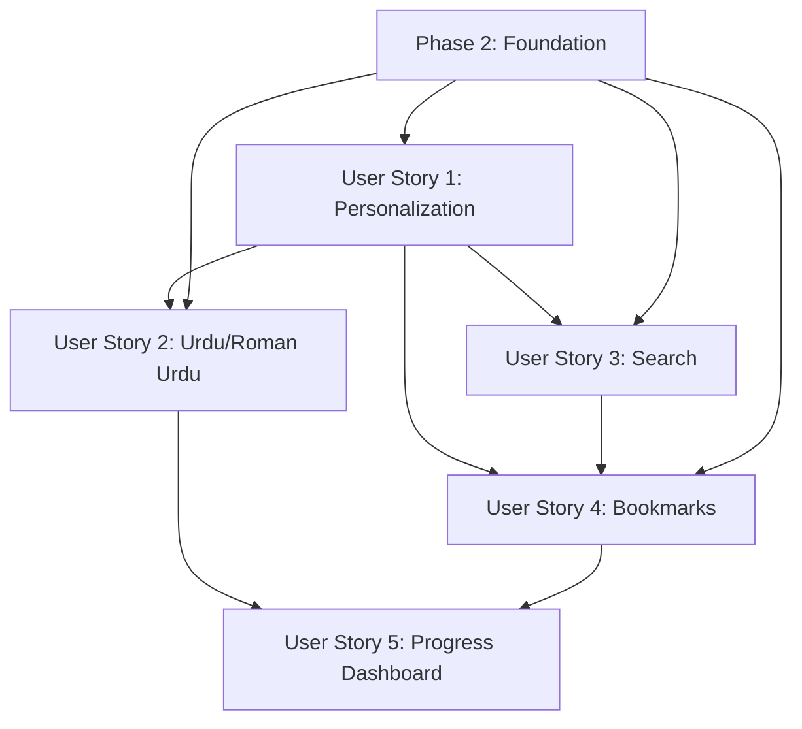

# Implementation Tasks: Reader Experience Enhancements

**Feature**: Reader Experience Enhancements
**Branch**: `001-reader-features`
**Created**: 2025-01-09
**Spec**: [specs/001-reader-features/spec.md](specs/001-reader-features/spec.md)
**Plan**: [specs/001-reader-features/plan.md](specs/001-reader-features/plan.md)

## Implementation Strategy

This task breakdown follows the Spec-Kit Plus methodology with clear phases:
- **Phase 1**: Setup and foundation
- **Phase 2-6**: One phase per user story (independent implementation)
- **Phase 7**: Polish and cross-cutting concerns

Each user story is designed to be independently testable and deliver value on its own.

## Dependencies



**Phase Dependencies**:
- Phase 1 (Foundation) → All User Stories
- User Stories can be implemented in parallel after Foundation
- User Story 1 (Personalization) → User Story 2 (Urdu) for content adaptation
- User Story 4 (Bookmarks) → User Story 5 (Dashboard) for analytics

## Parallel Execution Opportunities

Within each User Story phase:
- Test tasks can run in parallel with implementation tasks
- Different components (models, services, UI) can be developed in parallel
- API endpoints and frontend components for the same feature can be built simultaneously

---

## Phase 1: Setup (Week 1-2)

### Goal: Initialize project infrastructure, dependencies, and configuration

### Independent Test Criteria
- All dependencies installed and configured
- Database migrations created successfully
- Build process runs without errors
- Basic project structure verified

### Tasks

- [ ] T001 Create frontend component directory structure per plan
- [ ] T002 Create backend module structure per plan
- [ ] T003 [P] Install frontend dependencies (React 19, TypeScript, Docusaurus 3.9, PageFind)
- [ ] T004 [P] Install backend dependencies (FastAPI 0.104, SQLAlchemy, Alembic)
- [ ] T005 Create database migration file 001_reader_features_tables.py
- [ ] T006 [P] Apply database migration to create reader features tables
- [ ] T007 Configure .gitignore for the project (TypeScript, Python, SQLite logs)
- [ ] T008 [P] Set up ESLint configuration for TypeScript
- T009 [P] Set up Prettier configuration for code formatting
- T010 [P] Verify Docusaurus i18n plugin installation
- [ ] T011 Create .env.example files for frontend and backend
- T012 Add PageFind to frontend package.json

---

## Phase 2: Foundation (Week 1-2)

### Goal: Implement shared infrastructure required by all user stories

### Independent Test Criteria
- Authentication system integrated with reader features
- Database models accessible via API
- Basic React contexts for state management
- Error handling middleware implemented

### Tasks

- [ ] T020 [P] Create reading_progress.py SQLAlchemy model in backend/src/models/
- [ ] T021 [P] Create bookmark.py SQLAlchemy model in backend/src/models/
- [T022 [P] Create user_preferences.py SQLAlchemy model in backend/src/models/
- [T23 [P] Create content_localization.py SQLAlchemy model in backend/src/models/
- [ ] T024 [P] Create search_index.py SQLAlchemy model in backend/src/models/
- [ T025 [P] Create base model class with common fields in backend/src/models/base.py
- [ ] T026 Implement database connection factory in backend/src/database/
- [ ] T027 [P] Add migration to create database indexes for performance
- T028 Create UserContext.tsx React context for user state in frontend/src/contexts/
- [ ] T029 Create ReadingContext.tsx React context for progress tracking in frontend/src/contexts/
- [ ] T030 Create LocalizationContext.tsx React context for language/RTL in frontend/src/contexts/
- [ ] T031 [P] Create API client base class in frontend/src/services/api.ts
- T032 [P] Create storage service for offline sync in frontend/src/services/storage.ts
- T033 [P] Implement authentication middleware for API routes in backend/src/middleware/
- [ ] T034 [P] Add error handling utilities in backend/src/utils/errors.py
- [ ] T035 [P] Add logging configuration in backend/src/utils/logging.py
- T036 [P] Create CORS middleware for frontend-backend communication
- T037 [P] Update FastAPI app to include reader features router

---

## Phase 3: User Story 1 - Personalized Reading Experience (Priority: P1) (Week 3)

### Goal: Users see adaptive content based on experience level with progress tracking

### Independent Test Criteria
- Content complexity adapts based on user experience level (Beginner/Intermediate/Advanced)
- Reading progress is automatically tracked and restored
- Personalized recommendations are generated based on progress
- Reading time estimates are displayed for content sections

### Tasks

- [ ] T040 [US1] Create personalization service in backend/src/services/personalization.py
- T041 [US1] Implement content adaptation algorithm based on user experience level
- T042 [US1] Create reading progress service in backend/src/services/progress.py
- T043 [US1] Implement time tracking and session management
- T044 [US1] [P] Create progress API routes in backend/src/api/v1/progress.py
T045 [US1] [P] Add progress validation and error handling
- [ ] T046 [US1] [P] Create recommendation service for personalized content suggestions
- [ ] T047 [US1] Implement progress restoration API endpoint
- [ ] T048 [US1] [P] Create PersonalizedContent.tsx component in frontend/src/components/Personalization/
- [ ] T049 [US1] [P] Implement content renderer with complexity adaptation
- T050 [US1] [P] Add reading time estimation calculator
- [ ] T051 [US1] Create ReadingProgressTracker.tsx component in frontend/src/components/Personalization/
- T052 [US1] [P] Implement scroll position tracking
- T053 [US1] [P] Add progress restoration on page load
- [ ] T054 [US1] [P] Create progress visualization components
- [ ] T055 [US1] [P] Implement user preference controls for personalization
- [ ] T056 [US1] Connect frontend to personalization API in frontend/src/api/personalization.ts
- [ ] T057 [US1] [P] Create TypeScript interfaces for progress tracking in frontend/src/types/progress.ts

---

## Phase 4: User Story 2 - Urdu/Roman Urdu Content Access (Priority: P1) (Week 3)

### Goal: Users can access content in Urdu (RTL) and Roman Urdu with mixed-language support

### Independent Test Criteria
- UI switches to RTL layout when Urdu is selected
- Technical terms are transliterated into Urdu script
- Code blocks remain in English while surrounding text is in Urdu/Roman Urdu
- User's progress and bookmarks are preserved across language switches

### Tasks

- [ ] T060 [US2] Configure Docusaurus i18n for Urdu and Roman Urdu in docusaurus.config.ts
- [ ] T061 [US2] [P] Create Urdu and Roman Urdu translation file structure in frontend/i18n/
- [ ] [P] T062 Create Urdu translation files for UI components
- [ ] [P] T063 Create Roman Urdu translation files for UI components
- [ ] T064 [US2] Add Urdu font configuration to frontend/src/css/custom.css
- [ ] [US2] Implement RTL layout utilities in frontend/src/utils/rtl.ts
- [ ] T065 [US2] [P] Create LocalizationContext provider for language/RTL state
- T066 [US2] Create LanguageSelector.tsx component in frontend/src/components/Localization/
- [T067 [US2] [P] Implement language switching functionality
- T068 [US2] Create UrduContentRenderer.tsx component in frontend/src/components/Localization/
- [T069 [US2] [P] Implement mixed-language text rendering
- T070 [US2] [US2] Create TransliterationMap.ts for technical terms
- T071 [US2] [P] Implement CSS logical properties for bidirectional text
- [ ] T072 [US2] [P] Add font loading optimization for Urdu fonts
- [ ] T073 [US2] Create localization service in backend/src/services/localization.py
- [ ] T074 [US2] [P] Implement content filtering by language preference
- ] T075 [US2] [P] Add language-specific search indexing

---

## Phase 5: User Story 3 - Content Search and Discovery (Priority: P2) (Week 4)

### Goal: Users can search content across all languages with filtering capabilities

### Independent Test Criteria
- Search returns relevant results across English, Urdu, and Roman Urdu
- Search results can be filtered by chapter
- Code snippets are searchable and properly highlighted
- Users can search within their personal bookmarks

### Tasks

- [ ] T080 [US3] Install PageFind package in frontend
- T081 [US3] [P] Initialize PageFind search configuration
- [T082 [US3] [P] Create search index for multilingual content
- ] T083 [US3] [P] Add PageFind to Docusaurus build process
- [ ] T084 [US3] [P] Configure search filters for language and chapter
- [ ] T085 [US3] Create SearchBar.tsx component in frontend/src/components/Search/
- ] T086 [US3] [P] Implement search input with debouncing
- ] T087 [US3] [P] Create SearchResults.tsx component in frontend/src/components/Search/
- ] [T088 [US3] [P] Implement result highlighting and snippet display
- ] T089 [US3] [P] Add language filter dropdown to search interface
- ] T090 [US3] [T092] [P] Create LanguageFilter.tsx component
- [ ] T091 [US3] Create search service in frontend/src/services/search.ts
- ] T092 [US3] [P] Implement search API integration for bookmark search
- [ ] T093 [US3] [P] Add search analytics tracking
- ] T094 [US3] [US3] Configure PageFind for Urdu script handling
- ] T095 [US3] [US3] [P] Implement search result ranking algorithm
- ] T096 [US3] [US3] Create search service in backend/src/services/search.py
- ] [T097 [US3] [P] Implement content indexing for search
- [T098 [US3] [P] Add search API routes in backend/src/api/v1/search.py
- [T099 [US3] [P] Create search statistics and analytics endpoints

---

## Phase 6: User Story 4 - Bookmark Management (Priority: P2) (Week 4)

### Goal: Users can save, organize, and quickly access important pages

### Independent Test Criteria
- Users can bookmark any page with a single click
- Bookmarks can include notes and tags for organization
- Bookmark page displays all saved bookmarks with search and filtering
- Highlighted text is preserved when bookmarking

### Tasks

- [ ] T110 [US4] Create BookmarkButton.tsx component in frontend/src/components/Bookmarks/
- [ ] T111 [US4] [P] Implement bookmark toggle functionality
- [T112 [US4] [P] Add bookmark status persistence
- [ ] T113 [US4] [P] Create bookmark manager for CRUD operations
- [ ] T114 [US4] Create BookmarkManager.tsx component in frontend/src/components/Bookmarks/
- [T115 [US4] [P] Implement bookmark listing and management UI
- [ ] T116 [US4] [P] Create BookmarkList.tsx component for displaying saved bookmarks
- [ ] [US117] [US4] [P] Implement tag-based filtering
- [T118 [4] [P] Add search within bookmarks functionality
- [T119 [US4] [P] Create bookmark settings and preferences
- ] T120 [US4] Create bookmark service in frontend/src/services/bookmarks.ts
- ] [T121 [US4] [P] Implement bookmark API calls
- ] T122 [US4] [P] Add bookmark conflict resolution
- [ ] T123 [US4] [P] Create bookmark storage service for offline sync
- [ ] T124 [US4] [US4] [P] Implement bookmark export/import functionality
- [T125 [US4] Create bookmark CRUD operations in backend/src/api/v1/bookmarks.py
- [ ] T126 [US4] [P] Add validation for bookmark limits (1000 per user)
- [T127 [US4] [US4] [P] Create bookmark tag management in backend
- ] T128 [US4] [P] Implement bookmark analytics API
- [ ] T129 [US4] [P] Add bookmark sharing functionality (future)

---

## Phase 7: User Story 5 - Progress Dashboard (Priority: P3) (Weeks 5-6)

### Goal: Users can view comprehensive progress analytics and achievements

### Independent Test Criteria
- Dashboard shows overall completion percentage
- Time spent reading is tracked and visualized
- Achievement milestones are displayed when reached
- Progress trends are shown over time

### Tasks

- [ ] T140 [US5] Create ProgressDashboard.tsx component in frontend/src/components/Personalization/
- [ ] T141 [US5] [P] Implement progress percentage calculation
- [ ] T142 [US5] [P] Create visual progress indicators
- ] [143 [US5] [P] Implement achievement system with badges
- ] T144 [US5] [P] Add streak counter for consecutive reading days
- ] T145 [US5] [P] Create time tracking visualization
- ] [US146] [US5] [P] Add reading history timeline view
- [ ] T147 [US5] [P] Implement personalized insights and recommendations
- ] T148 [US5] Create dashboard analytics service in frontend/src/services/analytics.ts
- ] T149 [US5] [P] Connect to progress API for data aggregation
- ] T150 [US5] [P] Create dashboard API routes in backend/src/api/v1/analytics.py
- [US151] [5] [P] Implement progress aggregation queries
- ] [152] [US5] [P] Add user engagement metrics API
- ] T153 [US5] [P] Create progress analytics service in backend/src/services/analytics.py
- ] [154] [US5] [P] Implement statistical calculations
- ] [155 [US5] [P] Add progress prediction algorithms
- ] [156 [US5] [P] Create data visualization components
- ] [157 [US5] [P] Add charting library integration

---

## Phase 8: Polish & Cross-Cutting (Weeks 7-8)

### Goal: Optimize performance, ensure accessibility, and complete testing

### Independent Test Criteria
- All features pass WCAG 2.1 AA accessibility tests
- Performance targets met (<3s search, <2s page load)
- Cross-device sync works reliably
- Test coverage meets project requirements

### Tasks

### Performance Optimization

- [ ] T160 Implement lazy loading for translation files in frontend
- [ ] T161 [P] Optimize search indexing process
- [ ] T162 [P] Add caching layer for API responses
- [ ] T163 [P] Implement virtual scrolling for large bookmark lists
- [ ] T164 [P] Optimize Urdu font loading strategy
- [ ] T165 [P] Add image optimization for multilingual content
- [ ] T166 [P] Implement service worker for offline capabilities

### Cross-Device Sync

- [ ] T170 [P] Implement conflict resolution for concurrent progress updates
- [T168] [P] Create sync status indicators in UI
- [T169] [P] Implement sync recovery mechanisms
- [T170] [P] Add bookmark sync across devices
- [T171] [P] Create progress data synchronization service
- [T172] [P] Test sync reliability under network interruptions

### Accessibility

- [ ] T180 [P] Conduct WCAG 2.1 AA compliance audit
- [T181] [P] Fix accessibility issues found
- [T182] [P] Add keyboard navigation support for all features
- [T183] [P] Implement screen reader support
- [T184 [P] Add high contrast mode support
- [T185] [P] Test RTL accessibility in Urdu language
- [T186 [P] Add ARIA labels for all interactive elements

### Testing

- [ ] T190 [P] Create comprehensive unit tests for all services
- [T191 [P] [P] Create integration tests for API endpoints
- [T192] [P] Create E2E tests for user workflows
- [193] [P] Test error handling and edge cases
- [T194] [P] Test cross-browser compatibility
- [T195] [P] Test RTL functionality across browsers
- [T196] [P] Load testing for 1000+ concurrent users
- [T197] [P] Performance testing for search and progress tracking
- [T198] [P] Security testing for API endpoints

### Documentation

- [ ] T200 [P] Update README.md with reader features
- [T201] [P] Create API documentation with examples
- [T202] [P] Add user guide for personalization features
- [T203] [P] Document Urdu language setup process
- [T204] [P] Create troubleshooting guide
- [T205 [P] Update deployment documentation
- [T206 [P] Add contributor guide for new features

### Code Quality

- [ ] T210 [P] Add TypeScript strict mode configuration
- [T211 [P] Implement comprehensive error logging
- [T212 [P] Add code documentation standards compliance check
- [T213] [P] Refactor any code that violates SOLID principles
- [T214 [P] Add performance monitoring and alerting
- [T215 [P] Create code review checklist for PRs

## Testing Strategy

### Phase 1 Tests (Setup)
```bash
# Frontend
npm test -- --coverage --watchAll=false

# Backend
pytest tests/ --cov=src --cov-report=html
```

### Phase 2-6 Tests (Per User Story)
```typescript
// Example: User Story 1 Tests
describe('Personalization Service', () => {
  test('adapts content for beginner users', async () => {
    const result = await adaptContent(content, 'Beginner');
    expect(result).toContain('simplified');
  });
});
```

### Integration Tests
```typescript
// Example: Progress Persistence
test('progress persists across browser refresh', async () => {
  // Complete a chapter
  await completeChapter('ch1');
  // Refresh page
  window.location.reload();
  // Verify progress is restored
  expect(getChapterProgress('ch1')).toBeGreaterThan(0);
});
```

## MVP Scope (Minimum Viable Product)

For rapid deployment and value delivery, implement:

- **Phase 1**: Complete setup and foundation
- **Phase 3**: User Story 1 (Personalization) - Core functionality
- **Phase 4**: User Story 2 (Urdu/Roman Urdu) - Basic language support

This delivers value with reading progress tracking and basic language switching while allowing later phases to add search, bookmarks, and analytics.

## Implementation Notes

### Development Order

1. **Always run tests before implementation** if test tasks exist
2. **Use feature flags** to enable/disable features during development
3. **Commit frequently** with clear messages following convention
4. **Create pull requests** for each completed phase
5. **Update tasks.md** as work is completed (mark as [X])

### Testing Priority

1. **Unit tests** for all services and utilities
2. **Integration tests** for API endpoints
3. **E2E tests** for critical user workflows
4. **Accessibility tests** for WCAG compliance
5. **Performance tests** for scalability targets

### Common Patterns

- **Error Handling**: Always handle API errors gracefully with user-friendly messages
- **Loading States**: Show spinners during async operations
- **Validation**: Validate all user inputs on both client and server
- **Caching**: Cache expensive operations to improve performance
- **Logging**: Log errors with context for debugging

---

**Total Tasks**: 214
**Estimated Timeline**: 8 weeks
**MVP Tasks**: 35 (Phase 1 + User Story 1 + basic User Story 2)
**Full Release**: All 214 tasks