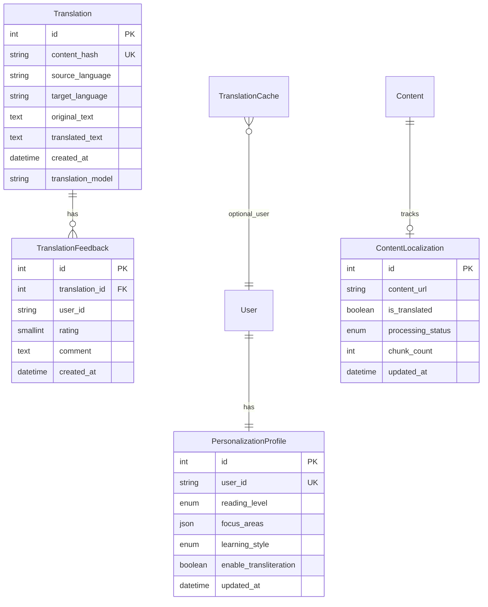

# Data Model: Urdu Translation and Personalization

**Feature**: Urdu Translation Improvements and Personalization
**Date**: 2025-12-10

## Entity Overview

This feature introduces four main entities for managing translations, caching, user preferences, and content localization.

## Translation Entity

```python
# backend/src/models/translation.py
class Translation(Base):
    __tablename__ = "translations"

    id = Column(Integer, primary_key=True)
    content_hash = Column(String(64), unique=True, nullable=False, index=True)
    source_language = Column(String(10), nullable=False)
    target_language = Column(String(10), nullable=False)
    original_text = Column(Text, nullable=False)
    translated_text = Column(Text, nullable=False)

    # Metadata
    created_at = Column(DateTime, default=datetime.utcnow)
    updated_at = Column(DateTime, default=datetime.utcnow, onupdate=datetime.utcnow)
    translation_model = Column(String(50), nullable=False)  # e.g., "gemini-1.5-pro"
    character_count = Column(Integer, nullable=False)

    # Relationships
    feedback = relationship("TranslationFeedback", back_populates="translation")

    # Constraints
    __table_args__ = (
        Index('idx_content_lookup', 'content_hash', 'source_language', 'target_language'),
    )
```

## Translation Feedback Entity

```python
# backend/src/models/translation.py
class TranslationFeedback(Base):
    __tablename__ = "translation_feedback"

    id = Column(Integer, primary_key=True)
    translation_id = Column(Integer, ForeignKey("translations.id"), nullable=False)
    user_id = Column(String(36), nullable=False)  # UUID from auth system
    rating = Column(SmallInteger, nullable=False)  # -1 (down) or 1 (up)
    comment = Column(Text, nullable=True)

    # Metadata
    created_at = Column(DateTime, default=datetime.utcnow)

    # Relationships
    translation = relationship("Translation", back_populates="feedback")

    # Constraints
    __table_args__ = (
        Index('idx_user_translation', 'user_id', 'translation_id', unique=True),
        CheckConstraint('rating IN (-1, 1)', name='check_rating_range'),
    )
```

## Personalization Profile Entity

```python
# backend/src/models/personalization.py
class PersonalizationProfile(Base):
    __tablename__ = "personalization_profiles"

    id = Column(Integer, primary_key=True)
    user_id = Column(String(36), unique=True, nullable=False, index=True)

    # Reading preferences
    reading_level = Column(Enum(ReadingLevel), default=ReadingLevel.INTERMEDIATE)
    preferred_language = Column(String(10), default='en')

    # Content preferences
    focus_areas = Column(JSON)  # Array of topics user cares about
    learning_style = Column(Enum(LearningStyle), default=LearningStyle.BALANCED)

    # Translation preferences
    enable_transliteration = Column(Boolean, default=True)
    technical_term_handling = Column(Enum(TermHandling), default=TermHandling.TRANSLITERATE)

    # UI preferences
    font_size = Column(Integer, default=16)
    focus_mode_preferences = Column(JSON)

    # Metadata
    created_at = Column(DateTime, default=datetime.utcnow)
    updated_at = Column(DateTime, default=datetime.utcnow, onupdate=datetime.utcnow)
    last_active = Column(DateTime, default=datetime.utcnow)
```

### Enums for Personalization

```python
from enum import Enum

class ReadingLevel(Enum):
    BEGINNER = "beginner"
    INTERMEDIATE = "intermediate"
    ADVANCED = "advanced"

class LearningStyle(Enum):
    VISUAL = "visual"      # More examples, diagrams
    PRACTICAL = "practical"  # Focus on code, implementation
    THEORETICAL = "theoretical"  # Focus on concepts, theory
    BALANCED = "balanced"

class TermHandling(Enum):
    TRANSLATE = "translate"      # Translate technical terms
    TRANSLITERATE = "transliterate"  # Keep in Urdu script
    KEEP_ENGLISH = "keep_english"  # Leave in English
```

## Content Localization Entity

```python
# backend/src/models/content_localization.py
class ContentLocalization(Base):
    __tablename__ = "content_localization"

    id = Column(Integer, primary_key=True)
    content_url = Column(String(500), nullable=False, index=True)
    content_hash = Column(String(64), nullable=False, index=True)

    # Localization status
    is_translated = Column(Boolean, default=False)
    last_translation_date = Column(DateTime)
    translation_cache_key = Column(String(64))

    # Content metadata
    word_count = Column(Integer)
    character_count = Column(Integer)
    has_code_blocks = Column(Boolean, default=False)
    detected_languages = Column(JSON)  # Array of detected languages

    # Processing metadata
    chunk_count = Column(Integer, default=1)
    processing_status = Column(Enum(ProcessingStatus), default=ProcessingStatus.PENDING)

    # Metadata
    created_at = Column(DateTime, default=datetime.utcnow)
    updated_at = Column(DateTime, default=datetime.utcnow, onupdate=datetime.utcnow)
```

### Processing Status Enum

```python
class ProcessingStatus(Enum):
    PENDING = "pending"
    PROCESSING = "processing"
    COMPLETED = "completed"
    FAILED = "failed"
    PARTIAL = "partial"  # Some chunks failed
```

## Cache Management Entity

```python
# backend/src/models/cache.py
class TranslationCache(Base):
    __tablename__ = "translation_cache"

    id = Column(Integer, primary_key=True)
    cache_key = Column(String(128), unique=True, nullable=False, index=True)

    # Cached data
    response_data = Column(JSON, nullable=False)

    # Cache metadata
    expires_at = Column(DateTime, nullable=False)
    access_count = Column(Integer, default=0)
    last_accessed = Column(DateTime, default=datetime.utcnow)

    # Additional info
    content_type = Column(String(50), default='translation')
    user_id = Column(String(36), nullable=True)  # Null for shared cache

    # Metadata
    created_at = Column(DateTime, default=datetime.utcnow)

    # Constraints
    __table_args__ = (
        Index('idx_expires', 'expires_at'),
        Index('idx_user_cache', 'user_id', 'content_type'),
    )
```

## Relationships Summary



## Validation Rules

### Translation Entity
- `content_hash`: SHA-256 hash of original_text + source_language
- `character_count`: Must match length of original_text
- `translated_text`: Cannot be empty for successful translations

### Translation Feedback
- `rating`: Must be -1 (down) or 1 (up)
- Unique combination of `user_id` and `translation_id`
- `comment`: Maximum 280 characters if provided

### Personalization Profile
- `user_id`: Valid UUID from authentication system
- `focus_areas`: Array of strings, max 10 items
- `font_size`: Between 12 and 24 pixels

### Content Localization
- `content_url`: Valid URL format
- `processing_status`: Must follow state machine (PENDING → PROCESSING → COMPLETED/FAILED)
- `chunk_count`: Must be ≥ 1

## Indexes for Performance

1. **Primary lookups**:
   - `translations.content_hash` (unique)
   - `personalization_profiles.user_id` (unique)
   - `translation_cache.cache_key` (unique)

2. **Query optimization**:
   - `translations(source_language, target_language, content_hash)`
   - `content_localization.content_url`
   - `translation_cache.expires_at`
   - `translation_feedback(user_id, translation_id)` (unique)

3. **Cleanup queries**:
   - `translation_cache.expires_at`
   - `translation_feedback.created_at`
   - `translations.updated_at`