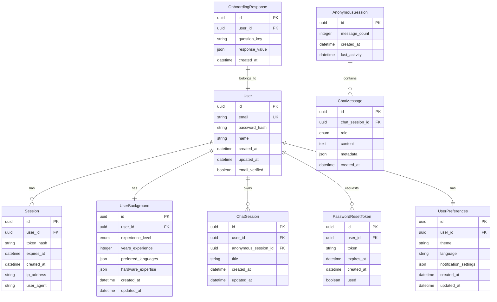

# Authentication Modification: Data Model

**Created**: 2025-01-08
**Phase**: 1 - Design & Contracts

## Entity Relationship Diagram



## Entity Definitions

### User

Represents a registered user with email/password authentication.

**Fields**:
- `id` (UUID, Primary Key): Unique identifier
- `email` (String, Unique, Required): User's email address
- `password_hash` (String, Required): Bcrypt-hashed password
- `name` (String, Optional): Display name
- `created_at` (DateTime, Required): Account creation timestamp
- `updated_at` (DateTime, Required): Last update timestamp
- `email_verified` (Boolean, Default: False): Email verification status

**Validation Rules**:
- Email must be valid format and unique
- Password hashed with bcrypt (min 12 rounds)
- Name length max 100 characters if provided

### UserBackground

Stores user's technical background for personalization.

**Fields**:
- `id` (UUID, Primary Key): Unique identifier
- `user_id` (UUID, Foreign Key → User): Associated user
- `experience_level` (Enum: "beginner" | "intermediate" | "advanced"): Self-assessed level
- `years_experience` (Integer, Range 0-50): Years of programming experience
- `preferred_languages` (JSON Array): List of programming languages
- `hardware_expertise` (JSON Object): CPU/GPU/Networking familiarity levels
- `created_at` (DateTime, Required): Creation timestamp
- `updated_at` (DateTime, Required): Last update timestamp

**JSON Schema for preferred_languages**:
```json
{
  "type": "array",
  "items": {
    "type": "string",
    "enum": ["python", "javascript", "java", "cpp", "rust", "go", "other"]
  },
  "maxItems": 10
}
```

**JSON Schema for hardware_expertise**:
```json
{
  "type": "object",
  "properties": {
    "cpu": {
      "type": "string",
      "enum": ["none", "basic", "intermediate", "advanced"]
    },
    "gpu": {
      "type": "string",
      "enum": ["none", "basic", "intermediate", "advanced"]
    },
    "networking": {
      "type": "string",
      "enum": ["none", "basic", "intermediate", "advanced"]
    }
  },
  "required": ["cpu", "gpu", "networking"]
}
```

### OnboardingResponse

Captures individual onboarding question responses.

**Fields**:
- `id` (UUID, Primary Key): Unique identifier
- `user_id` (UUID, Foreign Key → User): Responding user
- `question_key` (String, Required): Question identifier
- `response_value` (JSON, Required): User's response
- `created_at` (DateTime, Required): Response timestamp

**Example question_keys**:
- "experience_level_selection"
- "years_of_experience"
- "preferred_languages"
- "cpu_expertise"
- "gpu_expertise"
- "networking_expertise"

### Session

Active user authentication sessions with sliding expiration.

**Fields**:
- `id` (UUID, Primary Key): Unique identifier
- `user_id` (UUID, Foreign Key → User): Associated user
- `token_hash` (String, Required): Hashed JWT token for lookup
- `expires_at` (DateTime, Required): Session expiration time
- `created_at` (DateTime, Required): Session creation time
- `ip_address` (String, Optional): User's IP address
- `user_agent` (String, Optional): Browser/user agent string

**Constraints**:
- Each user has max 1 active session (single session enforcement)
- Sessions expire after 7 days of inactivity
- Token hash prevents token storage in plain text

### PasswordResetToken

Temporary tokens for secure password reset.

**Fields**:
- `id` (UUID, Primary Key): Unique identifier
- `user_id` (UUID, Foreign Key → User): User requesting reset
- `token` (String, Required): Secure random token
- `expires_at` (DateTime, Required): Token expiration (24 hours)
- `created_at` (DateTime, Required): Token creation time
- `used` (Boolean, Default: False): Token usage status

**Constraints**:
- Tokens expire after 24 hours
- Single use only (marked as used after successful reset)
- Old tokens invalidated when new one requested

### AnonymousSession

Temporary session for anonymous chat users.

**Fields**:
- `id` (UUID, Primary Key): Unique identifier
- `message_count` (Integer, Default: 0): Messages sent in this session
- `created_at` (DateTime, Required): Session start time
- `last_activity` (DateTime, Required): Last message timestamp

**Constraints**:
- Anonymous users limited to 3 messages
- Sessions auto-expire after 24 hours of inactivity
- Data cleaned up after migration or expiration

### ChatSession

Conversation threads associated with users or anonymous sessions.

**Fields**:
- `id` (UUID, Primary Key): Unique identifier
- `user_id` (UUID, Foreign Key → User, Nullable): Owner if authenticated
- `anonymous_session_id` (UUID, Foreign Key → AnonymousSession, Nullable): Owner if anonymous
- `title` (String, Required): Consistent title "New Chat"
- `created_at` (DateTime, Required): Session creation time
- `updated_at` (DateTime, Required): Last activity time

**Constraints**:
- Either user_id OR anonymous_session_id must be set (not both)
- Title uses consistent "New Chat" value for all sessions
- Sessions migrated from anonymous to authenticated on registration

### ChatMessage

Individual messages within chat sessions.

**Fields**:
- `id` (UUID, Primary Key): Unique identifier
- `chat_session_id` (UUID, Foreign Key → ChatSession): Parent session
- `role` (Enum: "user" | "assistant" | "system"): Message sender
- `content` (Text, Required): Message content
- `metadata` (JSON, Optional): Additional data (personalization info, sources)
- `created_at` (DateTime, Required): Message timestamp

**JSON Schema for metadata**:
```json
{
  "type": "object",
  "properties": {
    "personalized_for": {
      "type": "string",
      "description": "User background level used for personalization"
    },
    "sources": {
      "type": "array",
      "items": {
        "type": "string"
      },
      "description": "Source documents referenced"
    },
    "confidence": {
      "type": "number",
      "minimum": 0,
      "maximum": 1,
      "description": "Response confidence score"
    }
  }
}
```

### UserPreferences

User-specific settings and preferences.

**Fields**:
- `id` (UUID, Primary Key): Unique identifier
- `user_id` (UUID, Foreign Key → User): Owner
- `theme` (Enum: "light" | "dark" | "auto", Default: "auto"): UI theme preference
- `language` (String, Default: "en"): Interface language
- `notification_settings` (JSON, Required): Notification preferences
- `created_at` (DateTime, Required): Creation time
- `updated_at` (DateTime, Required): Last update time

**JSON Schema for notification_settings**:
```json
{
  "type": "object",
  "properties": {
    "email_responses": {
      "type": "boolean",
      "default": false
    },
    "browser_notifications": {
      "type": "boolean",
      "default": true
    },
    "marketing_emails": {
      "type": "boolean",
      "default": false
    }
  },
  "required": ["email_responses", "browser_notifications"]
}
```

## Data Relationships

### One-to-One Relationships
- User ↔ UserBackground (each user has one background record)
- User ↔ UserPreferences (each user has one preferences record)

### One-to-Many Relationships
- User → Session (user can have multiple sessions over time, but only one active)
- User → ChatSession (user can have multiple chat sessions)
- User → PasswordResetToken (user can request multiple resets)
- ChatSession → ChatMessage (session contains multiple messages)

### Many-to-One Relationships
- ChatMessage → ChatSession (messages belong to a session)
- OnboardingResponse → User (responses belong to a user)

### Polymorphic Relationships
- ChatSession → User OR AnonymousSession (session belongs to either user or anonymous)

## Database Indexes

### Performance Indexes
```sql
-- User lookups
CREATE INDEX idx_users_email ON users(email);
CREATE INDEX idx_users_created_at ON users(created_at);

-- Session validation (critical for performance)
CREATE INDEX idx_sessions_user_id ON sessions(user_id);
CREATE INDEX idx_sessions_token_hash ON sessions(token_hash);
CREATE INDEX idx_sessions_expires_at ON sessions(expires_at);

-- User background for personalization
CREATE INDEX idx_user_background_user_id ON user_background(user_id);

-- Chat session queries
CREATE INDEX idx_chat_sessions_user_id ON chat_sessions(user_id);
CREATE INDEX idx_chat_sessions_anonymous_id ON chat_sessions(anonymous_session_id);
CREATE INDEX idx_chat_sessions_updated_at ON chat_sessions(updated_at);

-- Chat message retrieval
CREATE INDEX idx_chat_messages_session_id ON chat_messages(chat_session_id);
CREATE INDEX idx_chat_messages_created_at ON chat_messages(created_at);

-- Cleanup operations
CREATE INDEX idx_password_reset_expires ON password_reset_tokens(expires_at);
CREATE INDEX idx_anonymous_sessions_activity ON anonymous_sessions(last_activity);
```

### Unique Constraints
```sql
-- Email uniqueness
ALTER TABLE users ADD CONSTRAINT uk_users_email UNIQUE (email);

-- Single active session per user
CREATE UNIQUE INDEX uk_sessions_active ON sessions(user_id)
WHERE expires_at > CURRENT_TIMESTAMP;

-- Single background per user
ALTER TABLE user_background ADD CONSTRAINT uk_user_background_user_id UNIQUE (user_id);
```

## Migration Strategy

### Initial Migration
1. Create new tables (UserBackground, OnboardingResponse, PasswordResetToken, AnonymousSession)
2. Add columns to existing User table (password_hash, email_verified)
3. Add user_id to ChatSession (nullable for anonymous sessions)
4. Add anonymous_session_id to ChatSession (nullable)
5. Create indexes and constraints

### Data Migration
1. Hash existing passwords if any (none expected)
2. Create default UserPreferences for existing users
3. Migrate existing anonymous chat sessions to AnonymousSession table

### Rollback Plan
1. Drop new tables
2. Remove new columns from User table
3. Remove foreign keys from ChatSession
4. Restore original indexes