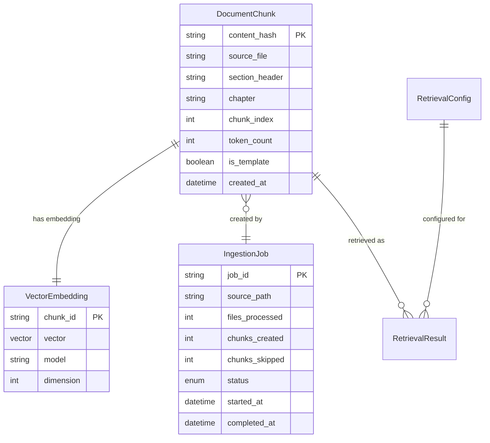
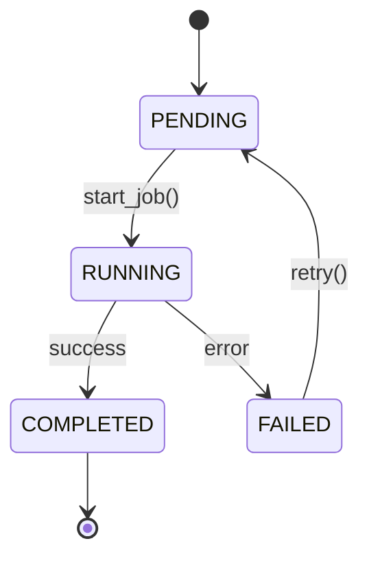
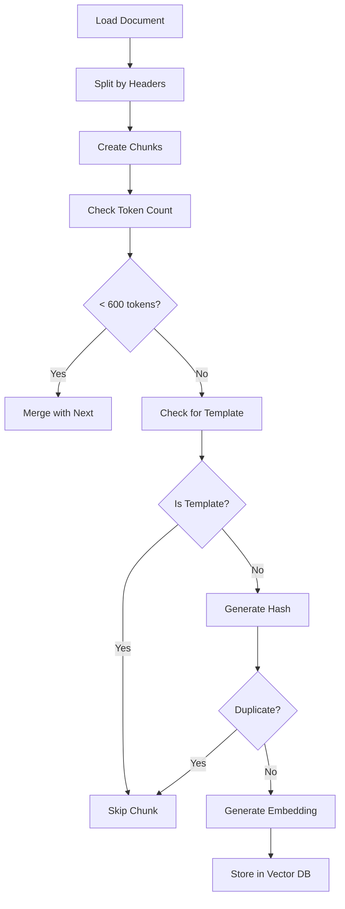

# Data Model: RAG Embedding System

**Version**: 1.0
**Generated**: 2025-12-06

## Core Entities

### 1. DocumentChunk

Represents a chunk of book content with metadata for retrieval.

```python
from typing import Optional, Dict, Any
from pydantic import BaseModel, Field
from datetime import datetime

class DocumentChunk(BaseModel):
    """A chunk of document content with metadata"""

    # Core content
    content: str = Field(..., description="Text content of the chunk")
    content_hash: str = Field(..., description="SHA256 hash of content for deduplication")

    # Metadata
    source_file: str = Field(..., description="Path to source file")
    section_header: Optional[str] = Field(None, description="Section title if available")
    chapter: Optional[str] = Field(None, description="Chapter name if available")
    chunk_index: int = Field(..., description="Position within document")
    token_count: int = Field(..., description="Number of tokens in content")

    # Flags
    is_template: bool = Field(False, description="True if chunk is template/meta content")

    # Timestamps
    created_at: datetime = Field(default_factory=datetime.utcnow)
    updated_at: Optional[datetime] = None

    class Config:
        json_encoders = {
            datetime: lambda v: v.isoformat()
        }
```

### 2. VectorEmbedding

Represents the vector embedding for a document chunk.

```python
class VectorEmbedding(BaseModel):
    """Vector embedding for semantic search"""

    chunk_id: str = Field(..., description="Unique identifier for chunk")
    vector: List[float] = Field(..., description="Embedding vector")
    model: str = Field(..., description="Embedding model used")
    dimension: int = Field(..., description="Vector dimension")

    class Config:
        schema_extra = {
            "example": {
                "chunk_id": "chunk_123",
                "vector": [0.1, 0.2, 0.3, "..."],
                "model": "text-embedding-3-small",
                "dimension": 1536
            }
        }
```

### 3. RetrievalResult

Represents a result from vector search with relevance information.

```python
class RetrievalResult(BaseModel):
    """Result from vector similarity search"""

    chunk: DocumentChunk
    similarity_score: float = Field(..., ge=0.0, le=1.0, description="Cosine similarity score")
    rank: int = Field(..., description="Rank in results")
    is_duplicate: bool = Field(False, description="True if duplicate of higher-ranked result")

    class Config:
        schema_extra = {
            "example": {
                "chunk": {
                    "content": "Physical AI represents the convergence...",
                    "source_file": "book/chapter1.md",
                    "section_header": "Introduction",
                    "chunk_index": 0,
                    "token_count": 567
                },
                "similarity_score": 0.89,
                "rank": 1,
                "is_duplicate": False
            }
        }
```

### 4. IngestionJob

Represents an ingestion process for documents.

```python
class IngestionJobStatus(str, Enum):
    PENDING = "pending"
    RUNNING = "running"
    COMPLETED = "completed"
    FAILED = "failed"

class IngestionJob(BaseModel):
    """Document ingestion job metadata"""

    job_id: str = Field(..., description="Unique job identifier")
    source_path: str = Field(..., description="Directory or file path ingested")

    # Statistics
    files_processed: int = Field(0, description="Number of files processed")
    chunks_created: int = Field(0, description="Number of chunks created")
    chunks_skipped: int = Field(0, description="Number of chunks skipped (templates/duplicates)")

    # Status
    status: IngestionJobStatus = Field(IngestionJobStatus.PENDING)
    error_message: Optional[str] = None

    # Timestamps
    started_at: Optional[datetime] = None
    completed_at: Optional[datetime] = None

    class Config:
        schema_extra = {
            "example": {
                "job_id": "job_456",
                "source_path": "backend/book_content",
                "files_processed": 15,
                "chunks_created": 1250,
                "chunks_skipped": 25,
                "status": "completed"
            }
        }
```

### 5. RetrievalConfig

Configuration for retrieval operations.

```python
class RetrievalConfig(BaseModel):
    """Configuration for retrieval operations"""

    # Search parameters
    similarity_threshold: float = Field(0.7, ge=0.0, le=1.0, description="Minimum similarity score")
    max_results: int = Field(5, ge=1, le=20, description="Maximum results to return")

    # MMR parameters
    use_mmr: bool = Field(True, description="Use Maximal Marginal Relevance")
    mmr_lambda: float = Field(0.5, ge=0.0, le=1.0, description="MMR diversity parameter")

    # Template filtering
    exclude_templates: bool = Field(True, description="Exclude template content from results")
    template_patterns: List[str] = Field(
        default_factory=lambda: [
            r'^how to use this book$',
            r'^table of contents$',
            r'^foreword$',
            r'^preface$'
        ]
    )
```

## Relationships



## State Transitions

### IngestionJob Status Flow



### Document Processing Flow



## Validation Rules

### DocumentChunk
- content_hash must be unique (enforced at storage level)
- token_count must match tiktoken count of content
- source_file must exist in allowed paths

### VectorEmbedding
- dimension must match model requirements (1536 for text-embedding-3-small)
- vector must be normalized (L2 norm = 1)

### RetrievalResult
- similarity_score must be from actual cosine similarity calculation
- rank must be sequential starting from 1

## Indexing Strategy

### Qdrant Collection Schema

```python
from qdrant_client.models import VectorParams, Distance, PayloadSchema, PayloadSchemaType

collection_config = {
    "vectors": VectorParams(
        size=1536,  # text-embedding-3-small dimension
        distance=Distance.COSINE
    ),
    "payload_schema": {
        "content_hash": PayloadSchema(type=PayloadSchemaType.KEYWORD),
        "source_file": PayloadSchema(type=PayloadSchemaType.KEYWORD),
        "section_header": PayloadSchema(type=PayloadSchemaType.TEXT),
        "is_template": PayloadSchema(type=PayloadSchemaType.BOOL),
        "token_count": PayloadSchema(type=PayloadSchemaType.INTEGER),
        "created_at": PayloadSchema(type=PayloadSchemaType.DATETIME)
    }
}
```

### Indexes for Performance
1. **content_hash**: Unique index for deduplication
2. **source_file**: Filter index for file-specific queries
3. **is_template**: Boolean index for template filtering
4. **created_at**: Range index for time-based queries