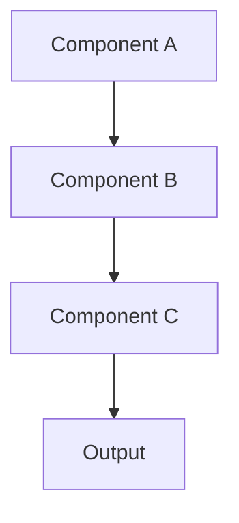

# Physical AI & Humanoid Robotics Quick Start Guide

## Overview

This guide provides step-by-step instructions for setting up the development environment and hardware infrastructure for the Physical AI & Humanoid Robotics textbook. This advanced curriculum requires high-performance hardware or cloud alternatives for effective learning.

## Hardware Requirements & Budget Planning

### Option 1: High-Performance Workstation (Recommended)
- **GPU**: NVIDIA RTX 4070 Ti (12GB VRAM) or higher
- **CPU**: Intel Core i7 (13th Gen+) or AMD Ryzen 9
- **RAM**: 64GB DDR5 (32GB minimum, may crash during complex simulations)
- **Storage**: 2TB SSD (500GB minimum)
- **OS**: Ubuntu 22.04 LTS (dual boot if necessary)
- **Estimated Cost**: $3,000-$5,000

### Option 2: Cloud-Native Setup (Budget Alternative)
- **Cloud Provider**: AWS g5.2xlarge (A10G GPU, 24GB VRAM)
- **Hourly Cost**: ~$1.50/hour
- **Monthly Cost**: ~$205 (based on 10 hours/week usage)
- **No upfront hardware investment**
- **Accessible from any computer with internet

### Option 3: Edge AI Kit (Physical Deployment)
- **Jetson Orin Nano Super Dev Kit**: $249
- **Intel RealSense D435i Camera**: $349
- **ReSpeaker USB Mic Array**: $69
- **SD Card (128GB) + Accessories**: $30
- **Total Cost**: ~$700

### Robot Hardware (Choose One Tier)
- **Tier A (Proxy)**: Unitree Go2 Edu - $1,800-$3,000
- **Tier B (Miniature)**: Hiwonder TonyPi Pro - $600
- **Tier C (Premium)**: Unitree G1 Humanoid - $16,000+

## Software Requirements

### Core Development Stack
- **Python 3.10+** - Primary development language
- **ROS 2 Humble Hawksbill** - Robotics framework (LTS)
- **NVIDIA Isaac Sim** - Advanced simulation platform
- **Gazebo Classic + Gazebo Sim** - Physics simulation
- **Unity** - High-fidelity rendering and visualization
- **Git** - Version control
- **VS Code** - Recommended IDE with extensions

### Platform Requirements
- **Primary**: Ubuntu 22.04 LTS (required for Isaac Sim + ROS 2)
- **Alternative**: Windows with WSL2 (limited Isaac Sim support)
- **Cloud**: AWS/GCP instances with GPU support

## Development Setup

### 1. Repository Setup

```bash
# Clone the repository
git clone <repository-url>
cd ai-book

# Switch to feature branch
git checkout 002-robotics-textbook

# Install dependencies
npm install
```

### 2. ROS 2 Environment

```bash
# Install ROS 2 Humble
sudo apt update && sudo apt install locales
sudo locale-gen en_US en_US.UTF-8
sudo update-locale LC_ALL=en_US.UTF-8 LANG=en_US.UTF-8
export LANG=en_US.UTF-8

# Add ROS 2 apt repository
sudo apt install software-properties-common
sudo add-apt-repository universe
sudo apt update && sudo apt install curl
sudo curl -sSL https://raw.githubusercontent.com/ros/rosdistro/master/ros.asc | sudo apt-key add -
sudo sh -c 'echo "deb http://packages.ros.org/ros2/ubuntu $(lsb_release -cs) main" > /etc/apt/sources.list.d/ros2-latest.list'

# Install ROS 2 Humble
sudo apt update
sudo apt install ros-humble-desktop python3-argcomplete
```

### 3. Development Tools

```bash
# Install Docusaurus CLI
npm install -g @docusaurus/core

# Install useful VS Code extensions
code --install-extension ms-python.python
code --install-extension ms-python.black-formatter
code --install-extension redhat.vscode-yaml
code --install-extension ms-vscode.cpptools
```

### 4. Environment Configuration

```bash
# Create ROS 2 workspace
mkdir -p ~/ros2_ws/src
cd ~/ros2_ws

# Clone ROS 2 dependencies into workspace
# (Examples will be provided in chapters)

# Build workspace
colcon build

# Source environment
echo "source ~/ros2_ws/install/setup.bash" >> ~/.bashrc
source ~/.bashrc
```

## Project Structure

```
ai-book/
├── docs/
│   ├── part-1-foundations/
│   │   ├── chapter-1-introduction/
│   │   └── chapter-2-sensors/
│   ├── part-2-nervous-system/
│   │   ├── chapter-3-ros2-architecture/
│   │   ├── chapter-4-ros2-nodes/
│   │   └── chapter-5-launch-systems/
│   ├── part-3-digital-twin/
│   │   ├── chapter-6-gazebo-simulation/
│   │   └── chapter-7-physics-simulation/
│   ├── part-4-ai-brain/
│   │   ├── chapter-8-nvidia-isaac/
│   │   ├── chapter-9-visual-slam/
│   │   └── chapter-10-reinforcement-learning/
│   └── part-5-advanced-humanoids/
│       ├── chapter-11-humanoid-kinematics/
│       └── chapter-12-vla-systems/
├── src/
│   ├── components/          # React components
│   ├── css/                # Styling
│   └── theme/              # Docusaurus theme customization
└── static/
    ├── code-examples/     # All code examples
    ├── diagrams/          # Mermaid diagrams
    └── assets/            # Images and media
```

## Content Development Workflow

### 1. Chapter Creation

```bash
# Create new chapter directory
mkdir docs/part-X-foundations/chapter-Y-topic

# Create chapter markdown file
touch docs/part-X-foundations/chapter-Y-topic/index.mdx
```

### 2. Front Matter Template

```yaml
---
title: "Chapter Y: Topic Title"
description: "Chapter description for SEO"
sidebar_position: Y
tags: [topic1, topic2, topic3]
authors: [author-name]
last_updated: 2025-12-04
---

# Chapter Y: Topic Title

## Learning Objectives

- [ ] Objective 1
- [ ] Objective 2
- [ ] Objective 3
```

### 3. Code Example Template

```python
# File: static/code-examples/chapter-Y/example.py
"""
Example code for Chapter Y
Demonstrates: [specific concept]
"""

import rclpy
from rclpy.node import Node

class ExampleNode(Node):
    def __init__(self):
        super().__init__('example_node')
        # Node initialization

    def example_method(self):
        # Method implementation
        pass

def main(args=None):
    rclpy.init(args=args)
    node = ExampleNode()
    rclpy.spin(node)
    node.destroy_node()
    rclpy.shutdown()

if __name__ == '__main__':
    main()
```

### 4. Diagram Creation

```markdown
## Architecture Diagram



## Implementation Steps

1. **Step 1**: Setup development environment
2. **Step 2**: Create chapter content structure
3. **Step 3**: Write learning objectives and outcomes
4. **Step 4**: Develop code examples
5. **Step 5**: Create visualizations and diagrams
6. **Step 6**: Add knowledge checks
7. **Step 7**: Test code examples
8. **Step 8**: Review and validate content

## Code Example Testing

### Automated Testing

```bash
# Run Python code examples
python static/code-examples/chapter-Y/example.py

# Run ROS 2 examples
ros2 run package_name executable_name
```

### Manual Testing

1. Verify code syntax and functionality
2. Test on multiple platforms if applicable
3. Validate dependencies and versions
4. Check error handling and edge cases

## Content Guidelines

### Writing Standards
- Use clear, concise language
- Define technical terms on first use
- Provide context before code examples
- Include troubleshooting tips
- Add cross-references to related chapters

### Code Standards
- Follow PEP 8 for Python code
- Use type hints where appropriate
- Include docstrings for all functions
- Handle errors gracefully
- Comment complex algorithms

### Diagram Standards
- Use Mermaid.js syntax
- Keep diagrams simple and clear
- Add descriptive titles and captions
- Ensure accessibility with text alternatives

## Deployment and Publishing

### Local Development

```bash
# Start local development server
npm start

# Build production version
npm run build

# Serve production build
npm run serve
```

### Content Validation

```bash
# Validate markdown syntax
npm run lint

# Check all links
npm run check-links

# Test code examples
npm run test-code
```

## Troubleshooting

### Common Issues

**ROS 2 Environment Issues**
```bash
# Source ROS 2 environment
source /opt/ros/humble/setup.bash

# Check ROS 2 installation
ros2 --version
```

**Code Example Issues**
```bash
# Check Python version
python --version

# Install missing dependencies
pip install -r requirements.txt
```

**Build Issues**
```bash
# Clear cache
rm -rf node_modules
rm -rf .docusaurus

# Reinstall dependencies
npm install
```

## Getting Help

### Resources
- [Docusaurus Documentation](https://docusaurus.io/docs)
- [ROS 2 Documentation](https://docs.ros.org/en/humble/)
- [Mermaid.js Guide](https://mermaid.js.org/)

### Support Channels
- GitHub Issues: Report bugs and request features
- Discussion Forums: Ask questions and share knowledge
- Documentation: Reference guides and tutorials

## Next Steps

1. Complete development environment setup
2. Review project structure and conventions
3. Start with Chapter 1 content creation
4. Follow the iterative development process
5. Test and validate all content before publishing

This quick start guide provides everything needed to begin contributing to the robotics textbook content. Happy writing!