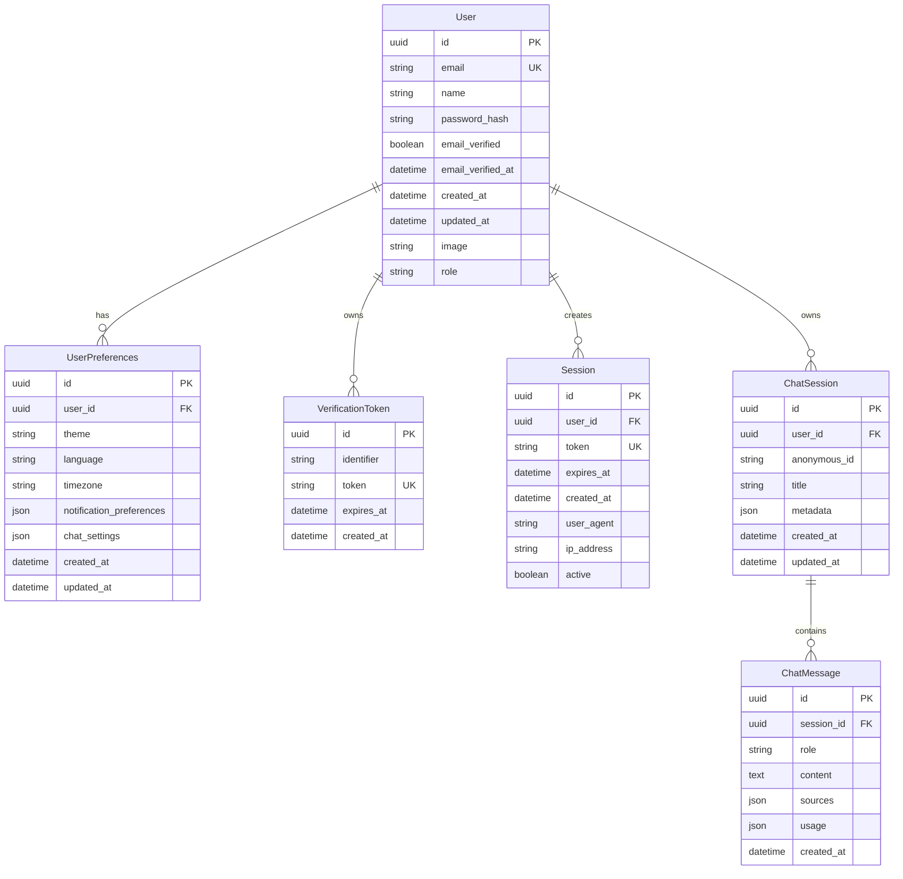

# Data Model: User Authentication

**Date**: 2025-01-21
**Feature**: User Authentication

## Entity Relationship Diagram



## Better Auth Tables (Managed via Direct PostgreSQL)

Better Auth manages these tables directly using the pg Pool connection:

### Users Table
```sql
-- Managed by Better Auth, not via SQLModel
CREATE TABLE better_auth_users (
    id UUID PRIMARY KEY DEFAULT gen_random_uuid(),
    email VARCHAR(255) UNIQUE NOT NULL,
    name VARCHAR(255),
    password_hash VARCHAR(255) NOT NULL,
    email_verified BOOLEAN DEFAULT false,
    email_verified_at TIMESTAMPTZ,
    image VARCHAR(255),
    role VARCHAR(50) DEFAULT 'user',
    created_at TIMESTAMPTZ DEFAULT now(),
    updated_at TIMESTAMPTZ DEFAULT now()
);

-- Indexes for performance
CREATE INDEX idx_users_email ON better_auth_users(email);
CREATE INDEX idx_users_email_verified ON better_auth_users(email_verified);
```

### Sessions Table
```sql
-- Managed by Better Auth
CREATE TABLE better_auth_sessions (
    id UUID PRIMARY KEY DEFAULT gen_random_uuid(),
    user_id UUID NOT NULL REFERENCES better_auth_users(id) ON DELETE CASCADE,
    token VARCHAR(255) UNIQUE NOT NULL,
    expires_at TIMESTAMPTZ NOT NULL,
    created_at TIMESTAMPTZ DEFAULT now(),
    user_agent TEXT,
    ip_address INET,
    active BOOLEAN DEFAULT true
);

-- Indexes for session lookups
CREATE INDEX idx_sessions_user_id ON better_auth_sessions(user_id);
CREATE INDEX idx_sessions_token ON better_auth_sessions(token);
CREATE INDEX idx_sessions_expires_at ON better_auth_sessions(expires_at);
CREATE INDEX idx_sessions_active ON better_auth_sessions(active);
```

### Verification Tokens Table
```sql
-- Managed by Better Auth
CREATE TABLE better_auth_verification_tokens (
    id UUID PRIMARY KEY DEFAULT gen_random_uuid(),
    identifier VARCHAR(255) NOT NULL,
    token VARCHAR(255) UNIQUE NOT NULL,
    expires_at TIMESTAMPTZ NOT NULL,
    created_at TIMESTAMPTZ DEFAULT now()
);

-- Index for token lookups
CREATE INDEX idx_verification_tokens_token ON better_auth_verification_tokens(token);
CREATE INDEX idx_verification_tokens_identifier ON better_auth_verification_tokens(identifier);
CREATE INDEX idx_verification_tokens_expires_at ON better_auth_verification_tokens(expires_at);
```

## SQLModel Tables (Managed via ORM)

### UserPreferences Model

```python
# backend/src/models/user.py
from sqlalchemy import Column, String, Boolean, DateTime, text, JSON
from sqlalchemy.dialects.postgresql import UUID
from sqlalchemy.orm import relationship
from sqlmodel import SQLModel, Field
from datetime import datetime
from typing import Optional, Dict, Any
from pydantic import validator

class UserPreferencesBase(SQLModel):
    theme: str = Field(default="system", max_length=20)  # light, dark, system
    language: str = Field(default="en", max_length=10)
    timezone: str = Field(default="UTC", max_length=50)
    profile_description: Optional[str] = Field(default=None, max_length=500)

    notification_preferences: Dict[str, Any] = Field(
        default_factory=lambda: {
            "email_notifications": True,
            "chat_reminders": False,
            "feature_updates": True,
            "security_alerts": True
        }
    )

    chat_settings: Dict[str, Any] = Field(
        default_factory=lambda: {
            "model_preference": "gpt-4",
            "temperature": 0.7,
            "max_tokens": 2000,
            "save_history": True,
            "show_sources": True
        }
    )

class UserPreferences(UserPreferencesBase, table=True):
    id: Optional[UUID] = Field(
        default_factory=text("gen_random_uuid()"),
        primary_key=True,
        sa_column_kwargs={"server_default": text("gen_random_uuid()")}
    )
    user_id: UUID = Field(foreign_key="better_auth_users.id", unique=True)

    created_at: datetime = Field(
        default_factory=datetime.utcnow,
        sa_column_kwargs={"server_default": text("now()")}
    )
    updated_at: datetime = Field(
        default_factory=datetime.utcnow,
        sa_column={
            "server_default": text("now()"),
            "onupdate": text("now()")
        }
    )

    @validator('theme')
    def validate_theme(cls, v):
        allowed = ['light', 'dark', 'system']
        if v not in allowed:
            raise ValueError(f"Theme must be one of {allowed}")
        return v

class UserPreferencesCreate(UserPreferencesBase):
    user_id: UUID

class UserPreferencesUpdate(SQLModel):
    theme: Optional[str] = None
    language: Optional[str] = None
    timezone: Optional[str] = None
    notification_preferences: Optional[Dict[str, Any]] = None
    chat_settings: Optional[Dict[str, Any]] = None

class UserPreferencesRead(UserPreferencesBase):
    id: UUID
    user_id: UUID
    created_at: datetime
    updated_at: datetime
```

### Enhanced ChatSession Model

```python
# backend/src/models/chat.py
from sqlalchemy import Column, String, ForeignKey, DateTime, text, JSON
from sqlalchemy.dialects.postgresql import UUID
from sqlalchemy.orm import relationship
from sqlmodel import SQLModel, Field
from datetime import datetime
from typing import Optional, Dict, Any

class ChatSessionBase(SQLModel):
    title: Optional[str] = Field(default=None, max_length=255)
    metadata: Dict[str, Any] = Field(default_factory=dict)

class ChatSession(ChatSessionBase, table=True):
    id: Optional[UUID] = Field(
        default_factory=text("gen_random_uuid()"),
        primary_key=True,
        sa_column_kwargs={"server_default": text("gen_random_uuid()")}
    )

    # Link to Better Auth user (nullable for anonymous sessions)
    user_id: Optional[UUID] = Field(
        default=None,
        foreign_key="better_auth_users.id",
        sa_column_kwargs={"nullable": True}
    )

    # Keep anonymous_id for migration and anonymous sessions
    anonymous_id: Optional[str] = Field(
        default=None,
        max_length=255,
        sa_column_kwargs={"nullable": True, "index": True}
    )

    created_at: datetime = Field(
        default_factory=datetime.utcnow,
        sa_column_kwargs={"server_default": text("now()")}
    )
    updated_at: datetime = Field(
        default_factory=datetime.utcnow,
        sa_column={
            "server_default": text("now()"),
            "onupdate": text("now()")}
        )
    }

class ChatSessionCreate(ChatSessionBase):
    user_id: Optional[UUID] = None
    anonymous_id: Optional[str] = None

class ChatSessionUpdate(SQLModel):
    title: Optional[str] = None
    metadata: Optional[Dict[str, Any]] = None
    user_id: Optional[UUID] = None

class ChatSessionRead(ChatSessionBase):
    id: UUID
    user_id: Optional[UUID]
    anonymous_id: Optional[str]
    created_at: datetime
    updated_at: datetime

# Helper class for linking anonymous sessions to users
class SessionLink(SQLModel):
    anonymous_session_id: UUID
    user_id: UUID
    linked_at: datetime = Field(default_factory=datetime.utcnow)
```

### Database Migration Script

```python
# backend/alembic/versions/001_create_auth_tables.py
"""Create authentication and user preference tables

Revision ID: 001
Revises:
Create Date: 2025-01-21

"""
from alembic import op
import sqlalchemy as sa
from sqlalchemy.dialects import postgresql

# revision identifiers
revision = '001'
down_revision = None
branch_labels = None
depends_on = None

def upgrade() -> None:
    # Create Better Auth tables (these are managed by Better Auth directly)
    op.execute("""
        CREATE TABLE IF NOT EXISTS better_auth_users (
            id UUID PRIMARY KEY DEFAULT gen_random_uuid(),
            email VARCHAR(255) UNIQUE NOT NULL,
            name VARCHAR(255),
            password_hash VARCHAR(255) NOT NULL,
            email_verified BOOLEAN DEFAULT false,
            email_verified_at TIMESTAMPTZ,
            image VARCHAR(255),
            role VARCHAR(50) DEFAULT 'user',
            created_at TIMESTAMPTZ DEFAULT now(),
            updated_at TIMESTAMPTZ DEFAULT now()
        )
    """)

    op.execute("""
        CREATE TABLE IF NOT EXISTS better_auth_sessions (
            id UUID PRIMARY KEY DEFAULT gen_random_uuid(),
            user_id UUID NOT NULL REFERENCES better_auth_users(id) ON DELETE CASCADE,
            token VARCHAR(255) UNIQUE NOT NULL,
            expires_at TIMESTAMPTZ NOT NULL,
            created_at TIMESTAMPTZ DEFAULT now(),
            user_agent TEXT,
            ip_address INET,
            active BOOLEAN DEFAULT true
        )
    """)

    op.execute("""
        CREATE TABLE IF NOT EXISTS better_auth_verification_tokens (
            id UUID PRIMARY KEY DEFAULT gen_random_uuid(),
            identifier VARCHAR(255) NOT NULL,
            token VARCHAR(255) UNIQUE NOT NULL,
            expires_at TIMESTAMPTZ NOT NULL,
            created_at TIMESTAMPTZ DEFAULT now()
        )
    """)

    # Create SQLModel-managed tables
    op.create_table('user_preferences',
        sa.Column('id', postgresql.UUID(as_uuid=True), nullable=False, server_default=sa.text('gen_random_uuid()')),
        sa.Column('user_id', postgresql.UUID(as_uuid=True), nullable=False),
        sa.Column('theme', sa.String(length=20), nullable=False, server_default='system'),
        sa.Column('language', sa.String(length=10), nullable=False, server_default='en'),
        sa.Column('timezone', sa.String(length=50), nullable=False, server_default='UTC'),
        sa.Column('notification_preferences', sa.JSON(), nullable=False),
        sa.Column('chat_settings', sa.JSON(), nullable=False),
        sa.Column('created_at', sa.DateTime(timezone=True), server_default=sa.text('now()'), nullable=False),
        sa.Column('updated_at', sa.DateTime(timezone=True), server_default=sa.text('now()'), nullable=False),
        sa.ForeignKeyConstraint(['user_id'], ['better_auth_users.id'], ondelete='CASCADE'),
        sa.PrimaryKeyConstraint('id'),
        sa.UniqueConstraint('user_id')
    )

    # Add index to user_preferences
    op.create_index(op.f('ix_user_preferences_user_id'), 'user_preferences', ['user_id'], unique=False)

    # Update chat_sessions table to add user_id foreign key
    op.add_column('chat_sessions',
        sa.Column('user_id', postgresql.UUID(as_uuid=True), nullable=True)
    )

    # Add foreign key constraint
    op.create_foreign_key(
        'fk_chat_sessions_user_id',
        'chat_sessions',
        'better_auth_users',
        ['user_id'],
        ['id'],
        ondelete='SET NULL'
    )

    # Add indexes for Better Auth tables
    op.create_index('ix_users_email', 'better_auth_users', ['email'], unique=False)
    op.create_index('ix_users_email_verified', 'better_auth_users', ['email_verified'], unique=False)
    op.create_index('ix_sessions_user_id', 'better_auth_sessions', ['user_id'], unique=False)
    op.create_index('ix_sessions_token', 'better_auth_sessions', ['token'], unique=False)
    op.create_index('ix_sessions_expires_at', 'better_auth_sessions', ['expires_at'], unique=False)
    op.create_index('ix_sessions_active', 'better_auth_sessions', ['active'], unique=False)

def downgrade() -> None:
    # Drop foreign key from chat_sessions
    op.drop_constraint('fk_chat_sessions_user_id', 'chat_sessions', type_='foreignkey')
    op.drop_column('chat_sessions', 'user_id')

    # Drop SQLModel tables
    op.drop_index(op.f('ix_user_preferences_user_id'), table_name='user_preferences')
    op.drop_table('user_preferences')

    # Drop Better Auth indexes
    op.drop_index('ix_sessions_active', table_name='better_auth_sessions')
    op.drop_index('ix_sessions_expires_at', table_name='better_auth_sessions')
    op.drop_index('ix_sessions_token', table_name='better_auth_sessions')
    op.drop_index('ix_sessions_user_id', table_name='better_auth_sessions')
    op.drop_index('ix_users_email_verified', table_name='better_auth_users')
    op.drop_index('ix_users_email', table_name='better_auth_users')

    # Drop Better Auth tables
    op.drop_table('better_auth_verification_tokens')
    op.drop_table('better_auth_sessions')
    op.drop_table('better_auth_users')
```

## TypeScript Interfaces

### User and Auth Interfaces

```typescript
// frontend/src/types/auth.ts

export interface User {
  id: string;
  email: string;
  name: string;
  emailVerified: boolean;
  emailVerifiedAt?: string;
  image?: string;
  role: 'user' | 'admin';
  createdAt: string;
  updatedAt: string;
  preferences?: UserPreferences;
  profileDescription?: string;
}

export interface UserPreferences {
  id: string;
  userId: string;
  theme: 'light' | 'dark' | 'system';
  language: string;
  timezone: string;
  profileDescription?: string;
  notificationPreferences: {
    emailNotifications: boolean;
    chatReminders: boolean;
    featureUpdates: boolean;
    securityAlerts: boolean;
  };
  chatSettings: {
    modelPreference: string;
    temperature: number;
    maxTokens: number;
    saveHistory: boolean;
    showSources: boolean;
  };
  createdAt: string;
  updatedAt: string;
}

export interface AuthResponse {
  success: boolean;
  user?: User;
  token?: string;
  error?: string;
}

export interface CreateUserData {
  email: string;
  name: string;
  password: string;
  confirmPassword: string;
}

export interface LoginData {
  email: string;
  password: string;
}

export interface UpdateProfileData {
  name?: string;
  timezone?: string;
  language?: string;
  preferences?: Partial<UserPreferences['notificationPreferences']> &
                     Partial<UserPreferences['chatSettings']>;
}

export interface Session {
  id: string;
  userId: string;
  token: string;
  expiresAt: string;
  createdAt: string;
  userAgent?: string;
  ipAddress?: string;
  active: boolean;
}

export interface VerificationToken {
  id: string;
  identifier: string;
  token: string;
  expiresAt: string;
  createdAt: string;
}
```

### Enhanced Chat Interfaces

```typescript
// frontend/src/types/chat.ts

export interface ChatSession {
  id: string;
  userId?: string;  // Now optional, links to Better Auth user
  anonymousId?: string;  // Kept for migration
  title?: string;
  metadata: Record<string, any>;
  createdAt: string;
  updatedAt: string;
  messages?: ChatMessage[];
}

export interface ChatMessage {
  id: string;
  sessionId: string;
  role: 'user' | 'assistant' | 'system';
  content: string;
  sources: Source[];
  usage: UsageStats;
  createdAt: string;
}

export interface SessionLinkRequest {
  anonymousSessionId: string;
  userId: string;
}

export interface SessionLinkResponse {
  success: boolean;
  linkedSessions: number;
  error?: string;
}
```

## Data Validation Rules

### Backend Pydantic Models

```python
# backend/src/schemas/auth.py
from pydantic import BaseModel, EmailStr, validator, Field
from typing import Optional
import re

class UserCreateSchema(BaseModel):
    email: EmailStr
    name: str = Field(..., min_length=1, max_length=255)
    password: str = Field(..., min_length=8, max_length=128)
    confirmPassword: str

    @validator('password')
    def validate_password(cls, v):
        if not re.search(r'[A-Z]', v):
            raise ValueError('Password must contain at least one uppercase letter')
        if not re.search(r'[a-z]', v):
            raise ValueError('Password must contain at least one lowercase letter')
        if not re.search(r'\d', v):
            raise ValueError('Password must contain at least one digit')
        return v

    @validator('confirmPassword')
    def passwords_match(cls, v, values):
        if 'password' in values and v != values['password']:
            raise ValueError('Passwords do not match')
        return v

    @validator('name')
    def validate_name(cls, v):
        if not v.strip():
            raise ValueError('Name cannot be empty')
        return v.strip()

class UserLoginSchema(BaseModel):
    email: EmailStr
    password: str

class PasswordResetSchema(BaseModel):
    email: EmailStr

class ConfirmPasswordResetSchema(BaseModel):
    token: str
    password: str = Field(..., min_length=8, max_length=128)
    confirmPassword: str

    @validator('confirmPassword')
    def passwords_match(cls, v, values):
        if 'password' in values and v != values['password']:
            raise ValueError('Passwords do not match')
        return v

class UserPreferencesUpdateSchema(BaseModel):
    theme: Optional[str] = Field(None, regex='^(light|dark|system)$')
    language: Optional[str] = Field(None, min_length=2, max_length=10)
    timezone: Optional[str] = Field(None, min_length=1, max_length=50)
    notification_preferences: Optional[dict] = None
    chat_settings: Optional[dict] = None
```

## Key Design Decisions

1. **Hybrid Database Approach**:
   - Better Auth manages its tables directly for optimal performance
   - SQLModel manages application data with type safety
   - Clear separation prevents coupling

2. **Foreign Key Strategy**:
   - ChatSessions have nullable user_id for anonymous sessions
   - UserPreferences have required user_id (created on user registration)
   - All foreign keys use ON DELETE CASCADE/SET NULL appropriately

3. **Migration Path**:
   - Preserve anonymous_id for existing sessions
   - Session linking service to migrate anonymous sessions to authenticated users
   - Gradual migration without data loss

4. **Indexing Strategy**:
   - Email uniqueness for authentication
   - Session token lookups for validation
   - User_id for session and preference queries
   - Expiration timestamps for cleanup jobs

5. **JSON Schema Validation**:
   - Default values for preferences ensure consistency
   - Type hints in Python and TypeScript
   - Validation at both API and database level