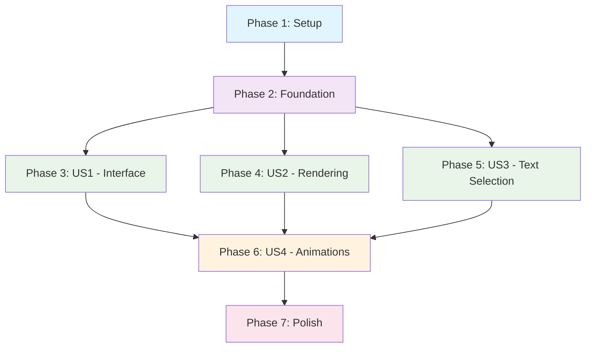

# Implementation Tasks: Advanced Chatbot UI with Text Selection Integration

**Feature**: 003-chat-ui
**Created**: 2025-12-06
**Based on**: [spec.md](./spec.md), [plan.md](./plan.md)
**Status**: Ready for Implementation

## Phase 1: Setup and Foundation

### Goal
Establish project structure, dependencies, and basic configuration for ChatGPT-style chatbot widget implementation.

### Independent Test Criteria
- All required dependencies installed without errors
- TypeScript configuration supports React components with strict typing
- Project structure follows the defined architecture
- Basic ChatWidget component renders without errors

### Implementation Tasks

- [X] T001 Install required dependencies (framer-motion, react-markdown, react-syntax-highlighter, types)
- [X] T002 Create ChatWidget directory structure per implementation plan
- [X] T003 Configure TypeScript for strict type checking and React components
- [X] T004 Create basic type definitions for ChatMessage, TextSelection, SourceCitation interfaces
- [X] T005 Set up Tailwind CSS configuration for ChatGPT-style dark theme
- [X] T006 Create base ChatWidgetContainer component with basic structure

## Phase 2: Foundational Infrastructure

### Goal
Implement core chat functionality, state management, and API integration before adding UI enhancements.

### Independent Test Criteria
- Chat widget opens/closes with basic state management
- Messages can be sent and displayed (no styling yet)
- Streaming API integration works with basic error handling
- Docusaurus theme integration renders ChatWidget on all pages

### Implementation Tasks

- [X] T007 Create ChatSession context with useReducer for state management
- [X] T008 [P] Implement useChatSession hook for chat state operations
- [X] T009 [P] Create basic ChatInterface component with message list and input
- [X] T010 Implement streaming API integration with SSE connection handling
- [X] T011 [P] Create useStreamingResponse hook for real-time message updates
- [X] T012 [P] Add structured error handling for API failures (retry logic, error states)
- [X] T013 Update Docusaurus Root.tsx to integrate ChatWidgetContainer
- [X] T014 Add basic responsive styling for mobile and desktop

## Phase 3: User Story 1 - Enhanced Chatbot Interface (P1)

### Goal
Deliver modern ChatGPT-style UI with visual feedback, animations, and professional aesthetics.

### Independent Test Criteria
- Widget opens to welcome screen with "What can I help with today?" and suggestion chips
- Messages display with distinct styling (user vs AI)
- Input area shows as floating capsule with integrated send button
- Basic open/close animations work smoothly
- Thinking indicator appears during AI processing

### Implementation Tasks

- [X] T015 [US1] Create WelcomeScreen component with greeting and suggestion chips
- [X] T016 [US1] [P] Implement MessageBubble components with distinct user/AI styling
- [X] T017 [US1] Create InputArea component with capsule design and send button
- [X] T018 [US1] [P] Implement ThinkingIndicator with pulsing animation
- [X] T019 [US1] Add basic widget open/close animations with Framer Motion
- [X] T020 [US1] Integrate suggestion chips with pre-filled message templates
- [X] T021 [US1] Add ARIA labels and keyboard navigation for accessibility

## Phase 4: User Story 2 - Rich Message Rendering (P1)

### Goal
Enable proper rendering of markdown content, code blocks with syntax highlighting, and source citations.

### Independent Test Criteria
- AI responses render with correct markdown formatting (bold, italics, lists)
- Code blocks display with syntax highlighting and copy button
- Source citations appear as clickable badges below responses
- All links open in new tabs with proper security attributes

### Implementation Tasks

- [X] T022 [US2] Create MessageRenderer component with react-markdown integration
- [X] T023 [US2] [P] Implement custom markdown renderers for different element types
- [X] T024 [US2] Add syntax highlighting for code blocks with react-syntax-highlighter
- [X] T025 [US2] [P] Create CopyButton component for code block functionality
- [X] T026 [US2] Implement SourceBadge component with chapter/section display
- [X] T027 [US2] [P] Add click handlers for source badge navigation
- [X] T028 [US2] [P] Implement source badge click tracking for analytics
- [X] T029 [US2] Configure link rendering to open URLs in new tabs securely
- [X] T030 [US2] Add XSS protection and content sanitization for markdown

## Phase 5: User Story 3 - Contextual Text Selection Query (P1)

### Goal
Enable users to select text anywhere in the book and query the AI about it with the "Ask AI" feature.

### Independent Test Criteria
- Text selection triggers "Ask AI" tooltip near selected content
- Clicking "Ask AI" opens chatbot and pre-fills with selected text context
- Selected text respects 2000 character limit with truncation warning
- Tooltip positioning works correctly at screen edges
- Multiple selections work independently without conflicts

### Implementation Tasks

- [X] T031 [US3] Create useTextSelection hook with global selection detection
- [X] T032 [US3] [P] Implement text selection validation and character limit checking
- [X] T033 [US3] Create SelectionTooltip component with "Ask AI" button
- [X] T034 [US3] [P] Implement smart positioning logic with screen edge collision detection
- [X] T035 [US3] Add React Portal for rendering SelectionTooltip outside component tree
- [X] T036 [US3] [P] Implement context injection when "Ask AI" is clicked
- [X] T037 [US3] Add debouncing for rapid selection changes
- [X] T038 [US3] Handle edge cases (no selection, overlapping tooltips, mobile touch)

## Phase 6: User Story 4 - Smooth Animations and Interactions (P2)

### Goal
Add fluid animations, transitions, and interactive feedback throughout the chatbot interface.

### Independent Test Criteria
- Message entry animations slide/fade new messages smoothly
- Streaming cursor blinks during real-time message updates
- Widget maintains 60fps animations on standard devices
- Mobile animations are reduced/disabled with user toggle option
- All animations respect system reduced-motion preferences

### Implementation Tasks

- [ ] T039 [US4] Create animation configurations in utils/animations.ts
- [ ] T040 [US4] [P] Implement message entry animations with stagger effects
- [ ] T041 [US4] Add StreamingCursor component with blinking animation
- [ ] T042 [US4] [P] Create animation variants for different screen sizes
- [ ] T043 [US4] Implement mobile animation reduction with user preference toggle
- [ ] T044 [US4] [P] Add prefers-reduced-motion support and detection
- [ ] T045 [US4] Optimize animations for GPU acceleration and performance
- [ ] T046 [US4] Add performance monitoring for animation frame rates

## Phase 7: Polish and Cross-Cutting Concerns

### Goal
Complete implementation with error handling, performance optimization, and production readiness.

### Independent Test Criteria
- All error scenarios display appropriate UI with recovery options
- Memory usage stays below 50MB during extended conversations
- Widget loads within 200ms on 3G connections
- Zero JavaScript errors in production across supported browsers
- Full mobile responsiveness with feature parity

### Implementation Tasks

- [ ] T047 [P] Implement comprehensive error boundaries for all components
- [ ] T048 [P] Add "Try Again" functionality for streaming failures
- [ ] T049 [P] Implement session state management with React memory only
- [ ] T050 [P] Add performance monitoring and memory usage tracking
- [ ] T051 [P] Optimize bundle size with code splitting for chat components
- [ ] T052 [P] Add comprehensive logging for debugging and monitoring (errors, performance metrics, user interactions)
- [ ] T053 [P] Implement proper cleanup for SSE connections and event listeners
- [ ] T054 [P] Add visual feedback for connection status and retry attempts
- [ ] T055 [P] Finalize accessibility compliance with screen reader support
- [ ] T056 [P] Add comprehensive browser compatibility testing
- [ ] T057 [P] Create production build optimization and configuration

## Dependencies and Execution Order

### Phase Dependencies
- **Phase 1**: No dependencies (can start immediately)
- **Phase 2**: Depends on Phase 1 completion
- **Phases 3-5**: Can run in parallel after Phase 2 completion
- **Phase 6**: Depends on completion of Phases 3-5
- **Phase 7**: Final phase after all user stories complete

### Parallel Execution Opportunities

**Within Phases 3-5** (after Phase 2 complete):
- **Parallel Group 1**: T015-T021 (US1 Interface) + T022-T029 (US2 Rendering)
- **Parallel Group 2**: T030-T037 (US3 Text Selection) can run alongside Group 1

**Within Phase 7** (polish tasks):
- Most polish tasks (T046-T056) can run in parallel as they address different concerns

### Independent Test Scenarios

**User Story 1 (Enhanced Interface)**:
1. Open chatbot → Verify welcome screen appears within 500ms
2. Send message → Verify distinct styling and input area functionality
3. Test animations → Verify smooth transitions and thinking indicator

**User Story 2 (Rich Rendering)**:
1. Send markdown query → Verify formatting renders correctly
2. Request code example → Verify syntax highlighting and copy button
3. Check sources → Verify clickable badges with navigation

**User Story 3 (Text Selection)**:
1. Select text → Verify "Ask AI" tooltip appears
2. Click "Ask AI" → Verify chatbot opens with context
3. Test long selections → Verify truncation and warnings

**User Story 4 (Animations)**:
1. Test on desktop → Verify 60fps animations
2. Test on mobile → Verify reduced animations with toggle
3. Test reduced motion → Verify system preference respect

### MVP Scope (Minimum Viable Product)

**Core Features (US1 Only)**:
- Basic ChatGPT-style interface with message exchange
- Simple widget open/close functionality
- Basic streaming integration
- Essential error handling

**MVP Tasks**: T001-T014, T015-T021 (29 total tasks)

**Timeline Estimate**: 2-3 sprints for MVP, 4-5 sprints for full feature

### Implementation Strategy

**Incremental Delivery**:
1. **Sprint 1**: Setup + Foundation (T001-T014)
2. **Sprint 2**: User Story 1 - Enhanced Interface (T015-T021)
3. **Sprint 3**: User Story 2 - Rich Rendering (T022-T029)
4. **Sprint 4**: User Story 3 - Text Selection (T030-T037)
5. **Sprint 5**: User Story 4 - Animations + Polish (T038-T056)

**Risk Mitigation**:
- Complete Phase 2 first to validate API integration
- Test text selection on various content types early
- Monitor animation performance throughout development
- Implement comprehensive error handling before polish phase

### Success Metrics

**Performance Targets**:
- Initial render: < 200ms (T055)
- Animation frame rate: 60fps (T045)
- Memory usage: < 50MB (T049)
- Text selection response: < 100ms (T036)

**Quality Targets**:
- Zero JavaScript errors (T055)
- 95% markdown rendering accuracy (T029)
- 98% text selection reliability (T037)
- Full mobile responsiveness (T014)

---

**Total Tasks**: 57
**Estimated Effort**: 4-5 sprints
**Critical Path**: Phase 1 → Phase 2 → Any (Phase 3/4/5) → Phase 6 → Phase 7