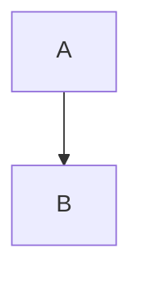

# Module 2: Content Generation Specification

## 1. Overview
This module focuses on generating the comprehensive educational content for the "Physical AI & Humanoid Robotics" textbook. The content will be structured into 12 chapters covering 5 key parts, adhering to the "AI-Native" writing style for optimal RAG performance and student learning.

## 2. Content Architecture

### 2.1 Structure
The book is divided into 5 parts corresponding to the course modules:

*   **Part 1: Foundations (Weeks 1-2)**
    *   `01-intro-physical-ai.md`: Concept of Embodied Intelligence.
    *   `02-sensors-perception.md`: Hardware interface (LiDAR, IMU, Cameras).
*   **Part 2: The Nervous System (Weeks 3-5)**
    *   `03-ros2-architecture.md`: Nodes, Topics, Services.
    *   `04-ros2-python.md`: Coding nodes with `rclpy`.
    *   `05-launch-params.md`: System orchestration.
*   **Part 3: The Digital Twin (Weeks 6-7)**
    *   `06-gazebo-simulation.md`: URDF/SDF modeling.
    *   `07-unity-physics.md`: High-fidelity rendering.
*   **Part 4: The AI Brain (Weeks 8-10)**
    *   `08-nvidia-isaac.md`: Isaac Sim & SDK.
    *   `09-vslam-nav2.md`: Navigation & Mapping.
    *   `10-reinforcement-learning.md`: Sim-to-Real control policies.
*   **Part 5: Advanced Humanoids (Weeks 11-13)**
    *   `11-humanoid-kinematics.md`: Bipedal locomotion.
    *   `12-vla-conversational.md`: Vision-Language-Action models.

### 2.2 Chapter Format (Template)
Each MDX file must follow this structure:

```mdx
---
slug: /chapter-slug
title: Chapter Title
description: Brief summary for SEO/Preview
tags: [topic1, topic2]
---

# Chapter X: Title

## 🎯 Learning Objectives
- Objective 1
- Objective 2
- Objective 3

## 1. Introduction
...

## 2. Technical Concept (e.g., ROS 2 Nodes)
...

...

## 3. Implementation (Code)
```python
# Code example
```

## 🧠 Knowledge Check
1. Question 1?
   - [ ] Option A
   - [x] Option B
```

## 3. Content Standards
*   **Depth**: Technical depth suitable for university students.
*   **Code**: Verified Python `rclpy` patterns.
*   **Diagrams**: Extensive use of Mermaid for architecture.
*   **Tone**: Professional, authoritative, yet accessible.

## 4. Navigation
*   **Sidebar**: `sidebars.ts` must be updated to auto-generate or explicitly list the hierarchy.
*   **Next/Prev**: Docusaurus handles this automatically via file order.

## 5. Success Criteria
*   [ ] 12 MDX files created in `docs/`.
*   [ ] All chapters render correctly with frontmatter.
*   [ ] Mermaid diagrams render.
*   [ ] Code blocks have syntax highlighting.
*   [ ] Sidebar navigation works.
